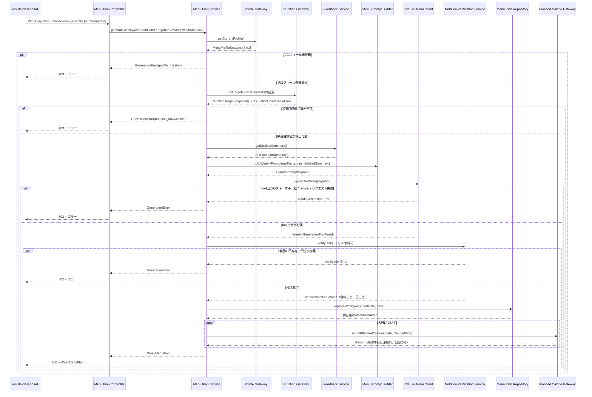
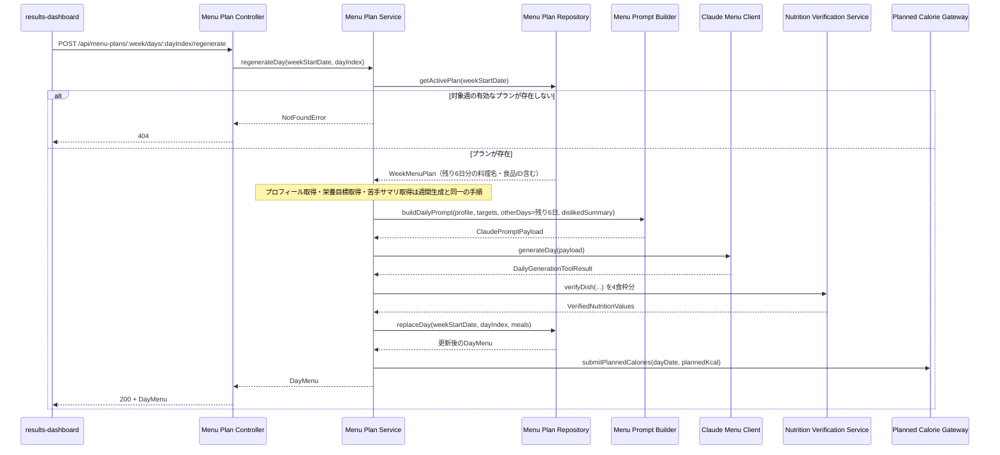
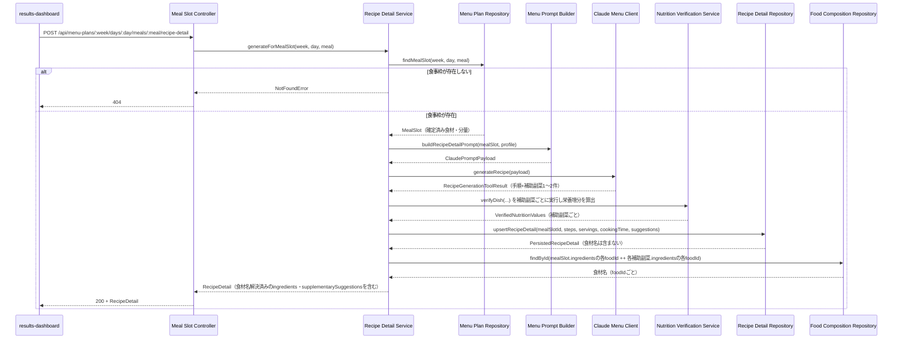
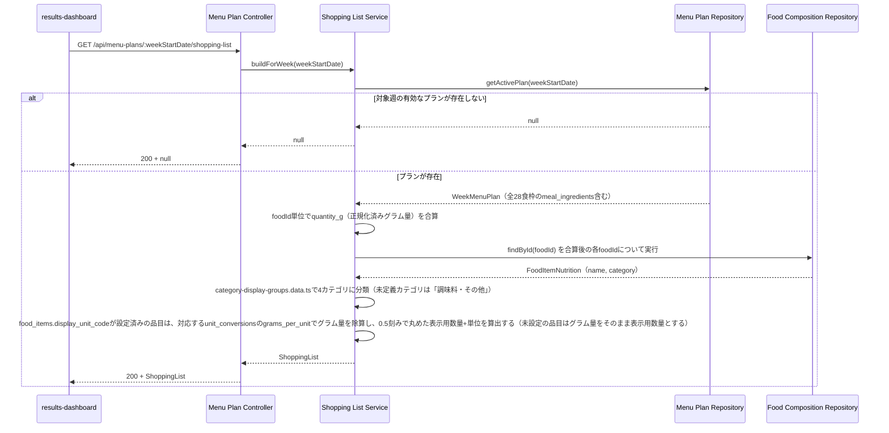
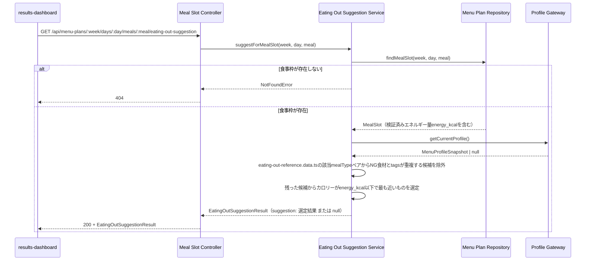
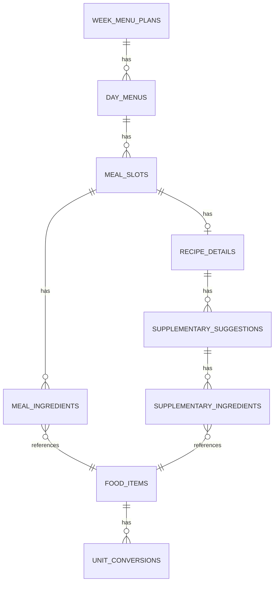

# Technical Design: menu-generation

## Overview

本機能は、栄養管理Webアプリケーションの献立生成エンジンである。`nutrition-engine` が算出する栄養目標値（カロリー・PFC目標）と `user-profile` が保持する食の嗜好・NG食材・食事制限設定・調理時間/スキル/予算感を入力として、Claude API（Messages API）による1週間分（朝食・昼食・夕食・間食）の献立を構造化tool出力で生成する。食材の選定はClaudeに自由記述させず、事前に用意した食品ID一覧（MEXT「日本食品標準成分表（八訂）増補2023」ベース）からの`strict: true`のtool呼び出しに限定し、選択された食品IDと分量（正規化された単位）を食品成分DBと突き合わせて栄養価を決定論的に計算・検証する。

**Purpose**: LLMによる献立内容（料理名・食材選定・調理手順）の創造的生成と、食品成分DBによる決定論的な栄養価検証を組み合わせ、多様性と信頼性を両立した1週間分の献立を提供する。
**Users**: アプリを利用する唯一の利用者本人が、週次で献立を確認し、必要に応じて週単位・日単位で差し替え、個々の食事のレシピ詳細を閲覧し、満足度をフィードバックする。
**Impact**: greenfieldプロジェクトの3番目のspecであり、`user-profile` が構築した既存のFastifyアプリ・monorepo構成に、新規のバックエンドモジュール群（Claude API連携・食品成分DB・献立永続化）を追加する。`user-profile` および `nutrition-engine` の既存コンポーネントには変更を加えず、それらが公開するService Interfaceを狭いGatewayポート経由で読み書きする。

### Goals
- `nutrition-engine` の栄養目標値と `user-profile` の嗜好・NG食材・食事制限設定（タイプ・強度・自由記述）を踏まえ、1週間分（朝昼晩+間食）の献立をClaude APIの構造化tool出力で生成する
- 食材選択を既知の食品ID一覧に制約する `strict: true` のtool定義を用い、生成後の栄養価をMEXT八訂ベースの食品成分DBと突き合わせて決定論的に検証する
- 週単位・日単位（他6日を考慮した重複回避付き）の両方の献立再生成をサポートする
- 個々の食事セルに対するオンデマンドのレシピ詳細生成と、「もう一品追加するなら」の補助的な副菜提案を同一の生成要求で提供する
- 満足度フィードバック（好き/苦手）を収集し、以降の生成プロンプトに反映して苦手な食材・料理の再提案を避ける
- 計画献立に基づく1日あたりの計画摂取カロリー値を算出し、`user-profile` の日次ログへ提供する
- 対象週の確定済み食材から、分量単位正規化テーブルを用いてカテゴリ別の週間買い物リストを集約する
- 特定の食事枠を外食に置き換える場合の代替案を、キュレーション済みの静的参照データから決定論的に選定して提供する

### Non-Goals
- 栄養目標値（カロリー・PFC・微量栄養素）そのものの計算式（`nutrition-engine` の責務）
- プロフィール・嗜好・NG食材・食事制限設定・摂取カロリー実績等の日次ログの保存（`user-profile` の責務）
- 献立・レシピ・買い物リスト・外食代替提案・栄養充足率等の画面レイアウトとUI実装（`results-dashboard` の責務）
- 認証・認可・複数ユーザー対応
- MEXT八訂の全収載食品（2000件超）の網羅（v1は実用的なサブセットから開始する、詳細は `research.md` を参照）

## Boundary Commitments

### This Spec Owns
- Claude APIとの連携（プロンプト構築、`strict: true` のtool定義、モデル・thinking/effortパラメータの制御）
- 週間献立生成・週単位再生成・日単位再生成（他6日考慮）のオーケストレーションと永続化
- 食品成分DB（MEXT八訂ベースの参照データ）とその照合による栄養価計算・検証ロジック
- 分量単位（g / 個 / 大さじ 等）の正規化テーブルとその解決ロジック
- 食事セル単位のレシピ詳細（材料・分量・手順・栄養内訳）と追加副菜提案のオンデマンド生成（いずれの材料一覧も `FoodCompositionRepository` からの食材名解決を含む）
- 満足度フィードバック（好き/苦手）の記録と、次回以降の生成プロンプトへの反映
- 計画摂取カロリー値の算出と、`user-profile` への提供、および `results-dashboard` 向けの参照インターフェース
- 対象週の確定済み食材からのカテゴリ別買い物リストの生成（分量単位正規化テーブルを用いたグラム換算・合算、`FoodCompositionRepository` からの品目名解決を含む）
- 特定の食事枠に対する外食代替提案の生成（キュレーション済みの静的参照データに基づく決定論的選定。Claude APIによる自由生成は用いない）

### Out of Boundary
- 活動係数・BMR・TDEE・PFC比率調整式・微量栄養素目標値・ダイエット安全ガードレールの算出（`nutrition-engine`）
- プロフィール・日次ログ（摂取カロリー実績等）のスキーマ、検証ルール、永続化（`user-profile`）
- 献立・レシピ・買い物リスト・外食代替提案のグラフ描画・モーダル表示等のUI実装（`results-dashboard`）
- 認証・認可・複数ユーザーのデータ分離

### Allowed Dependencies
- `user-profile` の `ProfileService.getProfile()`（プロセス内呼び出し。`ProfileGateway` 経由で読み取り専用アクセス）
- `user-profile` の `DailyLogService.setPlannedCalories(date, plannedKcal)`（プロセス内呼び出し。`PlannedCalorieGateway` 経由で書き込みアクセス）
- `nutrition-engine` の `NutritionService.getSummary(date)`（プロセス内呼び出し。`NutritionGateway` 経由で読み取り専用アクセス）
- Anthropic Claude API（Messages API、外部HTTPS通信。APIキーは環境変数で管理し、DBに保存しない）
- ランタイム基盤（Node.js、npm workspaces monorepo内の `server` パッケージに追加実装。新規のSQLiteテーブルを自パッケージ内に追加する）
- 本spec自身が公開するAPI（週間献立プラン・レシピ詳細・栄養価検証結果の参照インターフェース）への `results-dashboard` からのアクセスは「本specが公開する契約への外部からのアクセス」であり、本spec自身が依存する対象ではない

### Revalidation Triggers
- `user-profile` のProfile型（`ngIngredients` / `preferredIngredients` / `restrictionType` / `restrictionIntensity` / `restrictionNotes` / `cookingSkill` / `cookingTimePreference` / `budgetPreference`）のフィールド構成を変更した場合 → `ProfileGateway` の射影ロジックの再確認が必要
- `nutrition-engine` の `NutritionSummary` 型（`calorieTarget` / `pfc` / `activityLevelLabel` / `dietMode.guardrails`）のレスポンス形式を変更した場合 → `NutritionGateway` と `MenuPromptBuilder` の再確認が必要
- `user-profile` の `DailyLogService.setPlannedCalories` の契約（シグネチャ・エラー型）を変更した場合 → `PlannedCalorieGateway` の再確認が必要
- 本specが提供する週間献立プラン・栄養価検証結果・レシピ詳細のレスポンス形式を変更した場合 → `results-dashboard` の表示ロジックに影響するため再確認が必要
- MEXT食品成分表のデータソース版数が更新された場合、または収載範囲を拡張する場合 → `food_items` の参照データ更新と出典表示の見直しが必要
- 既定のClaude APIモデルID・thinking/effort設定を変更した場合 → 生成品質・コストの再評価と `research.md` の更新が必要
- 本specが提供する買い物リスト・外食代替提案のレスポンス形式を変更した場合 → `results-dashboard` の表示ロジックに影響するため再確認が必要
- 食品カテゴリ→表示グループのマッピング（`category-display-groups.data.ts`）または外食メニュー参照データ（`eating-out-reference.data.ts`）を更新した場合 → 買い物リストのカテゴリ分類結果・外食代替提案の選定結果への影響を再確認する必要がある
- `VerifiedNutritionValues`（`MealSlot.nutrition` / `DayMenu.dayNutrition`）に微量栄養素9項目を追加したことに伴い、`results-dashboard`の微量栄養素充足率表示は`nutrition-engine`の目標値と本specの実績値の比を自前で算出する構成になった。`per100g`が`null`の微量栄養素を0として合算する仕様のため、微量栄養素データが未収載の食材が多い週は充足率が実際よりやや低く表示されうることを`results-dashboard`側にも申し送る必要がある

## Architecture

### Architecture Pattern & Boundary Map

**選定パターン**: レイヤードアーキテクチャ（Route → Service → Repository）+ Gatewayポート（`user-profile` / `nutrition-engine` 向け）+ 外部API統合コンポーネント（Claude API向け）。`user-profile` / `nutrition-engine` と同一の設計言語を踏襲し、本spec固有の関心事（プロンプト構築・tool制約・食品成分DB照合）は独立したコンポーネントとして分離する（詳細は `research.md` の Architecture Pattern Evaluation を参照）。

```mermaid
graph TB
    subgraph BackendApi
        MenuPlanController[Menu Plan Controller]
        MealSlotController[Meal Slot Controller]
        MenuPlanService[Menu Plan Service]
        RecipeDetailService[Recipe Detail Service]
        FeedbackService[Feedback Service]
        MenuPromptBuilder[Menu Prompt Builder]
        ClaudeMenuClient[Claude Menu Client]
        NutritionVerificationService[Nutrition Verification Service]
        UnitConversionService[Unit Conversion Service]
        MenuPlanRepository[Menu Plan Repository]
        RecipeDetailRepository[Recipe Detail Repository]
        FeedbackRepository[Feedback Repository]
        FoodCompositionRepository[Food Composition Repository]
        ProfileGateway[Profile Gateway]
        NutritionGateway[Nutrition Gateway]
        PlannedCalorieGateway[Planned Calorie Gateway]
        ShoppingListService[Shopping List Service]
        EatingOutSuggestionService[Eating Out Suggestion Service]
    end

    subgraph UserProfileSpec
        ProfileService[Profile Service]
        DailyLogService[Daily Log Service]
    end

    subgraph NutritionEngineSpec
        NutritionService[Nutrition Service]
    end

    subgraph External
        ClaudeApi[Claude Messages API]
    end

    subgraph AdjacentSpecs
        ResultsDashboard[results-dashboard]
    end

    MenuPlanController --> MenuPlanService
    MenuPlanController --> ShoppingListService
    MealSlotController --> RecipeDetailService
    MealSlotController --> FeedbackService
    MealSlotController --> EatingOutSuggestionService

    MenuPlanService --> ProfileGateway
    MenuPlanService --> NutritionGateway
    MenuPlanService --> PlannedCalorieGateway
    MenuPlanService --> FeedbackService
    MenuPlanService --> MenuPromptBuilder
    MenuPlanService --> ClaudeMenuClient
    MenuPlanService --> NutritionVerificationService
    MenuPlanService --> MenuPlanRepository

    RecipeDetailService --> MenuPlanRepository
    RecipeDetailService --> ProfileGateway
    RecipeDetailService --> MenuPromptBuilder
    RecipeDetailService --> ClaudeMenuClient
    RecipeDetailService --> NutritionVerificationService
    RecipeDetailService --> RecipeDetailRepository
    RecipeDetailService --> FoodCompositionRepository

    FeedbackService --> FeedbackRepository

    NutritionVerificationService --> FoodCompositionRepository
    NutritionVerificationService --> UnitConversionService

    ShoppingListService --> MenuPlanRepository
    ShoppingListService --> FoodCompositionRepository

    EatingOutSuggestionService --> MenuPlanRepository
    EatingOutSuggestionService --> ProfileGateway

    ProfileGateway --> ProfileService
    PlannedCalorieGateway --> DailyLogService
    NutritionGateway --> NutritionService

    ClaudeMenuClient --> ClaudeApi
    ClaudeMenuClient --> FoodCompositionRepository

    ResultsDashboard -.reads weekly plan, nutrition verification, and shopping list.-> MenuPlanController
    ResultsDashboard -.reads recipe detail and eating-out suggestion.-> MealSlotController
```



**Architecture Integration**:
- 選定パターン: レイヤードアーキテクチャ（依存方向 Types/Schema → 食品成分・単位参照データ → Repository → Domain Service（Gateway含む）→ Controller。外部通信 [Claude API / user-profile / nutrition-engine] はDomain Serviceの依存先として一方向に呼び出す）
- ドメイン境界: `MenuPlan`（週間献立集約）、`RecipeDetail`（レシピ詳細集約）、`SatisfactionFeedback`（満足度フィードバック集約）、`FoodComposition`（食品成分参照データ）の4つのドメインに分離する。いずれも `Profile` 集約・`DailyLog` 集約・`NutritionSummary` を所有せず、Gatewayという狭いポート経由でのみアクセスする
- 新規コンポーネントの理由: 本spec固有の関心事（Claude API連携、食品成分DB照合、単位正規化、満足度フィードバック学習）はいずれも `user-profile` / `nutrition-engine` に存在しない新規責務であり、全コンポーネントが新規作成される
- 境界順守: Controller層はHTTPの関心事のみを扱う。Claude APIとの通信・プロンプト構築ロジックは `ClaudeMenuClient` / `MenuPromptBuilder` に閉じ込め、`MenuPlanService` / `RecipeDetailService` はそれらのオーケストレーションのみを担う。`ProfileGateway` / `NutritionGateway` / `PlannedCalorieGateway` は `user-profile` / `nutrition-engine` の公開Service Interfaceの呼び出しのみを行い、その内部実装（Repository構造等）には依存しない
- `ShoppingListService` / `EatingOutSuggestionService` は本spec内部の `MenuPlanRepository` / `FoodCompositionRepository` / `ProfileGateway` のみに依存し、新規の外部依存・Gatewayを追加しない。両コンポーネントが必要とする食品ID→表示名/カテゴリの解決は本spec自身が既に保持する `FoodCompositionRepository` で完結するため、`results-dashboard` 側が別途食品カタログ参照用のGatewayを持つ必要はない
- `RecipeDetailService` も同様に `FoodCompositionRepository` へ新規に依存し（4.8）、レシピ詳細・追加副菜提案の材料一覧に含まれる食品ID→食材名の解決を本spec内部で完結させる。`ShoppingListItem.name` と同じ設計判断であり、`RecipeDetailRepository`（`recipe_details`/`supplementary_suggestions`/`supplementary_ingredients` テーブル）への新規マイグレーションは不要（名前解決は永続化せず返却時に都度算出する）

### Technology Stack

| Layer | Choice / Version | Role in Feature | Notes |
|-------|------------------|------------------|-------|
| Backend | Node.js 22 LTS + Fastify 5 + TypeScript 5 | `/api/menu-plans` および `/api/menu-plans/:week/days/:day/meals/:meal` 系のHTTPハンドリング、`user-profile`/`nutrition-engine` と同一プロセス上でのオーケストレーション実行 | `user-profile` の `design.md` で確定済みのスタックをそのまま踏襲（再選定なし） |
| LLM連携 | Anthropic Claude API（Messages API）、`@anthropic-ai/sdk`（TypeScript公式SDK） | 週間/日単位の献立生成、レシピ詳細+補助副菜提案の生成。いずれも `strict: true` のtool定義による構造化出力 | 既定モデルは `claude-sonnet-5`（設定値として外部化、将来 `claude-opus-5` に切替可能）。週間/日単位生成は `thinking: {type: "adaptive"}` + `effort: "medium"`、レシピ詳細生成は `thinking: {type: "disabled"}` + `effort: "low"`。選定理由は `research.md` を参照 |
| Validation | Zod 4 | リクエスト（週開始日・dayIndex・mealType・feedback入力）とレスポンス型の検証・型推論、Claude tool出力の構造検証 | `shared` パッケージに `menu.schema.ts` を追加し、`profile.schema.ts` / `daily-log.schema.ts` / `nutrition.schema.ts` と同様の方式で型を共有する |
| Data / Storage | SQLite（ファイルベース）+ better-sqlite3 13 | 週間献立プラン・レシピ詳細・満足度フィードバック・食品成分参照データ・単位正規化テーブルの永続化 | `user-profile` が構築した同一SQLiteファイルに新規テーブルを追加する。マイグレーションは既存の番号付きSQLファイル方式を継続する |
| Infrastructure / Runtime | npm workspaces monorepo（既存の `server` / `shared` パッケージに追加） | `server/src/menu-generation/` ディレクトリとして追加実装。フロントエンド（`web` パッケージ）への追加は行わない | 本specはUIを持たない（`results-dashboard` の責務）ため `web` パッケージへの変更はない |

## File Structure Plan

### Directory Structure
```
server/
├── src/
│   ├── db/
│   │   └── migrations/
│   │       ├── 005_create_food_items.sql               # 食品成分参照データ
│   │       ├── 006_create_unit_conversions.sql         # 分量単位正規化テーブル
│   │       ├── 007_create_menu_plan_tables.sql         # week_menu_plans / day_menus / meal_slots / meal_ingredients
│   │       ├── 008_create_recipe_detail_tables.sql     # recipe_details / supplementary_suggestions / supplementary_ingredients
│   │       └── 009_create_satisfaction_feedback.sql    # satisfaction_feedback
│   ├── menu-generation/
│   │   ├── menu-plan.routes.ts              # /api/menu-plans ルーティング（週/日の生成・再生成・取得・買い物リスト取得）
│   │   ├── menu-plan.service.ts             # 週間/日単位生成のオーケストレーション
│   │   ├── menu-plan.repository.ts          # week_menu_plans/day_menus/meal_slots/meal_ingredients への永続化
│   │   ├── meal-slot.routes.ts              # /api/menu-plans/:week/days/:day/meals/:meal ルーティング（レシピ詳細・フィードバック・外食代替提案）
│   │   ├── recipe-detail.service.ts         # レシピ詳細+補助副菜提案の生成オーケストレーション
│   │   ├── recipe-detail.repository.ts      # recipe_details/supplementary_suggestions/supplementary_ingredients への永続化
│   │   ├── feedback.service.ts              # 満足度フィードバックの記録・苦手サマリの提供
│   │   ├── feedback.repository.ts           # satisfaction_feedback への永続化
│   │   ├── menu-prompt.builder.ts           # プロフィール/栄養目標/他日コンテキスト/苦手サマリからプロンプトを構築
│   │   ├── claude-menu.client.ts            # Anthropic Messages APIラッパー（strict tool定義・モデル/thinking/effort制御）
│   │   ├── nutrition-verification.service.ts # 食品ID+分量から実際の栄養価を計算・検証
│   │   ├── unit-conversion.service.ts       # 分量+単位→グラム換算（食材固有/汎用エントリの解決）
│   │   ├── food-composition.repository.ts   # food_items（食品成分参照データ）へのアクセス、tool schema用ID一覧取得
│   │   ├── profile.gateway.ts               # ProfileService.getProfile() の薄いラッパー（menu-generation向け射影）
│   │   ├── nutrition.gateway.ts             # NutritionService.getSummary(date) の薄いラッパー
│   │   ├── planned-calorie.gateway.ts       # DailyLogService.setPlannedCalories(date, kcal) の薄いラッパー
│   │   ├── shopping-list.service.ts         # 週間献立食材のカテゴリ別集約（買い物リスト生成）
│   │   ├── eating-out-suggestion.service.ts # 食事枠単位の外食代替提案の決定論的選定
│   │   ├── category-display-groups.data.ts  # 食品カテゴリ（MEXT分類）→買い物リスト表示グループの静的マッピング
│   │   ├── eating-out-reference.data.ts     # 外食メニュー参照ペア（静的キュレーションデータ）
│   │   └── constants.ts                     # モデルID・thinking/effort設定・単位コード一覧等の名前付き定数
│   └── app.ts                               # （変更）menu-generation ルートの登録を追加
└── package.json

shared/
├── src/
│   └── menu.schema.ts                       # Zodスキーマ + 推論型（WeekMenuPlan, DayMenu, MealSlot, RecipeDetail, FeedbackInput, ShoppingList, EatingOutSuggestionResult 等）
└── package.json
```

### Modified Files
- `server/src/app.ts`: `menu-plan.routes.ts` / `meal-slot.routes.ts` のルート登録を追加する（`user-profile` / `nutrition-engine` の既存ルーティング登録と並列に追加するのみで、既存のルーティングには変更を加えない）

## System Flows

### 週間献立生成・週単位再生成フロー


- 週間生成（初回）と週単位再生成は同一フローを辿る。相違点は、再生成時のみ `Feedback Service` から取得した苦手サマリが必ずプロンプトに含まれる点（初回生成時はフィードバック蓄積が無いため空になる、要件6.2/7.5）
- `PlannedCalorieGateway` への送信が失敗しても（要件11.4）、献立生成処理全体は成功として扱う。失敗はログに記録するのみとする

### 日単位再生成フロー（他6日考慮）


- `otherDays` には残り6日の各食枠の料理名と食品ID一覧のみを含め、栄養価の内部計算値は含めない（プロンプトの簡潔性のため）。重複回避の指示（要件7.3）は `MenuPromptBuilder` がプロンプトテキストとして明示的に組み込む

### レシピ詳細+追加副菜の生成フロー


- レシピ詳細生成では既に確定している食材・分量・栄養価（`meal_slots` / `meal_ingredients`）を変更しない（要件8.3）。補助副菜の栄養価は「増分」として提示し、既存の食枠の栄養価には合算しない
- レシピ詳細の`ingredients`（対象食事枠の確定済み食材）および各`supplementarySuggestions[].ingredients`について、`FoodCompositionRepository`から解決した食材名を付与する（要件4.8）。この名前解決は`RecipeDetailRepository`に永続化せず、`RecipeDetailService`が返却時に都度算出する（`ShoppingListService`が`ShoppingListItem.name`を解決する既存パターンと同一の設計判断であり、新規マイグレーションを必要としない）

### 買い物リスト生成フロー


- 単位が異なる料理（例: 卵「1個」とひき肉「50g」）が混在していても、`meal_ingredients.quantity_g` に既に正規化済みの値が保存されているため、追加の単位変換ロジックを実装せずに合算できる（要件14.2）
- 対象週のプランが存在しない場合は、既存の `GET /api/menu-plans/:weekStartDate` と同様に200 + `null` を返し、専用のエラー型は導入しない（要件14.6）
- 表示用数量は「グラム量から自然な単位への換算」という単純な四則演算にとどめ、`NutritionVerificationService`が算出する栄養価には一切影響しない（表示専用の派生値であることを明示する）。0.5刻み丸めで0になる場合（少量の調味料等）は最小表示単位として0.5を下限にする（要件14.7）

```typescript
interface ShoppingListItem {
  foodId: string;
  name: string;
  category: "野菜・きのこ" | "肉・魚" | "乳製品・卵・豆" | "調味料・その他";
  quantityGrams: number;
  displayQuantity: number; // display_unit_code設定時は換算後の数量（0.5刻み）、未設定時はquantityGramsと同値
  displayUnit: string; // display_unit_code設定時はその単位コード、未設定時は "g"
}

interface ShoppingList {
  weekStartDate: string;
  items: ShoppingListItem[];
}
```

### 外食代替提案生成フロー


- 基準値には食事枠自体の検証済みエネルギー量（`meal_slots.energy_kcal`）を用いる。日全体の目標カロリーではなく対象食事枠固有の値を基準にすることで、朝食・昼食・夕食・間食それぞれに適した規模の代替案を選定できる
- NG食材の除外により該当`mealType`の候補が残らない場合でも、これは生成失敗ではなく「該当なし」として`suggestion: null`を返す（要件15.5）。Claude APIは呼び出さない（要件15.7）

```typescript
interface EatingOutSuggestion {
  typicalMenuName: string;
  typicalMenuKcal: number;
  alternativeMenuName: string;
  alternativeMenuKcal: number;
  proteinDeltaG: number; // alternativeMenuの代表的なたんぱく質量 - typicalMenuの代表的なたんぱく質量
}

interface EatingOutSuggestionResult {
  suggestion: EatingOutSuggestion | null;
}
```

## Requirements Traceability

| Requirement | Summary | Components | Interfaces | Flows |
|-------------|---------|------------|------------|-------|
| 1.1-1.6 | 週間献立の自動生成 | MenuPlanService, MenuPromptBuilder, ClaudeMenuClient, MenuPlanRepository | `POST /api/menu-plans/:week/generate` | 週間献立生成フロー |
| 2.1-2.6 | 食事制限・嗜好・自由記述の反映 | MenuPromptBuilder, ProfileGateway | `MenuPromptBuilder.buildWeeklyPrompt/buildDailyPrompt` | 週間献立生成フロー |
| 3.1-3.4 | 食品ID制約とtool定義 | ClaudeMenuClient, FoodCompositionRepository | `ClaudeMenuClient.generateWeek/generateDay/generateRecipe` | 週間献立生成フロー |
| 4.1-4.7 | 食品成分DBとの栄養価照合・検証（微量栄養素9項目を含む） | NutritionVerificationService, FoodCompositionRepository | `NutritionVerificationService.verifyDish` | 週間献立生成フロー、日単位再生成フロー |
| 5.1-5.4 | 分量単位の正規化 | UnitConversionService | `UnitConversionService.toGrams` | 週間献立生成フロー |
| 6.1-6.3 | 週単位の献立差し替え | MenuPlanService, FeedbackService, MenuPlanRepository, PlannedCalorieGateway | `POST /api/menu-plans/:week/regenerate` | 週間献立生成フロー |
| 7.1-7.5 | 日単位の献立差し替え（他日考慮） | MenuPlanService, MenuPlanRepository, MenuPromptBuilder | `POST /api/menu-plans/:week/days/:dayIndex/regenerate` | 日単位再生成フロー |
| 8.1-8.4 | レシピ詳細のオンデマンド生成 | RecipeDetailService, RecipeDetailRepository | `POST /api/menu-plans/:week/days/:day/meals/:meal/recipe-detail` | レシピ詳細+追加副菜の生成フロー |
| 9.1-9.4 | 追加副菜の提案 | RecipeDetailService, ClaudeMenuClient, NutritionVerificationService | `RecipeDetailService.generateForMealSlot` | レシピ詳細+追加副菜の生成フロー |
| 4.8 | レシピ詳細・追加副菜提案の食材名解決 | RecipeDetailService, FoodCompositionRepository | `RecipeDetailService.generateForMealSlot` | レシピ詳細+追加副菜の生成フロー |
| 10.1-10.5 | 満足度フィードバックの収集と反映 | FeedbackService, FeedbackRepository | `POST /api/menu-plans/:week/days/:day/meals/:meal/feedback` | 週間献立生成フロー |
| 11.1-11.4 | 計画摂取カロリーの算出・提供 | MenuPlanService, PlannedCalorieGateway, MenuPlanController | `PlannedCalorieGateway.submitPlannedCalories`, `GET /api/menu-plans/:week` | 週間献立生成フロー、日単位再生成フロー |
| 12.1-12.5 | 依存データの欠損・不整合時の挙動 | MenuPlanService, ProfileGateway, NutritionGateway, ClaudeMenuClient | `MenuPlanService.generateWeek/regenerateWeek/regenerateDay` | 週間献立生成フロー |
| 13.1-13.2 | シングルユーザー運用 | MenuPlanController, MealSlotController | 全API | - |
| 14.1-14.7 | 週間買い物リストの生成 | ShoppingListService, MenuPlanRepository, FoodCompositionRepository | `GET /api/menu-plans/:weekStartDate/shopping-list` | 買い物リスト生成フロー |
| 15.1-15.7 | 外食代替提案の生成 | EatingOutSuggestionService, MenuPlanRepository, ProfileGateway | `GET /api/menu-plans/:weekStartDate/days/:dayIndex/meals/:mealType/eating-out-suggestion` | 外食代替提案生成フロー |

## Components and Interfaces

| Component | Domain/Layer | Intent | Req Coverage | Key Dependencies (P0/P1) | Contracts |
|-----------|--------------|--------|---------------|---------------------------|-----------|
| MenuPlanController | API | `/api/menu-plans` のHTTPハンドリング（生成・再生成・取得・買い物リスト取得） | 1, 6, 7, 11.3, 12, 13, 14 | MenuPlanService (P0), ShoppingListService (P0) | API |
| MealSlotController | API | `/api/menu-plans/:week/days/:day/meals/:meal` のHTTPハンドリング（レシピ詳細・フィードバック・外食代替提案） | 8, 9, 10, 13, 15 | RecipeDetailService (P0), FeedbackService (P0), EatingOutSuggestionService (P0) | API |
| MenuPlanService | Domain | 週間/日単位生成のオーケストレーション、欠損データ判定 | 1, 6, 7, 11.1, 11.2, 11.4, 12 | ProfileGateway (P0), NutritionGateway (P0), PlannedCalorieGateway (P0), FeedbackService (P0), MenuPromptBuilder (P0), ClaudeMenuClient (P0), NutritionVerificationService (P0), MenuPlanRepository (P0) | Service |
| RecipeDetailService | Domain | レシピ詳細+補助副菜提案の生成オーケストレーション、両者の食材名解決 | 8, 9, 4.8 | MenuPlanRepository (P0), ProfileGateway (P1), MenuPromptBuilder (P0), ClaudeMenuClient (P0), NutritionVerificationService (P0), RecipeDetailRepository (P0), FoodCompositionRepository (P0) | Service |
| FeedbackService | Domain | 満足度フィードバックの検証・記録・苦手サマリ提供 | 10 | FeedbackRepository (P0) | Service |
| MenuPromptBuilder | Domain | プロフィール/栄養目標/他日コンテキスト/苦手サマリからClaude向けプロンプトを構築 | 2, 7.2, 7.3, 9.4, 10.3 | なし（純粋関数） | Service |
| ClaudeMenuClient | Domain/External | Claude Messages APIの呼び出し、`strict: true` tool定義の構築とレスポンス検証 | 1.2, 1.4, 3, 9.2, 12.3, 12.4 | Anthropic Claude API (P0, external), FoodCompositionRepository (P0) | Service |
| NutritionVerificationService | Domain | 食品ID+分量+単位から実際の栄養価を計算し目標との差分を算出 | 4, 9.3 | FoodCompositionRepository (P0), UnitConversionService (P0) | Service |
| UnitConversionService | Domain | 分量と単位をグラムに正規化（食材固有/汎用エントリの解決） | 5 | なし（純粋関数、参照データはFoodCompositionRepository経由） | Service |
| FoodCompositionRepository | Data | `food_items` / `unit_conversions` テーブルへのアクセス | 3.1, 4.1, 4.2, 4.6, 4.8, 5 | SQLite (P0) | State |
| MenuPlanRepository | Data | `week_menu_plans` / `day_menus` / `meal_slots` / `meal_ingredients` の永続化 | 1.3, 1.6, 6.1, 6.3, 7.1, 7.4, 11.3 | SQLite (P0) | State |
| RecipeDetailRepository | Data | `recipe_details` / `supplementary_suggestions` / `supplementary_ingredients` の永続化 | 8, 9 | SQLite (P0) | State |
| FeedbackRepository | Data | `satisfaction_feedback` の永続化（upsert） | 10 | SQLite (P0) | State |
| ProfileGateway | Data/Port | `user-profile` の `ProfileService` への狭いアクセスポート | 2, 12.1 | ProfileService (P0, `user-profile` spec) | Service |
| NutritionGateway | Data/Port | `nutrition-engine` の `NutritionService` への狭いアクセスポート | 1.5, 4.5, 12.2 | NutritionService (P0, `nutrition-engine` spec) | Service |
| PlannedCalorieGateway | Data/Port | `user-profile` の `DailyLogService.setPlannedCalories` への狭いアクセスポート | 11.2, 11.4 | DailyLogService (P0, `user-profile` spec) | Service |
| ShoppingListService | Domain | 週間献立食材のカテゴリ別集約（買い物リスト生成） | 14 | MenuPlanRepository (P0), FoodCompositionRepository (P0) | Service |
| EatingOutSuggestionService | Domain | 食事枠単位の外食代替提案の決定論的選定 | 15 | MenuPlanRepository (P0), ProfileGateway (P1), 静的参照データ (P0) | Service |

### Domain: Menu Plan Generation

#### MenuPlanController

| Field | Detail |
|-------|--------|
| Intent | `/api/menu-plans` のHTTPハンドリング |
| Requirements | 1, 6, 7, 11.3, 12, 13, 14 |

**Responsibilities & Constraints**
- 週開始日（`weekStartDate`）とdayIndex（0-6）をZodスキーマで検証し、`MenuPlanService` に委譲する
- `GenerationError` の `reason` に応じて 409（前提条件未達・重複要求）または 502（Claude API起因の失敗）を返す。Zod検証エラーは400、`NotFoundError` は404、その他は500を返す
- 認証・認可の機構を持たず、単一の利用者による利用を前提とする（13.1）
- 買い物リスト取得要求は `ShoppingListService.buildForWeek` に委譲し、対象週の有効なプランが存在しない場合も200 + `null` を返す（14.6、`GET /api/menu-plans/:weekStartDate` と同じ null 許容パターン）

**Dependencies**
- Outbound: MenuPlanService — 生成・再生成・取得の実行 (P0)
- Outbound: ShoppingListService — 買い物リストの生成 (P0)

**Contracts**: Service [ ] / API [x] / Event [ ] / Batch [ ] / State [ ]

##### API Contract

| Method | Endpoint | Request | Response | Errors |
|--------|----------|---------|----------|--------|
| POST | /api/menu-plans/:weekStartDate/generate | - | `WeekMenuPlan` | 400, 409, 502, 500 |
| POST | /api/menu-plans/:weekStartDate/regenerate | - | `WeekMenuPlan` | 400, 409, 502, 500 |
| POST | /api/menu-plans/:weekStartDate/days/:dayIndex/regenerate | - | `DayMenu` | 400, 404, 409, 502, 500 |
| GET | /api/menu-plans/:weekStartDate | - | `WeekMenuPlan \| null` | 400, 500 |
| GET | /api/menu-plans/:weekStartDate/shopping-list | - | `ShoppingList \| null` | 400, 500 |

#### MenuPlanService

| Field | Detail |
|-------|--------|
| Intent | 週間/日単位生成のオーケストレーション、依存データの欠損判定、計画摂取カロリーの送信 |
| Requirements | 1, 6, 7, 11.1, 11.2, 11.4, 12 |

**Responsibilities & Constraints**
- `ProfileGateway.getCurrentProfile()` が `null` を返す場合、生成を行わず `GenerationError(profile_missing)` を返す（12.1）
- `NutritionGateway.getTargetsForDate()` が栄養目標値算出不可を返す場合、生成を行わず `GenerationError(nutrition_unavailable)` を返す（12.2）
- 同一の対象（週全体または特定の日）に対する生成要求が処理中である間、新たな同一対象への生成要求を `GenerationError(generation_in_progress)` として拒否する（12.5）。判定はプロセス内のインメモリなロック（対象キー単位のフラグ）で行う
- 週間生成・週単位再生成では28食枠すべてを、日単位再生成では対象日の4食枠のみを `ClaudeMenuClient` に生成させ、`NutritionVerificationService` で検証したうえで `MenuPlanRepository` に永続化する
- 日単位再生成では、`MenuPlanRepository` から残り6日分の料理名・食品ID一覧を取得し、`MenuPromptBuilder` のコンテキストとして渡す（7.2）
- 週単位・日単位いずれの再生成でも `FeedbackService.getDislikedSummary()` の結果をプロンプトコンテキストに含める（6.2, 7.5）
- 献立の永続化が成功した各日について `PlannedCalorieGateway.submitPlannedCalories(date, plannedKcal)` を呼び出す。送信が失敗しても処理全体は失敗とせず、ログに記録する（11.4）
- Claude呼び出しまたは検証が失敗した場合、部分的な献立プランを永続化しない（1.4, 4.6）

**Dependencies**
- Outbound: ProfileGateway — プロフィール取得 (P0)
- Outbound: NutritionGateway — 栄養目標値取得 (P0)
- Outbound: PlannedCalorieGateway — 計画摂取カロリー送信 (P0)
- Outbound: FeedbackService — 苦手サマリ取得 (P0)
- Outbound: MenuPromptBuilder — プロンプト構築 (P0)
- Outbound: ClaudeMenuClient — 献立生成の実行 (P0)
- Outbound: NutritionVerificationService — 栄養価検証 (P0)
- Outbound: MenuPlanRepository — 永続化・取得 (P0)

**Contracts**: Service [x] / API [ ] / Event [ ] / Batch [ ] / State [ ]

##### Service Interface
```typescript
type IsoDate = string; // "YYYY-MM-DD"
type MealType = "breakfast" | "lunch" | "dinner" | "snack";

interface IngredientSelection {
  foodId: string;
  quantity: number; // > 0
  unit: string; // unit_conversions.unit_code
}

interface NutritionValues {
  energyKcal: number;
  proteinG: number;
  fatG: number;
  carbG: number;
}

interface VerifiedNutritionValues extends NutritionValues {
  fiberG: number;
  calciumMg: number;
  ironMg: number;
  vitaminAUg: number;
  vitaminDUg: number;
  vitaminB1Mg: number;
  vitaminB2Mg: number;
  vitaminCMg: number;
  saltEquivalentG: number;
}

interface MealSlot {
  mealType: MealType;
  dishName: string;
  ingredients: IngredientSelection[];
  nutrition: VerifiedNutritionValues; // 検証済み（要件4.7の9項目を含む）
}

interface DayMenu {
  dayDate: IsoDate;
  dayIndex: number; // 0-6
  meals: MealSlot[]; // 4件
  dayNutrition: VerifiedNutritionValues; // 4食枠のverifyDish結果をverifyDayで合算した日次合計
  plannedKcal: number;
  targetKcal: number | null;
  varianceKcal: number | null;
}

interface WeekMenuPlan {
  weekStartDate: IsoDate;
  generatedAt: string; // ISO 8601
  days: DayMenu[]; // 7件
}

type GenerationFailureReason =
  | "profile_missing"
  | "nutrition_unavailable"
  | "schema_validation_failed"
  | "food_id_not_found"
  | "unit_not_found"
  | "claude_refusal"
  | "claude_request_failed"
  | "generation_in_progress";

interface GenerationError {
  type: "generation_failed";
  reason: GenerationFailureReason;
  message: string;
}

interface MenuPlanService {
  generateWeek(weekStartDate: IsoDate): Promise<Result<WeekMenuPlan, GenerationError>>;
  regenerateWeek(weekStartDate: IsoDate): Promise<Result<WeekMenuPlan, GenerationError>>;
  regenerateDay(weekStartDate: IsoDate, dayIndex: number): Promise<Result<DayMenu, GenerationError | NotFoundError>>;
  getActivePlan(weekStartDate: IsoDate): WeekMenuPlan | null;
}
```
- Preconditions: `weekStartDate` は月曜日始まりの `YYYY-MM-DD` 形式（Controller層のZod検証を通過済み）。`dayIndex` は0-6の整数
- Postconditions: 成功時は検証済みの栄養価を含む献立プランを返し、永続化する。失敗時は永続化状態を変更しない（部分的な書き込みを行わない）
- Invariants: `MenuPlanRepository` が保持する各週の有効なプランは常に0または1件

#### MenuPromptBuilder

| Field | Detail |
|-------|--------|
| Intent | プロフィール・栄養目標・他日コンテキスト・苦手サマリからClaude向けプロンプト（system/userメッセージ）を構築する |
| Requirements | 2, 7.2, 7.3, 9.4, 10.3 |

**Responsibilities & Constraints**
- NG食材（`ngIngredients`）を明示的な除外制約として、好み食材（`preferredIngredients`）を優先候補として、それぞれ独立にプロンプトへ含める（2.1, 2.3）
- 食事制限タイプ・強度（`restrictionType` / `restrictionIntensity`）を制約として含めるが、タイプが `none` の場合は制限に関する文言を含めない（2.2, 2.5）
- `restrictionNotes`（その他の食事制限・自由記述）は、食事制限に限定した解釈をせず「一般的な献立に関する要望」として原文のまま渡す（2.4）。この扱いは、当該フィールドが食事制限以外の一般的な要望（例:「朝食は毎日同じでよい」）を含み得るという `user-profile` 側の仕様に由来する
- 調理スキル・調理時間の希望・予算感（`cookingSkill` / `cookingTimePreference` / `budgetPreference`）を、料理の複雑さ・食材選定への影響を与えるコンテキストとして含める（2.6）
- 日単位再生成の場合、残り6日分の料理名・食品ID一覧を提示し、それらとの食材重複を避けるよう明示的に指示する（7.2, 7.3）
- 苦手サマリ（`DislikedItemSummary[]`）を「これらの料理・食材の再提案を避ける」制約として含める（10.3）
- レシピ詳細生成の場合、対象食枠の確定済み食材・分量に基づく手順生成の指示と、追加副菜提案には食事制限・NG食材の制約を適用する指示を含める（9.4）

**Dependencies**
- なし（外部依存を持たない純粋関数。入力はすべて呼び出し元から渡される）

**Contracts**: Service [x] / API [ ] / Event [ ] / Batch [ ] / State [ ]

##### Service Interface
```typescript
type RestrictionType = "none" | "low_carb" | "low_fat" | "high_protein" | "calorie_only";
type RestrictionIntensity = "light" | "standard" | "strict";

interface MenuProfileSnapshot {
  ngIngredients: string[];
  preferredIngredients: string[];
  restrictionType: RestrictionType;
  restrictionIntensity: RestrictionIntensity | null;
  restrictionNotes: string | null;
  cookingSkill: string | null;
  cookingTimePreference: string | null;
  budgetPreference: string | null;
}

interface PfcTargets {
  proteinG: number;
  fatG: number;
  carbG: number;
}

interface NutritionTargetSnapshot {
  calorieTarget: number;
  pfc: PfcTargets;
  activityLevelLabel: string;
  guardrailWarningTypes: string[]; // dietMode.guardrails.warnings[].type。dietMode未使用時は空配列
}

interface DislikedItemSummary {
  dishName: string;
  foodIds: string[];
}

interface OtherDayContext {
  dayIndex: number;
  meals: { mealType: MealType; dishName: string; foodIds: string[] }[];
}

interface ClaudePromptPayload {
  system: string;
  userMessage: string;
}

interface MenuPromptBuilder {
  buildWeeklyPrompt(
    profile: MenuProfileSnapshot,
    targets: Record<IsoDate, NutritionTargetSnapshot>,
    dislikedSummary: DislikedItemSummary[],
  ): ClaudePromptPayload;

  buildDailyPrompt(
    profile: MenuProfileSnapshot,
    target: NutritionTargetSnapshot,
    otherDays: OtherDayContext[],
    dislikedSummary: DislikedItemSummary[],
  ): ClaudePromptPayload;

  buildRecipeDetailPrompt(
    meal: MealSlot,
    profile: MenuProfileSnapshot,
  ): ClaudePromptPayload;
}
```
- Preconditions: 呼び出し元が `MenuProfileSnapshot` / `NutritionTargetSnapshot` を取得済みであること
- Postconditions: 生成される `ClaudePromptPayload` は同一の入力に対して常に同一の内容を返す（決定論的なテキスト構築）
- Invariants: `restrictionNotes` の原文は要約・改変されずにそのままプロンプトへ含まれる

#### ClaudeMenuClient

| Field | Detail |
|-------|--------|
| Intent | Anthropic Claude Messages APIの呼び出し、`strict: true` のtool定義構築とレスポンスの構造検証 |
| Requirements | 1.2, 1.4, 3, 9.2, 12.3, 12.4 |

**Responsibilities & Constraints**
- 週間生成・日単位生成・レシピ詳細生成のそれぞれについて、`strict: true` かつ `additionalProperties: false` のtool定義を構築する。食材選択プロパティ（`food_id`）の型は `FoodCompositionRepository.listAllIds()` から取得した食品ID一覧の `enum` に制約する（3.1, 3.4）
- tool定義には分量（`quantity`: 正の数値）と単位（`unit`: 既知の単位コードの `enum`）を必須プロパティとして含める（3.2）
- `tool_choice` を対象toolに固定し（`{type: "tool", name: ...}`）、Claudeが必ず該当toolを呼び出すようにする
- 既定モデルは `claude-sonnet-5`（設定値として外部化）。週間/日単位生成は `thinking: {type: "adaptive"}` + `output_config: {effort: "medium"}`、レシピ詳細生成は `thinking: {type: "disabled"}` + `output_config: {effort: "low"}` を用いる（`research.md` 参照）
- tool定義（食品ID列挙を含む）にはプロンプトキャッシュ（`cache_control`）を適用し、リクエストごとのトークンコストを抑える
- レスポンスの `stop_reason` が `refusal` の場合は `ClaudeGenerationError(type: "refusal")` を返す（12.4）。ネットワーク/サーバーエラーの場合は `ClaudeGenerationError(type: "request_failed")` を返す（12.3）。tool呼び出しの `input` が期待するスキーマ形状（フィールド構成）を満たさない場合は `ClaudeGenerationError(type: "schema_validation_failed")` を返す（1.4）
- 食品ID・単位の実在性チェック自体は行わない（`strict: true` の `enum` 制約により構文的に保証されるが、`FoodCompositionRepository` のスナップショットとレスポンス時点でのズレを防ぐため、実際の栄養価照合は呼び出し元の `NutritionVerificationService` が行う）

**Dependencies**
- Outbound: Anthropic Claude API — 献立・レシピ生成のtool呼び出し (P0, external)
- Outbound: FoodCompositionRepository — tool schema用の食品ID一覧取得 (P0)

**Contracts**: Service [x] / API [ ] / Event [ ] / Batch [ ] / State [ ]

##### Service Interface
```typescript
interface WeeklyGenerationToolResult {
  days: {
    dayIndex: number;
    meals: { mealType: MealType; dishName: string; ingredients: IngredientSelection[] }[];
  }[];
}

interface DailyGenerationToolResult {
  meals: { mealType: MealType; dishName: string; ingredients: IngredientSelection[] }[];
}

interface RecipeGenerationToolResult {
  servings: number;
  cookingTimeMinutes: number;
  steps: string[];
  supplementarySuggestions: {
    dishName: string;
    ingredients: IngredientSelection[];
  }[]; // 1〜2件
}

type ClaudeGenerationErrorType = "schema_validation_failed" | "refusal" | "request_failed";

interface ClaudeGenerationError {
  type: ClaudeGenerationErrorType;
  message: string;
}

interface ClaudeMenuClient {
  generateWeek(payload: ClaudePromptPayload): Promise<Result<WeeklyGenerationToolResult, ClaudeGenerationError>>;
  generateDay(payload: ClaudePromptPayload): Promise<Result<DailyGenerationToolResult, ClaudeGenerationError>>;
  generateRecipe(payload: ClaudePromptPayload): Promise<Result<RecipeGenerationToolResult, ClaudeGenerationError>>;
}
```
- Preconditions: `payload` は `MenuPromptBuilder` が構築した内容であること
- Postconditions: 成功時は宣言したJSON Schemaに厳密に一致する構造化データを返す。失敗時は副作用（永続化）を発生させない
- Invariants: `WeeklyGenerationToolResult.days` は常に7件、各 `meals` は常に4件を要求する（要求どおりでない場合は `schema_validation_failed` として扱う）

##### Implementation Notes
- Integration: 実装は公式TypeScript SDK（`@anthropic-ai/sdk`）の非ベータ `client.messages.create` を用い、`strict: true` のtool定義と `tool_choice` で必ず該当toolが呼ばれるようにする
- Validation: Zodスキーマで `tool_use.input` を実行時に再検証し、SDKの型付けとAPIの実際のレスポンスの乖離を防ぐ
- Risks: 食品ID一覧が数百件規模になるため、tool定義のトークンコストと初回スキーマコンパイルの遅延が発生し得る。プロンプトキャッシュにより2回目以降のコストを抑える（`research.md` 参照）

### Domain: Nutrition Verification

#### NutritionVerificationService

| Field | Detail |
|-------|--------|
| Intent | 選択された食品ID・分量・単位から実際の栄養価（エネルギー・PFC・主要な微量栄養素9項目）を計算し、目標値との差分を算出する |
| Requirements | 4, 9.3 |

**Responsibilities & Constraints**
- 料理単位の栄養価（`verifyDish`）は、各食材について `UnitConversionService.toGrams` でグラムに正規化したうえで、`FoodCompositionRepository` の100gあたり栄養価（エネルギー・PFC・9種の微量栄養素）を乗じて合算する（4.3, 4.7）
- `FoodItemNutrition.per100g` の微量栄養素フィールドは食品によって`null`（未収載）でありうるため、合算時は`null`を0として扱う。これにより、微量栄養素データが未収載の食材が含まれる料理の充足率は実際よりわずかに低く算出されうる（過小評価側に倒す設計）。このフォールバックの存在は`results-dashboard`側の表示にも影響しうるため、Revalidation Triggersに追記する
- 日単位の栄養価（`verifyDay`）は、当該日の4食枠の `verifyDish` 結果を単純合算し、`DayMenu.dayNutrition` として保持する（4.4）
- 目標値との差分（`varianceKcal` 等）は、`NutritionGateway` から取得した当日の目標値とのカロリー差として算出する（4.5）
- 食材固有・汎用いずれの単位換算エントリも存在しない場合、または食品IDが `FoodCompositionRepository` に存在しない場合は `VerificationError` を返し、当該料理を永続化しない（4.6, 5.4）
- 補助副菜の栄養価は、既存食枠への合算を行わず「増分」として個別に算出する（9.3）

**Dependencies**
- Outbound: FoodCompositionRepository — 食品成分の参照 (P0)
- Outbound: UnitConversionService — 分量のグラム正規化 (P0)

**Contracts**: Service [x] / API [ ] / Event [ ] / Batch [ ] / State [ ]

##### Service Interface
```typescript
type VerificationErrorType = "food_id_not_found" | "unit_not_found";

interface VerificationError {
  type: VerificationErrorType;
  message: string;
  foodId?: string;
  unit?: string;
}

interface NutritionVerificationService {
  verifyDish(ingredients: IngredientSelection[]): Result<VerifiedNutritionValues, VerificationError>;
  verifyDay(mealNutritionValues: VerifiedNutritionValues[]): VerifiedNutritionValues;
  computeVarianceKcal(actualKcal: number, targetKcal: number): number;
}
```
- Preconditions: `ingredients` は空でないこと
- Postconditions: 成功時は各料理・各日の `VerifiedNutritionValues`（エネルギー・PFC・微量栄養素9項目）を返す。入力に不正な食品ID・単位が含まれる場合は失敗を返し、部分的な計算結果を返さない
- Invariants: 同一の `ingredients` に対して `verifyDish` は常に同一の結果を返す（決定論性）

#### UnitConversionService

| Field | Detail |
|-------|--------|
| Intent | 分量と単位をグラムへ正規化する（食材固有エントリの優先、汎用エントリへのフォールバック） |
| Requirements | 5 |

**Responsibilities & Constraints**
- 単位コードが `"g"` の場合、分量をそのままグラムとして扱う
- gram以外の単位について、`(food_id, unit_code)` に一致する食材固有の換算エントリが存在すればそれを使用する（5.2）
- 食材固有のエントリが存在しない場合、`(null, unit_code)` の汎用換算エントリが存在すればそれを使用する（5.3）
- いずれのエントリも存在しない場合は `VerificationError(type: "unit_not_found")` を返す（5.4）

**Dependencies**
- Outbound: FoodCompositionRepository — `unit_conversions` テーブルの参照 (P0)

**Contracts**: Service [x] / API [ ] / Event [ ] / Batch [ ] / State [ ]

##### Service Interface
```typescript
interface UnitConversionService {
  toGrams(foodId: string, quantity: number, unitCode: string): Result<number, VerificationError>;
}
```
- Preconditions: `quantity` は正の数値であること
- Postconditions: 成功時は正のグラム量を返す
- Invariants: 同一の `(foodId, quantity, unitCode)` に対して常に同一の結果を返す

### Domain: Food Composition Reference Data

#### FoodCompositionRepository

| Field | Detail |
|-------|--------|
| Intent | `food_items`（食品成分参照データ）と `unit_conversions`（単位正規化テーブル）への読み取りアクセス |
| Requirements | 3.1, 4.1, 4.2, 4.6, 5 |

**Responsibilities & Constraints**
- `food_items` は「日本食品標準成分表（八訂）増補2023」を一次データソースとする静的参照データであり、実装タスクにて一次資料から転記する（家庭料理をカバーする数百件規模のサブセット、詳細は `research.md` を参照）（4.1）
- 各食品の栄養価に付随する出典表示文字列（「日本食品標準成分表（八訂）増補2023年から引用」）を提供する（4.2）
- `listAllIds()` はtool schemaの `enum` 構築に使用され、`food_items` に存在するすべての `food_id` を返す

**Dependencies**
- Outbound: better-sqlite3 コネクション (P0)

**Contracts**: Service [x] / API [ ] / Event [ ] / Batch [ ] / State [x]

##### Service Interface
```typescript
interface FoodItemNutrition {
  foodId: string;
  name: string;
  category: string;
  per100g: NutritionValues & {
    fiberG: number | null;
    calciumMg: number | null;
    ironMg: number | null;
    vitaminAUg: number | null;
    vitaminDUg: number | null;
    vitaminB1Mg: number | null;
    vitaminB2Mg: number | null;
    vitaminCMg: number | null;
    saltEquivalentG: number | null;
  };
  sourceCitation: string;
}

interface UnitConversionEntry {
  foodId: string | null; // null = 汎用エントリ
  unitCode: string;
  gramsPerUnit: number;
}

interface FoodCompositionRepository {
  findById(foodId: string): FoodItemNutrition | null;
  listAllIds(): string[];
  findUnitConversion(foodId: string, unitCode: string): UnitConversionEntry | null;
  findGenericUnitConversion(unitCode: string): UnitConversionEntry | null;
}
```

##### State Management
- State model: `food_items`（食品ID主キーの参照テーブル）+ `unit_conversions`（`food_id`が任意のNULL許容外部キー、`(food_id, unit_code)`ユニーク制約）
- Persistence & consistency: いずれも読み取り専用の参照データとして扱い、実行時の書き込みは行わない（データ更新は実装タスク・将来のメンテナンスタスクとして別途行う）
- Concurrency strategy: シングルユーザー・単一プロセス前提のため排他制御は不要

### Domain: Menu Plan Persistence

#### MenuPlanRepository

| Field | Detail |
|-------|--------|
| Intent | `week_menu_plans` / `day_menus` / `meal_slots` / `meal_ingredients` の永続化と取得 |
| Requirements | 1.3, 1.6, 6.1, 6.3, 7.1, 7.4, 11.3 |

**Responsibilities & Constraints**
- `replaceWeek` は対象週の既存の `day_menus`/`meal_slots`/`meal_ingredients` を全件削除したうえで新しい7日分を単一トランザクション内で挿入する（1.3, 6.1）。`meal_slots`には`MealSlot.nutrition`（`VerifiedNutritionValues`13項目: エネルギー・PFC・微量栄養素9項目）をそのまま列として書き込む
- `replaceDay` は対象日の `meal_slots`/`meal_ingredients` のみを削除・再挿入し、他6日の行には触れない（7.1, 7.4）。書き込む列は`replaceWeek`と同一
- `getActivePlan` は対象週の最新の献立プラン（`week_menu_plans`一意行 + 従属する `day_menus`/`meal_slots`/`meal_ingredients`）を返す。存在しない場合は `null` を返す。各`DayMenu.dayNutrition`は、`day_menus`に列として保持せず、当該日の4件の`meal_slots`行（13項目）を読み取り時に単純合算して構築する（`day_menus`テーブル自体への微量栄養素カラム追加は行わない。冗長な二重管理を避けるため）
- `findOtherDays` は日単位再生成時に、対象日以外の6日分の料理名・食品ID一覧のみを射影して返す（7.2）

**Dependencies**
- Outbound: better-sqlite3 コネクション (P0)

**Contracts**: Service [x] / API [ ] / Event [ ] / Batch [ ] / State [x]

##### Service Interface
```typescript
interface MenuPlanRepository {
  getActivePlan(weekStartDate: IsoDate): WeekMenuPlan | null;
  findOtherDays(weekStartDate: IsoDate, excludeDayIndex: number): OtherDayContext[];
  findMealSlot(weekStartDate: IsoDate, dayIndex: number, mealType: MealType): (MealSlot & { id: number }) | null;
  replaceWeek(weekStartDate: IsoDate, days: DayMenu[]): WeekMenuPlan;
  replaceDay(weekStartDate: IsoDate, dayIndex: number, meals: MealSlot[], plannedKcal: number, targetKcal: number | null): DayMenu;
}
```
- Preconditions: 呼び出し元（`MenuPlanService`）が入力を検証済みであること
- Postconditions: `replaceWeek`/`replaceDay` は対象範囲の既存データを完全に置き換える。対象外の範囲（`replaceDay`における他6日）には影響しない
- Invariants: `week_menu_plans.week_start_date` は一意。`meal_slots` は `(day_menu_id, meal_type)` の組で一意

##### State Management
- State model: `week_menu_plans`（週開始日を主キーとする集約ルート）+ `day_menus`（週に従属、`day_index`で順序付け）+ `meal_slots`（日に従属、`meal_type`で一意）+ `meal_ingredients`（食枠に従属）
- Persistence & consistency: `replaceWeek`/`replaceDay` はそれぞれ単一トランザクションで実行し、Claude呼び出し・栄養価検証が成功した後にのみ呼び出される（生成失敗時は呼び出されない）
- Concurrency strategy: シングルユーザー・単一プロセス前提。同一対象への同時実行は `MenuPlanService` のインメモリロックで防止する（12.5）

### Domain: Recipe Detail

#### RecipeDetailService

| Field | Detail |
|-------|--------|
| Intent | 食事枠単位のレシピ詳細と補助副菜提案のオンデマンド生成オーケストレーション |
| Requirements | 8, 9, 4.8 |

**Responsibilities & Constraints**
- 対象の食事枠が `MenuPlanRepository` に存在しない場合、生成を行わず `NotFoundError` を返す
- 既に確定している食材・分量・栄養価を用いてレシピ詳細を生成し、`meal_slots`/`meal_ingredients` の値を変更しない（8.3）
- レシピ生成と同一の生成要求内で1〜2件の補助副菜提案を取得し、それぞれの栄養増分を `NutritionVerificationService` で算出する（9.1, 9.3）
- 生成成功時、既存のレシピ詳細（同一 `meal_slot_id`）があれば置き換える（upsert）
- 返却する `RecipeDetail.ingredients`（対象食事枠の確定済み食材。新規生成ではなく `MealSlot.ingredients` をそのまま用いる）と、各 `supplementarySuggestions[].ingredients` について、`FoodCompositionRepository` から解決した食材名を付与する（4.8）。この名前解決は `RecipeDetailRepository` に永続化せず、返却の都度算出する（`ShoppingListService` が `ShoppingListItem.name` を解決する既存パターンと同一の設計判断。新規マイグレーション不要）

**Dependencies**
- Outbound: MenuPlanRepository — 対象食事枠の取得 (P0)
- Outbound: ProfileGateway — NG食材・食事制限設定の取得 (P1)
- Outbound: MenuPromptBuilder — プロンプト構築 (P0)
- Outbound: ClaudeMenuClient — 生成の実行 (P0)
- Outbound: NutritionVerificationService — 補助副菜の栄養増分算出 (P0)
- Outbound: RecipeDetailRepository — 永続化 (P0)
- Outbound: FoodCompositionRepository — 食材名の解決 (P0)

**Contracts**: Service [x] / API [ ] / Event [ ] / Batch [ ] / State [ ]

##### Service Interface
```typescript
/** `IngredientSelection` に `FoodCompositionRepository` から解決した食材名を付与したもの（表示専用、4.8） */
interface ResolvedIngredient extends IngredientSelection {
  name: string;
}

interface SupplementarySuggestion {
  dishName: string;
  ingredients: ResolvedIngredient[];
  nutritionDelta: NutritionValues;
}

interface RecipeDetail {
  mealSlotId: number;
  servings: number;
  cookingTimeMinutes: number;
  steps: string[];
  // 対象食事枠に既に確定している食材（MealSlot.ingredients）を食材名解決したもの。
  // Claudeによる新規生成ではなく、既存データ+FoodCompositionRepository参照の組み立てのみ（4.8）。
  ingredients: ResolvedIngredient[];
  nutrition: NutritionValues;
  supplementarySuggestions: SupplementarySuggestion[]; // 1〜2件
}

interface RecipeDetailService {
  generateForMealSlot(
    weekStartDate: IsoDate,
    dayIndex: number,
    mealType: MealType,
  ): Promise<Result<RecipeDetail, GenerationError | NotFoundError>>;
}
```
- Preconditions: 対象の週・日・食事枠が `MenuPlanRepository` に存在すること
- Postconditions: 成功時はレシピ詳細と補助副菜提案を永続化して返す。対象食事枠の栄養価は変更しない。返却される `RecipeDetail`/`SupplementarySuggestion` の `ingredients` は常に食材名解決済み
- Invariants: `supplementarySuggestions` は常に1〜2件

#### RecipeDetailRepository

| Field | Detail |
|-------|--------|
| Intent | `recipe_details` / `supplementary_suggestions` / `supplementary_ingredients` の永続化 |
| Requirements | 8, 9 |

**Responsibilities & Constraints**
- `meal_slot_id` に対して常に高々1件の `recipe_details` 行を保持する（upsert）
- 食事枠が再生成により置き換えられた場合（`meal_slots` 行のCASCADE DELETE）、従属する `recipe_details`/`supplementary_suggestions`/`supplementary_ingredients` も自動的に削除される（8.4）

**Dependencies**
- Outbound: better-sqlite3 コネクション (P0)

**Contracts**: Service [x] / API [ ] / Event [ ] / Batch [ ] / State [x]

##### Service Interface
```typescript
// 永続化される内部表現。food_itemsとの結合（食材名解決）は行わず、food_id/quantity/unitのみを保持する
// （`supplementary_ingredients`テーブルに`name`列を追加しない）。食材名解決は`RecipeDetailService`が
// 返却時に都度`FoodCompositionRepository`で行う（4.8）。公開型`RecipeDetail`/`SupplementarySuggestion`
// （`ingredients: ResolvedIngredient[]`）とは異なり、ここでの`ingredients`は`IngredientSelection[]`のまま。
interface PersistedSupplementarySuggestion {
  dishName: string;
  ingredients: IngredientSelection[];
  nutritionDelta: NutritionValues;
}

interface PersistedRecipeDetail {
  mealSlotId: number;
  servings: number;
  cookingTimeMinutes: number;
  steps: string[];
  nutrition: NutritionValues;
  supplementarySuggestions: PersistedSupplementarySuggestion[]; // 1〜2件
}

interface RecipeDetailRepository {
  findByMealSlotId(mealSlotId: number): PersistedRecipeDetail | null;
  upsert(mealSlotId: number, detail: Omit<PersistedRecipeDetail, "mealSlotId">): PersistedRecipeDetail;
}
```

##### State Management
- State model: `recipe_details`（`meal_slot_id`に1対1、ON DELETE CASCADE）+ `supplementary_suggestions`（レシピ詳細に従属）+ `supplementary_ingredients`（副菜提案に従属）
- Persistence & consistency: `upsert` は単一トランザクションで既存行を削除してから再挿入する
- Concurrency strategy: シングルユーザー・単一プロセス前提のため排他制御は不要

### Domain: Satisfaction Feedback

#### FeedbackService

| Field | Detail |
|-------|--------|
| Intent | 満足度フィードバックの検証・記録、および次回生成向けの苦手サマリ提供 |
| Requirements | 10 |

**Responsibilities & Constraints**
- 対象の食事枠（週開始日・dayIndex・mealType）が有効な献立プラン内に存在することを確認し、存在しない場合は `NotFoundError` を返す
- フィードバック記録時、対象食枠の料理名と主要な食材の食品IDをスナップショットとして保存する（10.2）
- 同一の食事枠インスタンス（`week_start_date`, `day_index`, `meal_type`の組）への再フィードバックは、既存のフィードバックを最新値で上書きする（10.5）
- `getDislikedSummary` は、直近に「苦手」と記録されたフィードバックから料理名・食品ID一覧を要約して返す（10.3）。上限件数を設け、古いフィードバックより新しいものを優先する

**Dependencies**
- Outbound: FeedbackRepository — 永続化・取得 (P0)

**Contracts**: Service [x] / API [ ] / Event [ ] / Batch [ ] / State [ ]

##### Service Interface
```typescript
interface FeedbackInput {
  liked: boolean;
}

interface FeedbackService {
  recordFeedback(
    weekStartDate: IsoDate,
    dayIndex: number,
    mealType: MealType,
    input: FeedbackInput,
  ): Result<void, ValidationError | NotFoundError>;
  getDislikedSummary(limit?: number): DislikedItemSummary[];
}
```
- Preconditions: 対象食事枠が `MenuPlanRepository` に存在すること（記録時点のスナップショットは `MenuPlanService`/`RecipeDetailService` 経由で `FeedbackService` に渡される）
- Postconditions: `recordFeedback` は同一食事枠インスタンスに対して常に高々1件のフィードバック行を保持する
- Invariants: `getDislikedSummary` は `liked: false` のフィードバックのみを対象とする

#### FeedbackRepository

| Field | Detail |
|-------|--------|
| Intent | `satisfaction_feedback` の永続化（upsert）とクエリ |
| Requirements | 10 |

**Responsibilities & Constraints**
- `(week_start_date, day_index, meal_type)` のユニーク制約に基づき、既存行があれば更新（`liked`・スナップショット・`updated_at`）し、なければ新規作成する
- `meal_slots` テーブルへの外部キーを持たず、フィードバックは独立したスナップショットとして永続化する（`meal_slots` が再生成で置き換えられてもフィードバック履歴は失われない、詳細は `research.md` を参照）

**Dependencies**
- Outbound: better-sqlite3 コネクション (P0)

**Contracts**: Service [x] / API [ ] / Event [ ] / Batch [ ] / State [x]

##### Service Interface
```typescript
interface SatisfactionFeedbackEntry {
  weekStartDate: IsoDate;
  dayIndex: number;
  mealType: MealType;
  dishName: string;
  primaryFoodIds: string[];
  liked: boolean;
  updatedAt: string;
}

interface FeedbackRepository {
  upsert(entry: Omit<SatisfactionFeedbackEntry, "updatedAt">): SatisfactionFeedbackEntry;
  findRecentDisliked(limit: number): SatisfactionFeedbackEntry[];
}
```

##### State Management
- State model: `satisfaction_feedback`（`(week_start_date, day_index, meal_type)`をユニークキーとする独立テーブル）
- Persistence & consistency: `meal_slots`とのFK関係を持たないスナップショット方式（`research.md` の Design Decisions を参照）
- Concurrency strategy: シングルユーザー・単一プロセス前提のため排他制御は不要

### Domain: Cross-Spec Gateways

#### ProfileGateway

| Field | Detail |
|-------|--------|
| Intent | `user-profile` の `ProfileService.getProfile()` への狭いアクセスポート |
| Requirements | 2, 12.1 |

**Responsibilities & Constraints**
- `user-profile` の `ProfileService.getProfile()` をプロセス内で呼び出し、本specが必要とするフィールド（`ngIngredients` / `preferredIngredients` / `restrictionType` / `restrictionIntensity` / `restrictionNotes` / `cookingSkill` / `cookingTimePreference` / `budgetPreference`）のみを含む `MenuProfileSnapshot` に射影する
- `user-profile` の内部実装（Repository層等）には依存しない
- フィールド名・型は `user-profile` の `Profile` インターフェースと完全に一致させ、変換・リネームを行わない（`nutrition-engine` の `ProfileGateway` と同じ方針）

**Dependencies**
- Outbound: `user-profile` の `ProfileService`（Service Interface経由） (P0)

**Contracts**: Service [x] / API [ ] / Event [ ] / Batch [ ] / State [ ]

##### Service Interface
```typescript
interface ProfileGateway {
  getCurrentProfile(): MenuProfileSnapshot | null;
}
```

#### NutritionGateway

| Field | Detail |
|-------|--------|
| Intent | `nutrition-engine` の `NutritionService.getSummary(date)` への狭いアクセスポート |
| Requirements | 1.5, 4.5, 12.2 |

**Responsibilities & Constraints**
- `nutrition-engine` の `NutritionService.getSummary(date)` をプロセス内で呼び出し、`dietMode` が非nullの場合はその `calorieTarget`/`pfc`/`guardrails`を、nullの場合は `normalMode` の値を採用して `NutritionTargetSnapshot` に射影する
- `nutrition-engine` が `CalculationUnavailableError` を返す場合、そのままエラーとして呼び出し元に伝播する（12.2）

**Dependencies**
- Outbound: `nutrition-engine` の `NutritionService`（Service Interface経由） (P0)

**Contracts**: Service [x] / API [ ] / Event [ ] / Batch [ ] / State [ ]

##### Service Interface
```typescript
type CalculationUnavailableReason = "profile_missing" | "incomplete_exercise_data" | "incomplete_diet_mode_data";

interface CalculationUnavailableError {
  type: "calculation_unavailable";
  reason: CalculationUnavailableReason;
  message: string;
}

interface NutritionGateway {
  getTargetsForDate(date: IsoDate): Result<NutritionTargetSnapshot, CalculationUnavailableError>;
}
```

#### PlannedCalorieGateway

| Field | Detail |
|-------|--------|
| Intent | `user-profile` の `DailyLogService.setPlannedCalories(date, plannedKcal)` への狭いアクセスポート |
| Requirements | 11.2, 11.4 |

**Responsibilities & Constraints**
- `user-profile` の `DailyLogService.setPlannedCalories(date, plannedKcal)` をプロセス内で呼び出す
- 呼び出しが失敗した場合、失敗を `Result` として返す。この失敗は呼び出し元（`MenuPlanService`）でログ記録のみに使われ、献立生成処理全体を失敗させない（11.4）

**Dependencies**
- Outbound: `user-profile` の `DailyLogService`（Service Interface経由） (P0)

**Contracts**: Service [x] / API [ ] / Event [ ] / Batch [ ] / State [ ]

##### Service Interface
```typescript
interface PlannedCalorieSubmissionError {
  type: "planned_calorie_submission_failed";
  message: string;
}

interface PlannedCalorieGateway {
  submitPlannedCalories(date: IsoDate, plannedKcal: number): Result<void, PlannedCalorieSubmissionError>;
}
```

### Domain: Meal Slot API (Presentation)

#### MealSlotController

| Field | Detail |
|-------|--------|
| Intent | `/api/menu-plans/:week/days/:day/meals/:meal` のHTTPハンドリング（レシピ詳細生成・フィードバック記録・外食代替提案） |
| Requirements | 8, 9, 10, 13, 15 |

**Responsibilities & Constraints**
- 週開始日・dayIndex・mealType・feedback入力（`{liked: boolean}`）をZodスキーマで検証する
- `NotFoundError` を404、`GenerationError` を502/409、Zod検証エラーを400として応答する
- 認証・認可の機構を持たない（13.1）
- 外食代替提案要求は `EatingOutSuggestionService.suggestForMealSlot` に委譲する。対象食事枠が存在しない場合は404を返し、NG食材の除外により候補が残らない場合は200 + `suggestion: null` を返す（生成失敗として扱わない、15.5, 15.6）

**Dependencies**
- Outbound: RecipeDetailService — レシピ詳細生成 (P0)
- Outbound: FeedbackService — フィードバック記録 (P0)
- Outbound: EatingOutSuggestionService — 外食代替提案の選定 (P0)

**Contracts**: Service [ ] / API [x] / Event [ ] / Batch [ ] / State [ ]

##### API Contract

| Method | Endpoint | Request | Response | Errors |
|--------|----------|---------|----------|--------|
| POST | /api/menu-plans/:weekStartDate/days/:dayIndex/meals/:mealType/recipe-detail | - | `RecipeDetail` | 400, 404, 409, 502, 500 |
| POST | /api/menu-plans/:weekStartDate/days/:dayIndex/meals/:mealType/feedback | `{ liked: boolean }` | 204 No Content | 400, 404, 500 |
| GET | /api/menu-plans/:weekStartDate/days/:dayIndex/meals/:mealType/eating-out-suggestion | - | `EatingOutSuggestionResult` | 400, 404, 500 |

## Data Models

### Domain Model
- **WeekMenuPlan 集約**（ルート: `week_menu_plans`、識別子: `week_start_date`）: `DayMenu[7]` を内包し、各 `DayMenu` は `MealSlot[4]` を、各 `MealSlot` は `MealIngredient[]` を内包する。週単位再生成は集約全体を、日単位再生成は特定の `DayMenu` 配下のみを置き換える
- **RecipeDetail 集約**（ルート: `recipe_details`、識別子: `meal_slot_id`）: `SupplementarySuggestion[1-2]` を内包し、各提案は独自の `ingredients` を持つ。対象 `MealSlot` のライフサイクルに従属する（CASCADE DELETE）
- **SatisfactionFeedback**（独立エンティティ、識別子: `(week_start_date, day_index, meal_type)`）: `MealSlot` のライフサイクルから独立したスナップショットとして保持される
- 不変条件: `WeekMenuPlan` は週ごとに常に0または1件。`RecipeDetail` は `MealSlot` ごとに常に0または1件。`SatisfactionFeedback` は食事枠インスタンスごとに常に0または1件

### Logical Data Model



- `WEEK_MENU_PLANS` は `week_start_date` を自然キーとし、常に高々1件のアクティブなプランが存在する（履歴として複数週分のプランは残る）
- `MEAL_SLOTS` は `(day_menu_id, meal_type)` の組で一意
- `SATISFACTION_FEEDBACK`（図には非表示、独立テーブル）は `(week_start_date, day_index, meal_type)` を自然キーとし、他テーブルへのFKを持たない
- `UNIT_CONVERSIONS.food_id` はNULL許容（NULL = 汎用エントリ）で `(food_id, unit_code)` がユニーク

### Physical Data Model

**food_items**
| Column | Type | Constraint |
|--------|------|------------|
| food_id | TEXT | PRIMARY KEY（MEXT食品番号） |
| name | TEXT | NOT NULL |
| category | TEXT | NOT NULL |
| energy_kcal_per100g | REAL | NOT NULL, >= 0 |
| protein_g_per100g | REAL | NOT NULL, >= 0 |
| fat_g_per100g | REAL | NOT NULL, >= 0 |
| carb_g_per100g | REAL | NOT NULL, >= 0 |
| fiber_g_per100g | REAL | NULL, >= 0 |
| calcium_mg_per100g | REAL | NULL, >= 0 |
| iron_mg_per100g | REAL | NULL, >= 0 |
| vitamin_a_ug_per100g | REAL | NULL, >= 0 |
| vitamin_d_ug_per100g | REAL | NULL, >= 0 |
| vitamin_b1_mg_per100g | REAL | NULL, >= 0 |
| vitamin_b2_mg_per100g | REAL | NULL, >= 0 |
| vitamin_c_mg_per100g | REAL | NULL, >= 0 |
| salt_equivalent_g_per100g | REAL | NULL, >= 0 |
| source_citation | TEXT | NOT NULL DEFAULT '日本食品標準成分表（八訂）増補2023年から引用' |
| display_unit_code | TEXT | NULL（買い物リスト表示用の自然な計数単位。例: 卵→'個'、白菜→'玉'。NULLの場合はグラム表示にフォールバックする） |

**unit_conversions**
| Column | Type | Constraint |
|--------|------|------------|
| id | INTEGER | PRIMARY KEY AUTOINCREMENT |
| food_id | TEXT | NULL, REFERENCES food_items(food_id) ON DELETE CASCADE（NULL = 汎用エントリ） |
| unit_code | TEXT | NOT NULL |
| grams_per_unit | REAL | NOT NULL, > 0 |
| UNIQUE(food_id, unit_code) | | |

**week_menu_plans**
| Column | Type | Constraint |
|--------|------|------------|
| week_start_date | TEXT | PRIMARY KEY（`YYYY-MM-DD`、月曜始まり） |
| generated_at | TEXT | NOT NULL |
| generation_source | TEXT | NOT NULL, CHECK IN ('initial','week_regenerate') |

**day_menus**
| Column | Type | Constraint |
|--------|------|------------|
| id | INTEGER | PRIMARY KEY AUTOINCREMENT |
| week_start_date | TEXT | NOT NULL, REFERENCES week_menu_plans(week_start_date) ON DELETE CASCADE |
| day_date | TEXT | NOT NULL, UNIQUE（`YYYY-MM-DD`） |
| day_index | INTEGER | NOT NULL, CHECK (0-6) |
| planned_kcal | REAL | NULL, >= 0 |
| target_kcal | REAL | NULL, >= 0 |
| variance_kcal | REAL | NULL |
| UNIQUE(week_start_date, day_index) | | |

**meal_slots**
| Column | Type | Constraint |
|--------|------|------------|
| id | INTEGER | PRIMARY KEY AUTOINCREMENT |
| day_menu_id | INTEGER | NOT NULL, REFERENCES day_menus(id) ON DELETE CASCADE |
| meal_type | TEXT | NOT NULL, CHECK IN ('breakfast','lunch','dinner','snack') |
| dish_name | TEXT | NOT NULL |
| energy_kcal | REAL | NOT NULL, >= 0 |
| protein_g | REAL | NOT NULL, >= 0 |
| fat_g | REAL | NOT NULL, >= 0 |
| carb_g | REAL | NOT NULL, >= 0 |
| fiber_g | REAL | NOT NULL, >= 0（要件4.7、`per100g`が`null`の食材は0として合算済み） |
| calcium_mg | REAL | NOT NULL, >= 0 |
| iron_mg | REAL | NOT NULL, >= 0 |
| vitamin_a_ug | REAL | NOT NULL, >= 0 |
| vitamin_d_ug | REAL | NOT NULL, >= 0 |
| vitamin_b1_mg | REAL | NOT NULL, >= 0 |
| vitamin_b2_mg | REAL | NOT NULL, >= 0 |
| vitamin_c_mg | REAL | NOT NULL, >= 0 |
| salt_equivalent_g | REAL | NOT NULL, >= 0 |
| generated_at | TEXT | NOT NULL |
| UNIQUE(day_menu_id, meal_type) | | |

**meal_ingredients**
| Column | Type | Constraint |
|--------|------|------------|
| id | INTEGER | PRIMARY KEY AUTOINCREMENT |
| meal_slot_id | INTEGER | NOT NULL, REFERENCES meal_slots(id) ON DELETE CASCADE |
| food_id | TEXT | NOT NULL, REFERENCES food_items(food_id) |
| quantity | REAL | NOT NULL, > 0 |
| unit_code | TEXT | NOT NULL |
| quantity_g | REAL | NOT NULL, > 0（正規化後の値） |

**recipe_details**
| Column | Type | Constraint |
|--------|------|------------|
| id | INTEGER | PRIMARY KEY AUTOINCREMENT |
| meal_slot_id | INTEGER | NOT NULL, UNIQUE, REFERENCES meal_slots(id) ON DELETE CASCADE |
| servings | INTEGER | NOT NULL DEFAULT 1, > 0 |
| cooking_time_minutes | INTEGER | NOT NULL, > 0 |
| steps_json | TEXT | NOT NULL（JSON配列文字列） |
| generated_at | TEXT | NOT NULL |

**supplementary_suggestions**
| Column | Type | Constraint |
|--------|------|------------|
| id | INTEGER | PRIMARY KEY AUTOINCREMENT |
| recipe_detail_id | INTEGER | NOT NULL, REFERENCES recipe_details(id) ON DELETE CASCADE |
| dish_name | TEXT | NOT NULL |
| energy_kcal_delta | REAL | NOT NULL |
| protein_g_delta | REAL | NOT NULL |
| fat_g_delta | REAL | NOT NULL |
| carb_g_delta | REAL | NOT NULL |
| sort_order | INTEGER | NOT NULL DEFAULT 0 |

**supplementary_ingredients**
| Column | Type | Constraint |
|--------|------|------------|
| id | INTEGER | PRIMARY KEY AUTOINCREMENT |
| supplementary_suggestion_id | INTEGER | NOT NULL, REFERENCES supplementary_suggestions(id) ON DELETE CASCADE |
| food_id | TEXT | NOT NULL, REFERENCES food_items(food_id) |
| quantity | REAL | NOT NULL, > 0 |
| unit_code | TEXT | NOT NULL |
| quantity_g | REAL | NOT NULL, > 0 |

**satisfaction_feedback**
| Column | Type | Constraint |
|--------|------|------------|
| id | INTEGER | PRIMARY KEY AUTOINCREMENT |
| week_start_date | TEXT | NOT NULL |
| day_index | INTEGER | NOT NULL, CHECK (0-6) |
| meal_type | TEXT | NOT NULL, CHECK IN ('breakfast','lunch','dinner','snack') |
| dish_name | TEXT | NOT NULL |
| primary_food_ids | TEXT | NOT NULL（JSON配列文字列） |
| liked | INTEGER | NOT NULL（0 or 1） |
| created_at | TEXT | NOT NULL |
| updated_at | TEXT | NOT NULL |
| UNIQUE(week_start_date, day_index, meal_type) | | |

### Data Contracts & Integration

**API Data Transfer**: JSON over HTTP。リクエスト/レスポンスの型は `shared` パッケージの `menu.schema.ts`（Zod）から推論し、`Components and Interfaces` に記載の各インターフェース定義と一致させる。

**Cross-Spec Data Contracts**（実装は本spec側、依存先の受信/提供口は依存spec側が保証）:
- 本specは `user-profile` の `GET /api/profile`（`ProfileService.getProfile()`のプロセス内相当）から `ngIngredients` / `preferredIngredients` / `restrictionType` / `restrictionIntensity` / `restrictionNotes` / `cookingSkill` / `cookingTimePreference` / `budgetPreference` を読み取る
- 本specは `user-profile` の `PUT /api/daily-logs/:date/planned-calories`（`DailyLogService.setPlannedCalories(date, plannedKcal)`のプロセス内相当）を呼び出して計画摂取カロリーを送信する
- 本specは `nutrition-engine` の `GET /api/nutrition/summary?date=`（`NutritionService.getSummary(date)`のプロセス内相当）から `normalMode.calorieTarget` / `normalMode.pfc` / `activityLevelLabel`（または `dietMode` が非nullの場合はそちら）を読み取る
- `results-dashboard` は本specが公開する `GET /api/menu-plans/:weekStartDate` および `POST .../recipe-detail` のレスポンスから、週間献立・栄養価検証結果・レシピ詳細・買い物リストの元データを読み取る

## Error Handling

### Error Strategy
`user-profile` / `nutrition-engine` と同じ `Result<T,E>` 判別共用体パターンを踏襲する。本specはClaude APIという外部LLMサービスに依存するため、依存データの前提条件未達（409）と、Claude APIおよびその応答品質に起因する生成失敗（502）を明確に区別する。

### Error Categories and Responses
- **入力エラー（400）**: 週開始日・dayIndex（0-6）・mealTypeの形式不正、feedback入力（`liked`）の型不正 → Zod検証エラーを返す
- **未検出（404）**: 存在しない週・日・食事枠に対するレシピ詳細生成・フィードバック記録要求 → `NotFoundError` を返す
- **前提条件未達（409）**: プロフィール未登録（`profile_missing`, 12.1）、栄養目標値算出不可（`nutrition_unavailable`, 12.2）、同一対象への重複生成要求（`generation_in_progress`, 12.5）→ `GenerationError` を返す
- **生成失敗（502）**: Claude APIリクエスト失敗（`claude_request_failed`, 12.3）、refusal（`claude_refusal`, 12.4）、tool出力のスキーマ検証失敗（`schema_validation_failed`, 1.4）、食品ID不存在（`food_id_not_found`, 4.6）、単位未定義（`unit_not_found`, 5.4）→ `GenerationError` を返し、`reason`フィールドで詳細を区別する。いずれの場合も部分的な献立プランを永続化しない
- **サーバーエラー（500）**: SQLite書き込み失敗等のインフラ障害 → 汎用エラーを返しログに詳細を記録する

### Error Envelope
```typescript
type Result<T, E> = { ok: true; value: T } | { ok: false; error: E };

interface ValidationError {
  type: "validation";
  fieldErrors: Record<string, string[]>;
}

interface NotFoundError {
  type: "not_found";
  message: string;
}

type GenerationFailureReason =
  | "profile_missing"
  | "nutrition_unavailable"
  | "schema_validation_failed"
  | "food_id_not_found"
  | "unit_not_found"
  | "claude_refusal"
  | "claude_request_failed"
  | "generation_in_progress";

interface GenerationError {
  type: "generation_failed";
  reason: GenerationFailureReason;
  message: string;
}
```

## Testing Strategy

### Unit Tests
- `MenuPromptBuilder.buildWeeklyPrompt` / `buildDailyPrompt`: NG食材が除外制約として、好み食材が優先候補として、`restrictionNotes`が原文のまま含まれること（食事制限の解釈に限定されないこと）を確認する（2.1, 2.3, 2.4）
- `MenuPromptBuilder.buildDailyPrompt`: 残り6日分の料理名・食品IDが生成コンテキストに含まれ、重複回避の指示が明示されることを確認する（7.2, 7.3）
- `NutritionVerificationService.verifyDish`: 複数食材・複数単位の組み合わせで正しく合算されること、食品ID不存在・単位未定義の各ケースで `VerificationError` を返すことを確認する（4.3, 4.6, 5.4）。微量栄養素9項目が食材ごとに正しく合算されること、`per100g`の該当項目が`null`の食材を含む場合に0として扱われ計算全体が失敗しないことを確認する（4.7）
- `UnitConversionService.toGrams`: 食材固有エントリが存在する場合はそれを優先し、存在しない場合は汎用エントリにフォールバックすることを確認する（5.2, 5.3）
- `FeedbackService.recordFeedback`: 同一の食事枠インスタンス（`week_start_date`, `day_index`, `meal_type`）への再フィードバックが最新値のみを保持することを確認する（10.5）
- `FeedbackService.getDislikedSummary`: `liked: false` のフィードバックのみが要約対象になることを確認する
- `ClaudeMenuClient`: tool定義のtool schemaに `strict: true` と `additionalProperties: false` が設定されること、Claudeレスポンスの `stop_reason` が `refusal` の場合に適切なエラー型を返すことをモックで確認する（3.4, 12.4）

### Integration Tests
- `POST /api/menu-plans/:week/generate`: モック化したClaude APIレスポンスに基づき、28食枠すべてが永続化され、7日分すべてについて `PlannedCalorieGateway.submitPlannedCalories` が呼ばれることを確認する（1.1, 1.3, 11.1, 11.2）
- `POST /api/menu-plans/:week/days/:dayIndex/regenerate`: 対象日の4食枠のみが置き換えられ、残り6日分の `meal_slots` が変更されないことを確認する（7.1, 7.4）
- `POST /api/menu-plans/:week/days/:day/meals/:meal/recipe-detail`: レシピ詳細と1〜2件の補助副菜提案が同一レスポンス内で返され、対象食枠の栄養価が変更されないことを確認する（8.1, 8.3, 9.1）
- `POST /api/menu-plans/:week/days/:day/meals/:meal/feedback` → 次回の週単位再生成: フィードバックで「苦手」と記録した料理・食材が、モック化したClaude呼び出しのプロンプトコンテキストに含まれることを確認する（10.3）
- `GET /api/menu-plans/:week`: プロフィール未登録状態で生成要求を行った場合に409（`profile_missing`）が返り、献立が永続化されないことを確認する（12.1）
- Claude APIモックがスキーマ不一致のレスポンスを返した場合、502（`schema_validation_failed`）が返り、部分的な献立プランが永続化されないことを確認する（1.4, 12.3）

## Security Considerations

本specは要件13により認証・認可を実装しない。これは `user-profile` / `nutrition-engine` と同じく個人利用・ローカル完結という前提に基づく設計上の決定である。Claude APIのAPIキーは環境変数で管理し、データベースやログに平文で記録しない。SQLアクセスは全てbetter-sqlite3のプリペアドステートメント経由で行い、SQLインジェクションを防止する。Claudeが生成する `dish_name` / `steps` 等の自由記述テキストはUIへの表示時にresults-dashboard側でエスケープ処理される前提とし、本specはその値をそのまま永続化する（構造化データとしての整形以上のサニタイズは行わない）。
