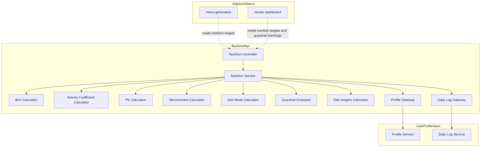
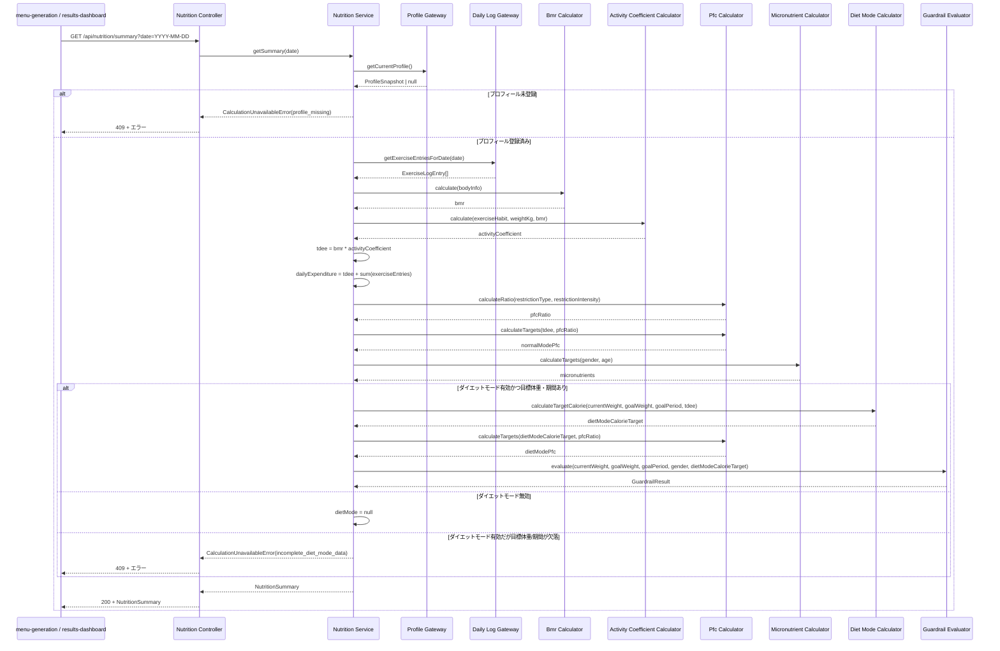
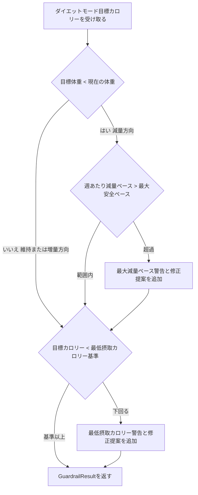
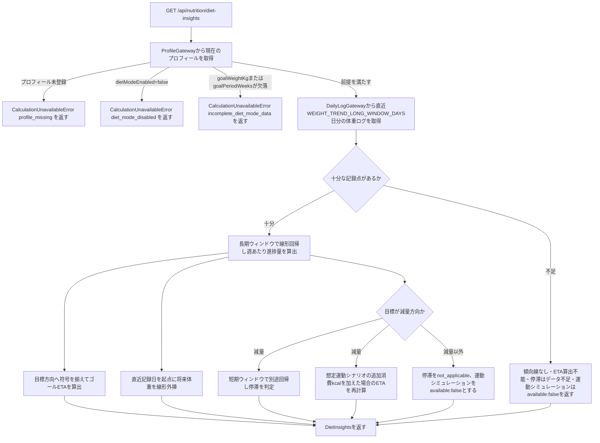

# Technical Design: nutrition-engine

## Overview

本機能は、栄養管理Webアプリケーションの栄養目標値計算エンジンである。`user-profile` が保持するプロフィール（身体情報・運動習慣詳細・食事制限設定・ダイエットモード目標）と日次ログ（当日の追加運動記録）を入力として読み取り、活動係数・BMR・TDEE・当日消費カロリー・PFCバランス・主要な微量栄養素の目標値を決定論的な計算式で算出する。ダイエットモードが有効な場合は、目標体重・目標達成期間から必要な1日あたりの目標カロリー・PFCを逆算し、安全ガードレール（最低摂取カロリー基準・最大減量ペース上限）に抵触する場合は警告と修正提案を付加する。また、ダイエットモードが有効な場合は、`user-profile` の日次ログに記録された体重の時系列からの傾向分析（線形回帰）・目標体重到達見込み週数（ゴールETA）の算出・減量停滞の検知・運動併用シミュレーションも算出する（roadmap.mdのBoundary Strategyにより、表示専用の `results-dashboard` ではなく本specがこれらの導出を担う）。

**Purpose**: LLM等の非決定的な手段を用いず、決定論的な計算式のみで栄養目標値を算出し、`menu-generation`（献立生成の制約条件）および `results-dashboard`（結果表示）が利用できる形式で提供する。
**Users**: アプリを利用する唯一の利用者本人。直接この機能を操作することはなく、`menu-generation` と `results-dashboard` が本specの提供するAPIを介して間接的に利用する。
**Impact**: greenfieldプロジェクトの2番目のspecであり、新規にバックエンドの計算モジュール群とAPIエンドポイントを追加する。`user-profile` が構築した既存のFastifyアプリ・monorepo構成に追加する形で実装し、新規のデータベーステーブルは作成しない（本specは自身の永続化ストアを持たないステートレスな計算エンジンである）。

### Goals
- `user-profile` の運動習慣データから、利用者に活動レベルを直接選択させることなく活動係数を算出する
- BMR（Mifflin-St Jeor式 / Katch-McArdle式）・TDEE・当日消費カロリーを決定論的な計算式で算出する
- 通常モードのPFCバランス・主要な微量栄養素目標値を算出し、食事制限設定（タイプ×強度）に応じてPFC比率を調整する
- ダイエットモードの目標カロリー・目標PFCを目標体重・目標達成期間から逆算し、安全ガードレール（最低摂取カロリー基準・最大減量ペース上限）に抵触する場合は警告と修正提案を提供する
- ダイエットモードにおける体重推移の傾向分析・目標体重到達見込み週数（ゴールETA）・減量停滞の検知・運動併用シミュレーションを、`user-profile` の体重ログとダイエットモード目標データから算出する
- 同一の入力データに対して常に同一の結果を返す（決定論性の保証）

### Non-Goals
- プロフィールデータ・日次ログの入力・保存・更新（`user-profile` の責務）
- 献立の具体的な内容の生成、食品成分DBとの照合（`menu-generation` の責務）
- 算出結果の画面表示・グラフ描画・可視化（`results-dashboard` の責務）
- 栄養目標値算出へのLLM等の非決定的な手段の利用
- 複数利用者管理・認証・認可（将来拡張、本specでは未実装）
- ガードレール抵触時に算出値を自動的に安全な値へ書き換えること（警告と修正提案の提示に留め、最終判断は利用者に委ねる）

## Boundary Commitments

### This Spec Owns
- 活動係数の算出ロジック（`user-profile` の運動習慣データを入力とする導出式）
- BMR・TDEE・当日消費カロリーの計算式
- 通常モードのPFCバランス・主要な微量栄養素目標値の算出式、および食事制限設定（タイプ×強度）に応じたPFC比率調整テーブル
- ダイエットモードの目標カロリー・目標PFCの逆算式
- ダイエット安全ガードレール（最低摂取カロリー基準・最大減量ペース上限）の判定式と警告・修正提案の生成ロジック
- 体重ログの傾向分析（線形回帰による週あたり体重変化量の算出）・目標体重到達見込み週数（ゴールETA）の算出・減量停滞の検知・運動併用シミュレーションのロジック（減量方向の目標に対してのみ適用する方向判定を含む）
- これらの算出結果を提供するAPIコントラクト（`menu-generation` / `results-dashboard` 向け）

### Out of Boundary
- プロフィール・日次ログのスキーマ、検証ルール、永続化（`user-profile`）
- 献立の生成、食品成分DBとの照合、分量正規化（`menu-generation`）
- 算出結果のグラフ描画・ダッシュボードUI・警告の画面表示（`results-dashboard`）
- 認証・認可・複数ユーザーのデータ分離

### Allowed Dependencies
- `user-profile` が公開する `ProfileService.getProfile()` および `DailyLogService.getLog(date)` / `DailyLogService.getLogsInRange(from, to)` のService Interface（プロセス内の関数呼び出し。両specは同一Fastifyプロセス・同一`server`パッケージ内で動作するため、HTTP経由の自己呼び出しは行わない）。`getLogsInRange` は `user-profile` の design.md で日次ログ推移データの提供インターフェースとして既に確定済みであり（要件11.1-11.4）、本spec向けの新規追加を必要としない
- ランタイム基盤（Node.js、同一プロセス内のインメモリ計算のみ。新規のデータベーステーブルへの依存はない）
- 本spec自身が公開するAPI（`GET /api/nutrition/summary`, `GET /api/nutrition/diet-insights`）への `menu-generation` / `results-dashboard` からのアクセスは、「本specが公開する契約への外部からのアクセス」であり、本spec自身が依存する対象ではない

### Revalidation Triggers
- `user-profile` の運動習慣データ（`exercise_routine_entries` の列構成、`jobActivityLevel` / `commuteMethod` の選択肢）を変更した場合 → 本specの活動係数算出ロジックの再確認が必要
- `user-profile` の食事制限設定（`restrictionType` / `restrictionIntensity` の選択肢）を変更した場合 → 本specのPFC比率調整テーブルの再確認が必要
- `user-profile` のダイエットモード目標（`goalWeightKg` / `goalPeriodWeeks` の必須条件）を変更した場合 → 本specのダイエットモード逆算・ガードレール判定の再確認が必要
- `user-profile` の日次ログのスキーマまたは `DailyLogService.getLogsInRange` のレスポンス形式（体重フィールドの構成）を変更した場合 → 本specの体重推移分析ロジック（`DietInsightsCalculator`）の再確認が必要
- 本specが算出する `NutritionSummary` / `DietInsights` のレスポンス形式を変更した場合 → `menu-generation` の入力契約および `results-dashboard` の表示ロジックの両方に影響するため両specの再確認が必要（`DietInsights` は特に `results-dashboard` の体重推移グラフ・目標達成予測・停滞期アドバイス・運動併用シミュレーション表示に直結する）
- 安全ガードレールの閾値（最低摂取カロリー・最大減量ペース）を変更した場合 → `results-dashboard` の警告表示文言に影響する可能性がある

## Architecture

### Architecture Pattern & Boundary Map

**選定パターン**: レイヤードアーキテクチャ（Route → Service → 計算モジュール群）。`user-profile` と同一の設計言語を踏襲し、本spec固有の計算ロジックは独立した純粋関数モジュールとして分離する（詳細は `research.md` の Architecture Pattern Evaluation を参照）。



**Architecture Integration**:
- 選定パターン: レイヤードアーキテクチャ（依存方向 定数/型 → 計算モジュール群 → Service → Controller）
- ドメイン境界: 本specは単一のドメイン「栄養計算（Nutrition Calculation）」として扱う。`Profile` 集約や `DailyLog` 集約を所有せず、`ProfileGateway` / `DailyLogGateway` という狭いポート経由でのみ読み取りアクセスする
- 新規コンポーネントの理由: 本spec固有の計算ロジック（活動係数・BMR・TDEE・PFC・微量栄養素・ダイエットモード逆算・ガードレール）はいずれも `user-profile` に存在しない新規責務であり、全コンポーネントが新規作成される
- 境界順守: `NutritionController` はHTTPの関心事のみを扱う。計算式・業務ルールは各計算モジュール（`BmrCalculator` 等）に閉じ込め、`NutritionService` はそれらのオーケストレーションのみを担う。`ProfileGateway` / `DailyLogGateway` は `user-profile` の公開Service Interfaceの呼び出しのみを行い、その内部実装（Repository構造等）には依存しない

### Technology Stack

| Layer | Choice / Version | Role in Feature | Notes |
|-------|------------------|------------------|-------|
| Backend | Node.js 22 LTS + Fastify 5 + TypeScript 5 | `GET /api/nutrition/summary` のHTTPハンドリング、`user-profile` と同一プロセス上での計算実行 | `user-profile` の `design.md` で確定済みのスタックをそのまま踏襲（再選定なし） |
| Validation | Zod 4 | クエリパラメータ（`date`）の検証、レスポンス型の推論 | `shared` パッケージに `nutrition.schema.ts` を追加し、`profile.schema.ts` / `daily-log.schema.ts` と同様の方式で型を共有する |
| Data / Storage | なし（新規テーブルなし） | 本specは自身の永続化ストアを持たない。微量栄養素の基準値のみ、コード内の静的参照データとして保持する | 計算のたびに `user-profile` から最新のプロフィール・日次ログを読み取るため、キャッシュや独自の永続化は不要（要件13.4の「更新後のデータを反映」を自然に満たす） |
| Infrastructure / Runtime | npm workspaces monorepo（既存の `server` / `shared` パッケージに追加） | `server/src/nutrition/` ディレクトリとして追加実装。フロントエンド（`web`パッケージ）への追加は行わない | 本specはUIを持たない（`results-dashboard` の責務）ため `web` パッケージへの変更はない |

## File Structure Plan

### Directory Structure
```
server/
├── src/
│   ├── nutrition/
│   │   ├── nutrition.routes.ts              # /api/nutrition ルーティング（Controller相当）
│   │   ├── nutrition.service.ts             # 計算モジュール群のオーケストレーション
│   │   ├── bmr.calculator.ts                # Mifflin-St Jeor / Katch-McArdle
│   │   ├── activity-coefficient.calculator.ts # 運動習慣データからの活動係数算出
│   │   ├── pfc.calculator.ts                # PFC比率調整・グラム換算
│   │   ├── micronutrient.calculator.ts      # 微量栄養素目標値のルックアップ
│   │   ├── micronutrient-reference.data.ts  # 性別×年齢区分ごとの基準値（静的参照データ）
│   │   ├── diet-mode.calculator.ts          # ダイエットモードの目標カロリー逆算
│   │   ├── guardrail.evaluator.ts           # 最低摂取カロリー・最大減量ペースの判定と修正提案生成
│   │   ├── diet-insights.calculator.ts      # 体重推移傾向・ゴールETA・停滞検知・運動併用シミュレーション
│   │   ├── profile.gateway.ts               # ProfileService.getProfile() の薄いラッパー
│   │   ├── daily-log.gateway.ts             # DailyLogService.getLog(date) / getLogsInRange(from, to) の薄いラッパー
│   │   └── constants.ts                     # 全ての名前付き定数（係数表・MET値・閾値等）を集約
│   └── app.ts                               # （変更）nutrition ルートの登録を追加
└── package.json

shared/
├── src/
│   └── nutrition.schema.ts                  # Zodスキーマ + 推論型（NutritionSummary, PfcRatio 等）
└── package.json
```

### Modified Files
- `server/src/app.ts`: `nutrition.routes.ts` のルート登録を追加する（`user-profile` の `profile.routes.ts` / `daily-log.routes.ts` の登録と並列に追加するのみで、既存のプロフィール・日次ログのルーティングには変更を加えない）

## System Flows

### 栄養目標値の算出フロー


### ガードレール判定フロー


- 減量方向以外（維持・増量）の場合は最大減量ペースのガードレールを適用しない（要件11.3）。最低摂取カロリーのガードレールは方向に関わらず常に評価する（要件10.1-10.3は方向を限定していない）
- 両方に抵触した場合、両方の警告と対応する修正提案をそれぞれ独立に生成する（要件11.4）

### ダイエットインサイト算出フロー


- 目標到達見込み週数（ゴールETA）は減量・維持・増量のいずれの方向でも算出する（`DietModeCalculator`と同様、単一の式が全方向をカバーする）。停滞判定・運動併用シミュレーションは減量方向（現在の体重が目標体重を上回る）の場合のみ評価し、それ以外は`not_applicable` / `available:false`を返す（要件15.1-15.3, 16.1-16.2, 17.1-17.2）
- 体重ログの記録点が不足する場合、傾向線・将来予測・ゴールETA・停滞判定・運動併用シミュレーションのいずれも算出せず、データ不足を表す結果を返す（要件14.5, 15.4, 16.5, 17.5）

## Requirements Traceability

| Requirement | Summary | Components | Interfaces | Flows |
|-------------|---------|------------|------------|-------|
| 1.1-1.5 | 運動習慣データからの活動係数算出 | ActivityCoefficientCalculator, NutritionService | `ActivityCoefficientCalculator.calculate` | 栄養目標値の算出フロー |
| 2.1-2.5 | BMRの算出 | BmrCalculator, NutritionService | `BmrCalculator.calculate` | 栄養目標値の算出フロー |
| 3.1-3.3 | TDEEの算出 | NutritionService | `NutritionService.getSummary` | 栄養目標値の算出フロー |
| 4.1-4.3 | 当日の消費カロリーの算出 | NutritionService, DailyLogGateway | `DailyLogGateway.getExerciseEntriesForDate` | 栄養目標値の算出フロー |
| 5.1-5.3 | 通常モードのPFCバランス目標算出 | PfcCalculator, NutritionService | `PfcCalculator.calculateTargets` | 栄養目標値の算出フロー |
| 6.1-6.5 | 通常モードの微量栄養素目標算出（喫煙・飲酒による調整を含む） | MicronutrientCalculator | `MicronutrientCalculator.calculateTargets` | 栄養目標値の算出フロー |
| 7.1-7.5 | 食事制限設定に応じたPFC比率調整 | PfcCalculator | `PfcCalculator.calculateRatio` | 栄養目標値の算出フロー |
| 8.1-8.3 | ダイエットモードの目標カロリー逆算 | DietModeCalculator, NutritionService | `DietModeCalculator.calculateTargetCalorie` | 栄養目標値の算出フロー |
| 9.1-9.2 | ダイエットモードの目標PFC算出 | PfcCalculator, NutritionService | `PfcCalculator.calculateTargets` | 栄養目標値の算出フロー |
| 10.1-10.3 | 最低摂取カロリー基準によるガードレール | GuardrailEvaluator | `GuardrailEvaluator.evaluate` | ガードレール判定フロー |
| 11.1-11.4 | 最大減量ペースによるガードレール | GuardrailEvaluator | `GuardrailEvaluator.evaluate` | ガードレール判定フロー |
| 12.1-12.2 | プロフィール未登録・必須データ欠損時の挙動 | NutritionService, ProfileGateway | `NutritionService.getSummary` | 栄養目標値の算出フロー |
| 13.1-13.4 | 計算の決定論性・シングルユーザー運用 | NutritionService, NutritionController | `GET /api/nutrition/summary` | 栄養目標値の算出フロー |
| 14.1-14.6 | 体重推移の傾向分析と将来予測 | DietInsightsCalculator, NutritionService, DailyLogGateway | `NutritionService.getDietInsights`, `DietInsightsCalculator.calculate` | ダイエットインサイト算出フロー |
| 15.1-15.4 | 目標体重到達見込み週数（ゴールETA）の算出 | DietInsightsCalculator, NutritionService | `DietInsightsCalculator.calculate` | ダイエットインサイト算出フロー |
| 16.1-16.5 | 減量停滞の検知 | DietInsightsCalculator | `DietInsightsCalculator.calculate` | ダイエットインサイト算出フロー |
| 17.1-17.5 | 運動併用シミュレーション | DietInsightsCalculator | `DietInsightsCalculator.calculate` | ダイエットインサイト算出フロー |

## Components and Interfaces

| Component | Domain/Layer | Intent | Req Coverage | Key Dependencies (P0/P1) | Contracts |
|-----------|--------------|--------|---------------|---------------------------|-----------|
| NutritionController | API | `/api/nutrition/summary`, `/api/nutrition/diet-insights` のHTTPハンドリング | 12.1, 12.2, 13.1-13.4, 14.6 | NutritionService (P0) | API |
| NutritionService | Domain | 計算モジュール群のオーケストレーションと欠損データ判定 | 3.1-3.3, 4.1-4.3, 12.1, 12.2, 13.4, 14.1, 14.2 | 各計算モジュール (P0), ProfileGateway (P0), DailyLogGateway (P0) | Service |
| BmrCalculator | Domain | BMR算出（Mifflin-St Jeor / Katch-McArdle） | 2.1-2.5 | なし（純粋関数） | Service |
| ActivityCoefficientCalculator | Domain | 運動習慣データからの活動係数算出 | 1.1-1.5 | なし（純粋関数） | Service |
| PfcCalculator | Domain | PFC比率調整とグラム/カロリー換算 | 5.1-5.3, 7.1-7.5, 9.1-9.2 | なし（純粋関数） | Service |
| MicronutrientCalculator | Domain | 微量栄養素目標値のルックアップ、喫煙・飲酒習慣による調整 | 6.1-6.5 | 静的参照データ (P1) | Service |
| DietModeCalculator | Domain | ダイエットモード目標カロリーの逆算 | 8.1-8.3 | なし（純粋関数） | Service |
| GuardrailEvaluator | Domain | 安全ガードレールの判定と修正提案生成 | 10.1-10.3, 11.1-11.4 | なし（純粋関数） | Service |
| DietInsightsCalculator | Domain | 体重推移傾向・ゴールETA・停滞検知・運動併用シミュレーションの算出 | 14.3-14.6, 15.1-15.4, 16.1-16.5, 17.1-17.5 | なし（純粋関数、constants.tsの既存定数を参照） | Service |
| ProfileGateway | Data/Port | `user-profile` のProfileServiceへの狭いアクセスポート | 1.3, 2.4, 12.1, 12.2 | ProfileService (P0, `user-profile` spec) | Service |
| DailyLogGateway | Data/Port | `user-profile` のDailyLogServiceへの狭いアクセスポート | 4.1-4.3, 14.1 | DailyLogService (P0, `user-profile` spec) | Service |

### Domain: Nutrition Calculation

#### NutritionController

| Field | Detail |
|-------|--------|
| Intent | `GET /api/nutrition/summary`, `GET /api/nutrition/diet-insights` のHTTPハンドリング |
| Requirements | 12.1, 12.2, 13.1, 13.2, 13.3, 13.4, 14.6 |

**Responsibilities & Constraints**
- クエリパラメータ `date`（省略時は当日）をZodスキーマで検証し、`NutritionService.getSummary` に委譲する
- `/api/nutrition/diet-insights` も同じ `date` クエリスキーマで検証し、`NutritionService.getDietInsights` に委譲する
- `CalculationUnavailableError` を409、Zod検証エラーを400、その他のサーバーエラーを500として応答する
- 認証・認可の機構を持たず、単一の利用者による利用を前提とする（13.3）

**Dependencies**
- Outbound: NutritionService — 算出結果の取得 (P0)

**Contracts**: Service [ ] / API [x] / Event [ ] / Batch [ ] / State [ ]

##### API Contract

| Method | Endpoint | Request | Response | Errors |
|--------|----------|---------|----------|--------|
| GET | /api/nutrition/summary?date={YYYY-MM-DD} | - （`date`省略時は当日日付を使用） | `NutritionSummary` | 400（日付形式不正）, 409（`CalculationUnavailableError`）, 500 |
| GET | /api/nutrition/diet-insights?date={YYYY-MM-DD} | - （`date`省略時は当日日付を使用。算出基準日） | `DietInsights` | 400（日付形式不正）, 409（`CalculationUnavailableError`: `profile_missing` / `diet_mode_disabled` / `incomplete_diet_mode_data`）, 500 |

#### NutritionService

| Field | Detail |
|-------|--------|
| Intent | プロフィール・日次ログの取得、各計算モジュールのオーケストレーション、欠損データ時の早期終了判定 |
| Requirements | 3.1, 3.2, 3.3, 4.1, 4.2, 4.3, 12.1, 12.2, 13.4 |

**Responsibilities & Constraints**
- `ProfileGateway.getCurrentProfile()` が `null` を返す場合、いかなる計算も行わずに `CalculationUnavailableError(profile_missing)` を返す（12.1）
- BMR算出にはプロフィールの身長・体重・年齢・性別・体脂肪率を用い、活動係数算出には運動習慣データを用いる。両者が算出できた場合のみ `TDEE = BMR × 活動係数` を計算する（3.1, 3.2）
- 当日消費カロリーは `TDEE + DailyLogGateway.getExerciseEntriesForDate(date)` の想定消費カロリー合計として算出し、指定日付以外のログを含めない（4.1-4.3）
- `dietModeEnabled` が `true` かつ `goalWeightKg` / `goalPeriodWeeks` のいずれかが欠落している場合、ダイエットモードの算出を行わず `CalculationUnavailableError(incomplete_diet_mode_data)` を返す（12.2）。`dietModeEnabled` が `false` の場合は `dietMode: null` を含む通常モードの結果のみを返す
- 呼び出しのたびに `ProfileGateway` / `DailyLogGateway` から最新の値を取得し、結果をキャッシュしない。これにより、直前にプロフィールや日次ログが更新されていれば次回の算出要求に反映される（13.4）
- `getDietInsights(date)` は `ProfileGateway.getCurrentProfile()` を呼び出し、`null` の場合は `CalculationUnavailableError(profile_missing)` を返す。プロフィールが存在しても `dietModeEnabled` が `false` の場合は `CalculationUnavailableError(diet_mode_disabled)` を、`dietModeEnabled` が `true` で `goalWeightKg` または `goalPeriodWeeks` が欠落している場合は `CalculationUnavailableError(incomplete_diet_mode_data)` を返す（14.2）
- 上記の前提を満たす場合、`DailyLogGateway.getWeightLogsInRange` で `date` から遡って `WEIGHT_TREND_LONG_WINDOW_DAYS` 日分の体重ログを取得し、現在の体重・目標体重とともに `DietInsightsCalculator.calculate` に委譲する（14.1, 14.3-14.6, 15, 16, 17）

**Dependencies**
- Outbound: ProfileGateway — 現在のプロフィール取得 (P0)
- Outbound: DailyLogGateway — 指定日付の追加運動ログ取得、体重ログの日付範囲取得 (P0)
- Outbound: BmrCalculator, ActivityCoefficientCalculator, PfcCalculator, MicronutrientCalculator, DietModeCalculator, GuardrailEvaluator, DietInsightsCalculator — 各計算の実行 (P0)

**Contracts**: Service [x] / API [ ] / Event [ ] / Batch [ ] / State [ ]

##### Service Interface
```typescript
type IsoDate = string; // "YYYY-MM-DD"

type CalculationUnavailableReason =
  | "profile_missing"
  | "incomplete_exercise_data"
  | "incomplete_diet_mode_data"
  | "diet_mode_disabled";

interface CalculationUnavailableError {
  type: "calculation_unavailable";
  reason: CalculationUnavailableReason;
  message: string;
}

interface NutritionSummary {
  computedAt: string; // ISO 8601、算出時刻（永続化されない）
  bmr: number;
  activityCoefficient: number;
  tdee: number;
  dailyExpenditure: {
    date: IsoDate;
    value: number;
  };
  normalMode: {
    calorieTarget: number;
    pfcRatio: PfcRatio;
    pfc: PfcTargets;
    micronutrients: MicronutrientTargets;
  };
  dietMode: {
    calorieTarget: number;
    pfcRatio: PfcRatio;
    pfc: PfcTargets;
    guardrails: GuardrailResult;
  } | null;
}

interface NutritionService {
  getSummary(date: IsoDate): Result<NutritionSummary, CalculationUnavailableError>;
  getDietInsights(date: IsoDate): Result<DietInsights, CalculationUnavailableError>;
}
```
- Preconditions: `date` は `YYYY-MM-DD` 形式の妥当な日付である（Controller層のZod検証を通過済み）
- Postconditions: 成功時は `NutritionSummary`（または `DietInsights`）を返す。`user-profile` 側のデータを変更しない（読み取り専用）
- Invariants: 同一の `date` と同一のプロフィール・日次ログ状態に対して、`getSummary` / `getDietInsights` は常に同一の結果を返す（13.1, 13.2）

#### BmrCalculator

| Field | Detail |
|-------|--------|
| Intent | Mifflin-St Jeor式 / Katch-McArdle式によるBMR算出 |
| Requirements | 2.1, 2.2, 2.3, 2.4, 2.5 |

**Responsibilities & Constraints**
- `bodyFatPct` が非nullの場合はKatch-McArdle式、nullの場合はMifflin-St Jeor式を用いる（2.1, 2.2）
- Mifflin-St Jeor式の性別オフセットは `constants.ts` の `MIFFLIN_GENDER_OFFSET = { male: 5, female: -161, undisclosed: -78 }` を用いる（2.3）。`undisclosed` は男女オフセットの平均値であり、性別未回答でも算出可能にする
- `heightCm` / `weightKg` / `age` のいずれかが欠落している場合はエラーを返す（2.4）。この検証は `NutritionService` が `ProfileGateway` から取得した `ProfileSnapshot` の必須項目チェックとして行う（`user-profile` 側で必須項目として保証済みのため、本コンポーネントは型レベルで非null値のみを受け取る）
- 算出結果が正の数値であることを内部でアサートする（2.5）

**Dependencies**
- なし（外部依存を持たない純粋関数）

**Contracts**: Service [x] / API [ ] / Event [ ] / Batch [ ] / State [ ]

##### Service Interface
```typescript
type Gender = "female" | "male" | "undisclosed";

interface BmrInput {
  weightKg: number;   // > 0
  heightCm: number;   // > 0
  age: number;        // > 0
  gender: Gender;
  bodyFatPct: number | null; // 0-100、非nullならKatch-McArdle式を使用
}

interface BmrCalculator {
  calculate(input: BmrInput): number; // kcal/day、常に正の数値
}
```
- 計算式:
  - Katch-McArdle（`bodyFatPct !== null`）: `leanBodyMassKg = weightKg × (1 − bodyFatPct / 100)`、`bmr = 370 + 21.6 × leanBodyMassKg`
  - Mifflin-St Jeor（`bodyFatPct === null`）: `bmr = 10 × weightKg + 6.25 × heightCm − 5 × age + MIFFLIN_GENDER_OFFSET[gender]`

#### ActivityCoefficientCalculator

| Field | Detail |
|-------|--------|
| Intent | 運動習慣データ（お仕事中の活動度・通勤手段・平均歩数・週間運動量）からの活動係数算出 |
| Requirements | 1.1, 1.2, 1.3, 1.4, 1.5 |

**Responsibilities & Constraints**
- 利用者への活動レベルの直接選択を要求せず、`user-profile` の運動習慣データのみから算出する（1.1, 1.2）
- `jobActivityLevel` をベース係数とし、`commuteMethod`・`averageDailySteps`・`exerciseRoutine` を加算補正として合成する（詳細は `research.md` の「活動係数の算出式」を参照）
- `averageDailySteps` が `null`、または `exerciseRoutine` が空配列の場合、それぞれの補正をゼロとして扱う（1.4）
- 算出結果を `[1.20, 1.90]` の範囲にクランプする（1.5）

**Dependencies**
- なし（外部依存を持たない純粋関数。ただし週間運動量のMET換算に `weightKg` と `bmr` を入力として要求する）

**Contracts**: Service [x] / API [ ] / Event [ ] / Batch [ ] / State [ ]

##### Service Interface
```typescript
type JobActivityLevel = "mostly_sedentary" | "mixed" | "mostly_active";
type CommuteMethod = "walk_or_bike" | "transit" | "car";
type ExerciseIntensity = "light" | "moderate" | "vigorous";

interface ExerciseRoutineEntry {
  scene: "commute" | "work" | "after_work" | "holiday" | "other";
  content: string;
  frequencyPerWeek: number; // > 0
  durationMinutes: number;  // > 0
  intensity: ExerciseIntensity;
}

interface ActivityCoefficientInput {
  jobActivityLevel: JobActivityLevel;
  commuteMethod: CommuteMethod;
  averageDailySteps: number | null;
  exerciseRoutine: ExerciseRoutineEntry[];
  weightKg: number;
  bmr: number;
}

interface ActivityCoefficientCalculator {
  calculate(input: ActivityCoefficientInput): number; // 1.20-1.90 の範囲
}
```
- 計算式:
  ```
  BaseCoefficient(jobActivityLevel) =
    mostly_sedentary: 1.20 | mixed: 1.375 | mostly_active: 1.55

  CommuteAdjustment(commuteMethod) =
    walk_or_bike: +0.05 | transit: +0.025 | car: +0.00

  StepAdjustment(averageDailySteps) =
    null または < 5,000: +0.000
    5,000-7,499: +0.025
    7,500-9,999: +0.050
    10,000-12,499: +0.075
    >= 12,500: +0.100

  MET(intensity) = light: 3.0 | moderate: 4.5 | vigorous: 7.0

  weeklyExerciseKcal = Σ over exerciseRoutine rows [
    MET(row.intensity) × 3.5 × weightKg / 200 × row.durationMinutes × row.frequencyPerWeek
  ]

  ExerciseAdjustment = (weeklyExerciseKcal / 7) / bmr

  ActivityCoefficient = clamp(
    BaseCoefficient + CommuteAdjustment + StepAdjustment + ExerciseAdjustment,
    1.20, 1.90
  )
  ```

#### PfcCalculator

| Field | Detail |
|-------|--------|
| Intent | 食事制限設定に応じたPFC比率調整と、目標カロリーに基づくグラム/カロリー換算 |
| Requirements | 5.1, 5.2, 5.3, 7.1, 7.2, 7.3, 7.4, 7.5, 9.1, 9.2 |

**Responsibilities & Constraints**
- ベースのPFC比率（制限なし/カロリー制限のみ、または強度未適用時）を `protein: 0.15, fat: 0.25, carb: 0.60` とする（5.1）
- `restrictionType` × `restrictionIntensity` の組み合わせに応じてベース比率を調整する（7.1, 7.2）。調整テーブルは以下の通り

  | restrictionType | intensity | protein | fat | carb |
  |---|---|---|---|---|
  | none | - | 0.15 | 0.25 | 0.60 |
  | calorie_only | - | 0.15 | 0.25 | 0.60 |
  | low_carb | light | 0.20 | 0.35 | 0.45 |
  | low_carb | standard | 0.25 | 0.40 | 0.35 |
  | low_carb | strict | 0.30 | 0.50 | 0.20 |
  | low_fat | light | 0.18 | 0.20 | 0.62 |
  | low_fat | standard | 0.20 | 0.15 | 0.65 |
  | low_fat | strict | 0.20 | 0.10 | 0.70 |
  | high_protein | light | 0.25 | 0.25 | 0.50 |
  | high_protein | standard | 0.30 | 0.25 | 0.45 |
  | high_protein | strict | 0.35 | 0.25 | 0.40 |

- `restrictionType` が `none` または `calorie_only` の場合、`restrictionIntensity` の値に関わらずベース比率を維持する（7.3。「カロリー制限のみ」はカロリー総量のみを制約する方針のため比率調整対象外とする）
- グラム換算はAtwater係数（たんぱく質4kcal/g、脂質9kcal/g、炭水化物4kcal/g）を用いる
- 「その他食事制限」の自由記述（`restrictionNotes`）はPFC比率の算出に使用しない（7.4。本コンポーネントの入力に含めない）
- 算出したPFC目標量をカロリーに換算した合計が、入力された目標カロリーと一致することを保証する（丸め誤差は±1kcalまで許容、5.3, 7.5）

**Dependencies**
- なし（外部依存を持たない純粋関数）

**Contracts**: Service [x] / API [ ] / Event [ ] / Batch [ ] / State [ ]

##### Service Interface
```typescript
type RestrictionType = "none" | "low_carb" | "low_fat" | "high_protein" | "calorie_only";
type RestrictionIntensity = "light" | "standard" | "strict";

interface PfcRatio {
  proteinPct: number; // 0-1、3値の合計は1
  fatPct: number;
  carbPct: number;
}

interface PfcTargets {
  proteinG: number;
  fatG: number;
  carbG: number;
  proteinKcal: number;
  fatKcal: number;
  carbKcal: number;
}

interface PfcCalculator {
  calculateRatio(restrictionType: RestrictionType, restrictionIntensity: RestrictionIntensity | null): PfcRatio;
  calculateTargets(calorieTarget: number, ratio: PfcRatio): PfcTargets;
}
```

#### MicronutrientCalculator

| Field | Detail |
|-------|--------|
| Intent | 性別・年齢に応じた主要な微量栄養素の目標摂取量のルックアップ、および喫煙・飲酒習慣に応じた調整 |
| Requirements | 6.1, 6.2, 6.3, 6.4, 6.5 |

**Responsibilities & Constraints**
- 対象栄養素: ビタミンA・ビタミンD・ビタミンB1・ビタミンB2・ビタミンC・カルシウム・鉄・食物繊維・食塩相当量（上限）の9項目（6.1）
- 性別（男性/女性/回答しない）×年齢区分（18-29 / 30-49 / 50-64 / 65-74 / 75以上）で区分された静的参照テーブル（`micronutrient-reference.data.ts`）をルックアップする（6.2）。データソースは「日本人の食事摂取基準」（厚生労働省）とし、実データは実装時に一次資料から転記する（`research.md` の Design Decisions を参照）
- 性別が「回答しない」の場合、当該年齢区分の男女基準値のうち大きい方（より多くの摂取を推奨する方）を採用する
- `smokingHabit`が`"smoker"`（`user-profile`の`SmokingHabit`型、UI表示「吸う」）の場合、参照テーブルから得たビタミンC目標に`SMOKING_VITAMIN_C_ADDITION_MG`（固定加算量。喫煙による酸化ストレス増大・ビタミンC代謝回転の増加を踏まえた値。`constants.ts`に定義）を加算する（6.3）
- `alcoholHabit`が`"frequent"`（`user-profile`の`AlcoholHabit`型、UI表示「よく飲む」）の場合、参照テーブルから得たビタミンB1目標に`HEAVY_DRINKING_VITAMIN_B1_ADDITION_MG`（固定加算量。慢性的な飲酒によるチアミン吸収阻害・必要量増加を踏まえた値。`constants.ts`に定義）を加算する（6.4）。`"occasional"`（UI表示「たまに」）・`"none"`（UI表示「しない」）・`null`の場合は調整しない（6.5）
- 喫煙・飲酒による加算は、量（本数・杯数）に応じた用量反応関係が確立されていないため、いずれも固定加算とし、頻度区分（吸う/吸わない、しない/たまに/よく飲む）のみを入力とする。より精緻な調整（本数・量ベース）は行わない旨を`research.md`に明記する

**Dependencies**
- Outbound: `micronutrient-reference.data.ts`（静的参照データ） (P1)

**Contracts**: Service [x] / API [ ] / Event [ ] / Batch [ ] / State [ ]

##### Service Interface
```typescript
type SmokingHabit = "non_smoker" | "smoker";
type AlcoholHabit = "none" | "occasional" | "frequent";

interface MicronutrientTargets {
  vitaminAUg: number;   // µg RAE
  vitaminDUg: number;   // µg
  vitaminB1Mg: number;  // mg
  vitaminB2Mg: number;  // mg
  vitaminCMg: number;   // mg
  calciumMg: number;    // mg
  ironMg: number;       // mg
  fiberG: number;       // g
  saltEquivalentUpperLimitG: number; // g（上限目安）
}

interface MicronutrientCalculator {
  calculateTargets(gender: Gender, age: number, smokingHabit: SmokingHabit | null, alcoholHabit: AlcoholHabit | null): MicronutrientTargets;
}
```

#### DietModeCalculator

| Field | Detail |
|-------|--------|
| Intent | 目標体重・目標達成期間からの1日あたり目標カロリーの逆算 |
| Requirements | 8.1, 8.2, 8.3 |

**Responsibilities & Constraints**
- `dietModeEnabled` が `true` の場合のみ呼び出される（`NutritionService` 側で判定、8.2は本コンポーネントを呼び出さないことで表現する）
- 体重1kgあたり7700kcalの静的換算定数（`ENERGY_DENSITY_KCAL_PER_KG`）を用いて、目標体重差分を日々のカロリー収支に変換する（8.1）
- 目標体重が現在の体重以上の場合、`weightDeltaKg` が0以下になり、結果として維持または増量方向（TDEE以上）の目標カロリーが自然に算出される（8.3。方向判定のための特別分岐は不要で、同一の式がそのまま両方向をカバーする）

**Dependencies**
- なし（外部依存を持たない純粋関数）

**Contracts**: Service [x] / API [ ] / Event [ ] / Batch [ ] / State [ ]

##### Service Interface
```typescript
interface DietModeCalculator {
  calculateTargetCalorie(
    currentWeightKg: number,
    goalWeightKg: number,
    goalPeriodWeeks: number,
    tdee: number
  ): number;
}
```
- 計算式:
  ```
  dailyCalorieAdjustment = (currentWeightKg - goalWeightKg) * ENERGY_DENSITY_KCAL_PER_KG / (goalPeriodWeeks * 7)
  targetCalorie = tdee - dailyCalorieAdjustment
  ```
  （`currentWeightKg > goalWeightKg` の減量方向では `dailyCalorieAdjustment` が正となり `targetCalorie < tdee`、`currentWeightKg <= goalWeightKg` の維持・増量方向では0以下となり `targetCalorie >= tdee` となる）

#### GuardrailEvaluator

| Field | Detail |
|-------|--------|
| Intent | 最低摂取カロリー基準・最大減量ペース上限の判定と警告・修正提案の生成 |
| Requirements | 10.1, 10.2, 10.3, 11.1, 11.2, 11.3, 11.4 |

**Responsibilities & Constraints**
- 性別に応じた最低摂取カロリー基準 `MIN_CALORIE_FLOOR = { male: 1500, female: 1200, undisclosed: 1500 }` を保持する（10.1）
- 体重に対する週あたりの最大安全減量ペースを `MAX_WEEKLY_LOSS_PACE_RATIO = 0.01`（現在の体重の1%/週）として保持する（11.1）
- `currentWeightKg > goalWeightKg`（減量方向）の場合のみ最大減量ペースのガードレールを評価する（11.3）。維持・増量方向では当該ガードレールをスキップする
- 最低摂取カロリーのガードレールは方向に関わらず常に評価する（10.2, 10.3）
- 抵触時は算出済みの目標カロリー・PFCを変更せず、警告フラグと少なくとも1件の修正提案（期間延長案・目標体重緩和案）を返す（10.2, 10.3, 11.2）
- 両方のガードレールに抵触した場合、それぞれ独立した警告と修正提案を返す（11.4）

**Dependencies**
- なし（外部依存を持たない純粋関数）

**Contracts**: Service [x] / API [ ] / Event [ ] / Batch [ ] / State [ ]

##### Service Interface
```typescript
type GuardrailWarningType = "min_calorie_floor" | "max_weekly_loss_pace";
type GuardrailSuggestionKind = "extend_period" | "ease_goal_weight";

interface GuardrailSuggestion {
  kind: GuardrailSuggestionKind;
  suggestedGoalPeriodWeeks?: number;
  suggestedGoalWeightKg?: number;
}

interface GuardrailWarning {
  type: GuardrailWarningType;
  message: string;
  suggestions: GuardrailSuggestion[]; // 常に1件以上
}

interface GuardrailResult {
  warnings: GuardrailWarning[]; // 抵触なしの場合は空配列
}

interface GuardrailEvaluator {
  evaluate(
    currentWeightKg: number,
    goalWeightKg: number,
    goalPeriodWeeks: number,
    gender: Gender,
    dietModeTargetCalorie: number
  ): GuardrailResult;
}
```
- 判定式:
  ```
  isLossDirection = currentWeightKg > goalWeightKg
  maxSafeWeeklyLossKg = currentWeightKg * MAX_WEEKLY_LOSS_PACE_RATIO
  weeklyPaceKg = (currentWeightKg - goalWeightKg) / goalPeriodWeeks   // isLossDirection時のみ評価

  // 最大減量ペース警告（isLossDirection時のみ）
  if isLossDirection and weeklyPaceKg > maxSafeWeeklyLossKg:
    suggestedGoalPeriodWeeks = ceil((currentWeightKg - goalWeightKg) / maxSafeWeeklyLossKg)
    suggestedGoalWeightKg    = round(currentWeightKg - maxSafeWeeklyLossKg * goalPeriodWeeks, 1)

  // 最低摂取カロリー警告（方向に関わらず評価）
  if dietModeTargetCalorie < MIN_CALORIE_FLOOR[gender]:
    // 同じ逆算式を「期間」または「目標体重」について解き直し、
    // dietModeTargetCalorie が MIN_CALORIE_FLOOR[gender] と等しくなる値を提案する
    suggestedGoalPeriodWeeks（期間延長案）, suggestedGoalWeightKg（目標体重緩和案）
  ```
  期間延長・目標体重緩和の提案値は、いずれも `DietModeCalculator` と同一の逆算式を目標変数について解き直すことで得る（同じ数式の逆算であり、新たな計算モデルを導入しない）。

#### DietInsightsCalculator

| Field | Detail |
|-------|--------|
| Intent | 体重ログの時系列から、傾向線・将来予測・目標体重到達見込み週数（ゴールETA）・減量停滞の検知・運動併用シミュレーションを算出する |
| Requirements | 14.3, 14.4, 14.5, 14.6, 15.1, 15.2, 15.3, 15.4, 16.1, 16.2, 16.3, 16.4, 16.5, 17.1, 17.2, 17.3, 17.4, 17.5 |

**Responsibilities & Constraints**
- 傾向分析には直近 `WEIGHT_TREND_LONG_WINDOW_DAYS`（56日、8週間）の体重ログを長期ウィンドウとして用いる。停滞判定の短期比較には直近 `WEIGHT_TREND_SHORT_WINDOW_DAYS`（14日、2週間）を用いる。将来予測は `WEIGHT_PROJECTION_HORIZON_WEEKS`（4週間）分を外挿する。停滞判定の閾値は `PLATEAU_PACE_RATIO_THRESHOLD`（0.30）とし、短期ペースが長期ペースの30%を明確に下回った場合を停滞とする。運動併用シミュレーションの想定シナリオは `EXERCISE_SIMULATION_SCENARIO = { frequencyPerWeek: 3, durationMinutes: 30, intensity: "moderate" }` とする（いずれも `constants.ts` に名前付き定数として集約し、選定根拠は `research.md` を参照）
- 目標到達見込み週数（ゴールETA）は減量・維持・増量のいずれの方向でも算出する。`DietModeCalculator`（8.3）と同様、方向ごとの特別分岐を設けず、目標方向に符号を揃えた単一の式で全方向をカバーする（15.1, 15.2, 15.3）
- 現在の体重が目標体重を上回る（減量方向の）場合に限り、減量停滞の判定と運動併用シミュレーションを評価する。維持・増量方向（`GuardrailEvaluator`の11.3と同じ方向判定）ではこれらを評価せず、それぞれ`plateau: { status: "not_applicable" }` / `exerciseSimulation: { available: false }` を返す（16.1, 16.2, 17.1, 17.2）
- 体重が記録された日数が `WEIGHT_TREND_MIN_DATA_POINTS`（2件）未満、または最初と最後の記録日の間隔が `WEIGHT_TREND_MIN_SPAN_DAYS`（14日）未満の場合、傾向線・将来予測・ゴールETA・停滞判定・運動併用シミュレーションのいずれも算出せず、データ不足を表す結果を返す（14.5, 15.4, 16.5, 17.5）
- 運動併用シミュレーションのMET換算式は `ActivityCoefficientCalculator` の `ExerciseAdjustment` と同一の式形（`MET × 3.5 × weightKg / 200 × durationMinutes × frequencyPerWeek`）を用いるが、これは既存コンポーネントの呼び出しではなく、同一の広く知られた換算式を本コンポーネント内で独立に適用するものである。MET値は `constants.ts` の既存値（`moderate: 4.5`）を参照し、再定義しない（17.3）
- 追加運動による週あたり体重変化量への換算には、`DietModeCalculator` が用いる `ENERGY_DENSITY_KCAL_PER_KG`（7700kcal/kg）を `constants.ts` から参照し、本コンポーネント内で再定義しない（17.4。定数の二重管理を避けるため、値は`constants.ts`の単一箇所にのみ保持する）
- 決定論的な純粋関数として実装し、外部依存（Gateway等）を持たない。呼び出し元（`NutritionService`）が `DailyLogGateway` から取得した体重ログをそのまま入力として受け取る

**Dependencies**
- なし（外部依存を持たない純粋関数。`constants.ts` の `ENERGY_DENSITY_KCAL_PER_KG` および活動係数算出用のMET定数を参照する）

**Contracts**: Service [x] / API [ ] / Event [ ] / Batch [ ] / State [ ]

##### Service Interface
```typescript
// WeightLogPoint は DailyLogGateway で定義（本コンポーネントはそれをそのまま入力として受け取る）

interface WeightTrendPoint {
  date: IsoDate;
  weightKg: number;
}

interface WeightProjectionPoint {
  date: IsoDate;
  projectedWeightKg: number;
}

type GoalEtaResult =
  | { available: false } // データ不足時
  | { available: true; weeklyProgressKg: number; estimatedWeeksToGoal: number | null };

type PlateauStatus =
  | { status: "insufficient_data" }
  | { status: "not_applicable" }   // 維持・増量方向のため評価対象外
  | { status: "on_track" }
  | { status: "plateaued"; message: string };

type ExerciseSimulationResult =
  | { available: false } // データ不足、または維持・増量方向のため評価対象外
  | {
      available: true;
      scenarioLabel: string; // 例: "週3回・30分の運動を追加"
      dietOnlyWeeksToGoal: number | null;
      dietPlusExerciseWeeksToGoal: number | null;
    };

interface DietInsights {
  weightHistory: WeightTrendPoint[];
  weightProjection: WeightProjectionPoint[]; // データ不足時は空配列
  goalEta: GoalEtaResult;
  plateau: PlateauStatus;
  exerciseSimulation: ExerciseSimulationResult;
}

interface DietInsightsCalculator {
  calculate(
    weightLogs: WeightLogPoint[],  // asOfDateから遡ってWEIGHT_TREND_LONG_WINDOW_DAYS日分、日付昇順
    currentWeightKg: number,
    goalWeightKg: number,
    asOfDate: IsoDate
  ): DietInsights;
}
```
- 算出手順:
  ```
  points = weightLogs から weightKg が null でない点を日付昇順に抽出したもの

  // データ不足判定（14.5, 15.4, 16.5, 17.5）
  if points.length < WEIGHT_TREND_MIN_DATA_POINTS
     or (points[last].date - points[0].date in days) < WEIGHT_TREND_MIN_SPAN_DAYS:
    return { weightHistory: points, weightProjection: [], goalEta: { available: false },
             plateau: { status: "insufficient_data" }, exerciseSimulation: { available: false } }

  // 長期回帰（傾き→週あたり変化量）
  x_i = points[i].date から points[0].date までの経過日数、y_i = points[i].weightKg
  slopeKgPerDay = 最小二乗法による回帰直線の傾き（Σ((x_i - x̄)(y_i - ȳ)) / Σ((x_i - x̄)²)）
  weeklyRateOfChangeKg = slopeKgPerDay * 7   // 正: 増加傾向、負: 減少傾向

  // 目標方向（DietModeCalculatorと同じ考え方）
  directionSign = sign(currentWeightKg - goalWeightKg)  // +1: 減量方向, -1: 増量方向, 0: 到達済み
  weeklyProgressKg = directionSign === 0 ? 0 : directionSign * (-weeklyRateOfChangeKg)  // 目標方向への週あたり進捗、正が前進

  // ゴールETA（15.1, 15.2, 15.3）
  if directionSign === 0:
    goalEta = { available: true, weeklyProgressKg: 0, estimatedWeeksToGoal: 0 }
  else if weeklyProgressKg > 0:
    goalEta = { available: true, weeklyProgressKg,
                estimatedWeeksToGoal: abs(currentWeightKg - goalWeightKg) / weeklyProgressKg }
  else:
    goalEta = { available: true, weeklyProgressKg, estimatedWeeksToGoal: null }

  // 将来予測（14.4）
  weightProjection = 直近の記録日を起点にWEIGHT_PROJECTION_HORIZON_WEEKS週分、
                      週単位でweeklyRateOfChangeKgを累積加算した点列

  // 停滞判定（16.1-16.5。減量方向のみ評価）
  if directionSign !== +1:
    plateau = { status: "not_applicable" }
  else:
    shortPoints = points のうち直近WEIGHT_TREND_SHORT_WINDOW_DAYS日以内のもの
    if shortPoints.length < WEIGHT_TREND_MIN_DATA_POINTS:
      plateau = { status: "insufficient_data" }
    else:
      shortWeeklyProgressKg = shortPointsに対する同様の回帰・符号規則で算出した週あたり進捗
      plateau = shortWeeklyProgressKg < weeklyProgressKg * PLATEAU_PACE_RATIO_THRESHOLD
                  ? { status: "plateaued", message: "..." }
                  : { status: "on_track" }

  // 運動併用シミュレーション（17.1-17.5。減量方向のみ評価）
  if directionSign !== +1:
    exerciseSimulation = { available: false }
  else:
    weeklyBurnKcal = MET(EXERCISE_SIMULATION_SCENARIO.intensity) * 3.5 * currentWeightKg / 200
                      * EXERCISE_SIMULATION_SCENARIO.durationMinutes * EXERCISE_SIMULATION_SCENARIO.frequencyPerWeek
    additionalWeeklyProgressKg = weeklyBurnKcal / ENERGY_DENSITY_KCAL_PER_KG
    combinedWeeklyProgressKg = weeklyProgressKg + additionalWeeklyProgressKg
    exerciseSimulation = {
      available: true,
      scenarioLabel: "週3回・30分の運動を追加",
      dietOnlyWeeksToGoal: goalEta.estimatedWeeksToGoal,
      dietPlusExerciseWeeksToGoal: combinedWeeklyProgressKg > 0
        ? abs(currentWeightKg - goalWeightKg) / combinedWeeklyProgressKg
        : null
    }
  ```

#### ProfileGateway

| Field | Detail |
|-------|--------|
| Intent | `user-profile` の `ProfileService.getProfile()` への狭いアクセスポート |
| Requirements | 1.3, 2.4, 12.1, 12.2 |

**Responsibilities & Constraints**
- `user-profile` の `ProfileService.getProfile()` をプロセス内で呼び出し、本specが必要とするフィールドのみを含む `ProfileSnapshot` に射影する
- `user-profile` の内部実装（Repository層等）には依存しない

**Dependencies**
- Outbound: `user-profile` の `ProfileService`（Service Interface経由） (P0)

**Contracts**: Service [x] / API [ ] / Event [ ] / Batch [ ] / State [ ]

##### Service Interface
```typescript
interface ProfileSnapshot {
  heightCm: number;
  weightKg: number;
  age: number;
  gender: Gender;
  bodyFatPct: number | null;
  jobActivityLevel: JobActivityLevel;
  commuteMethod: CommuteMethod;
  averageDailySteps: number | null;
  exerciseRoutine: ExerciseRoutineEntry[];
  smokingHabit: SmokingHabit | null;
  alcoholHabit: AlcoholHabit | null;
  restrictionType: RestrictionType;
  restrictionIntensity: RestrictionIntensity | null;
  dietModeEnabled: boolean;
  goalWeightKg: number | null;
  goalPeriodWeeks: number | null;
}

interface ProfileGateway {
  getCurrentProfile(): ProfileSnapshot | null;
}
```
- `ProfileSnapshot` のフィールド名・型は `user-profile` の `Profile` インターフェース（`design.md` 参照）と完全に一致させ、変換・リネームを行わない

#### DailyLogGateway

| Field | Detail |
|-------|--------|
| Intent | `user-profile` の `DailyLogService.getLog(date)` / `getLogsInRange(from, to)` への狭いアクセスポート |
| Requirements | 4.1, 4.2, 4.3, 14.1 |

**Responsibilities & Constraints**
- 指定日付の `ExerciseLogEntry[]` のみを返す（体重・摂取カロリー等、本specが使用しないフィールドは呼び出し元に露出しない）
- 対象日付にログが存在しない場合は空配列を返す
- `getWeightLogsInRange(from, to)` は、`user-profile` の `DailyLogService.getLogsInRange(from, to)` が返す `DailyLogEntry[]` から `date` / `weightKg` のみを `WeightLogPoint[]` に射影して返す（体脂肪率・摂取カロリー・運動記録等、本specが使用しないフィールドは呼び出し元に露出しない）。日付昇順で返す（14.1）

**Dependencies**
- Outbound: `user-profile` の `DailyLogService`（Service Interface経由） (P0)

**Contracts**: Service [x] / API [ ] / Event [ ] / Batch [ ] / State [ ]

##### Service Interface
```typescript
interface ExerciseLogEntry {
  id: number;
  activityName: string;
  durationMinutes: number;
  estimatedCaloriesBurned: number;
}

interface WeightLogPoint {
  date: IsoDate;
  weightKg: number | null;
}

interface DailyLogGateway {
  getExerciseEntriesForDate(date: IsoDate): ExerciseLogEntry[];
  getWeightLogsInRange(from: IsoDate, to: IsoDate): WeightLogPoint[]; // 日付昇順
}
```

## Data Models

### Domain Model
本specは永続化される集約を持たない。`NutritionSummary` および `DietInsights` は要求のたびに算出される値オブジェクト（Value Object）であり、保存されない。不変条件: 同一入力（プロフィール・日次ログのスナップショット、対象日付）に対して `NutritionSummary` / `DietInsights` は常に同一の値となる。

### Logical Data Model
新規のデータベーステーブルは作成しない。`micronutrient-reference.data.ts` は性別×年齢区分をキーとする静的な設定データ（コード内定数）であり、データベースクエリの対象ではない。

### Physical Data Model
なし（本specは新規のデータベーステーブルを作成しない）。

### Data Contracts & Integration

**API Data Transfer**: JSON over HTTP。レスポンス型は `shared` パッケージの `nutrition.schema.ts`（Zod）から推論し、`Components and Interfaces` に記載のインターフェース定義と一致させる。

**Cross-Spec Data Contracts**（実装は依存spec側、本specは提供口のみを保証）:
- `menu-generation` は `GET /api/nutrition/summary` のレスポンスから `normalMode.pfc` / `normalMode.calorieTarget`（または `dietMode` が非nullの場合はそちら）を献立生成のカロリー・PFC制約として利用する
- `results-dashboard` は同エンドポイントから `dailyExpenditure` / `normalMode` / `dietMode.guardrails` を読み取り、栄養充足率・消費カロリー収支・ガードレール警告を表示する
- `results-dashboard` は `GET /api/nutrition/diet-insights` のレスポンスから `weightHistory` / `weightProjection` / `goalEta` / `plateau` / `exerciseSimulation` を読み取り、体重推移グラフ・目標達成予測・停滞期アドバイス・運動併用シミュレーションを表示する
- 本specは `user-profile` の `ProfileService.getProfile()` および `DailyLogService.getLog(date)` / `getLogsInRange(from, to)` をプロセス内で呼び出す（`Allowed Dependencies` を参照）

## Error Handling

### Error Strategy
`user-profile` と同じ `Result<T,E>` 判別共用体パターンを踏襲する。本specは書き込みを行わないため、入力検証エラー（400、クエリパラメータの形式不正）と、計算前提データの欠損エラー（`CalculationUnavailableError`、409）の2系統に単純化する。

### Error Categories and Responses
- **入力エラー（400）**: `date` クエリパラメータの形式不正 → Zod検証エラーを返す
- **計算不可（409）**: プロフィール未登録（12.1）、ダイエットモード有効時の目標体重・目標達成期間の欠落（12.2）、`GET /api/nutrition/diet-insights` 呼び出し時にダイエットモードが無効（14.2、新設の`diet_mode_disabled`）→ `CalculationUnavailableError` を返し、`reason` フィールドで原因を明示する
- **サーバーエラー（500）**: 想定外の内部エラー → 汎用エラーを返しログに詳細を記録する
- なお、体重ログの記録点不足（傾向線・ゴールETA・停滞判定・運動併用シミュレーションが算出不能な状態）はエラーではなく、`DietInsights` の各フィールド内の構造化された状態（`available: false` / `status: "insufficient_data"` 等）として200レスポンスに含める。新規ユーザーが体重を記録し始めた直後などの通常状態であり、409エラーとして扱わない

### Error Envelope
```typescript
type Result<T, E> = { ok: true; value: T } | { ok: false; error: E };

type CalculationUnavailableReason =
  | "profile_missing"
  | "incomplete_exercise_data"
  | "incomplete_diet_mode_data"
  | "diet_mode_disabled";

interface CalculationUnavailableError {
  type: "calculation_unavailable";
  reason: CalculationUnavailableReason;
  message: string;
}
```

## Testing Strategy

### Unit Tests
- `BmrCalculator.calculate`: 体脂肪率ありでKatch-McArdle式、なしでMifflin-St Jeor式が使われること。性別が男性/女性/回答しないの3パターンでオフセットが正しく適用されること（2.1, 2.2, 2.3）
- `ActivityCoefficientCalculator.calculate`: 職業活動度3区分それぞれのベース係数、通勤手段・平均歩数の加算補正、週間運動量のMET換算補正が正しく合成されること。歩数未登録・運動量0件で該当補正がゼロになること（1.4）。極端な入力で結果が1.20-1.90にクランプされること（1.5）
- `PfcCalculator.calculateRatio`: 食事制限タイプ×強度の全組み合わせ（4タイプ×3強度、および `none`/`calorie_only`）で調整テーブル通りの比率が返ること。`none`/`calorie_only` では強度に関わらずベース比率のままであること（7.3）
- `PfcCalculator.calculateTargets`: 任意の目標カロリー・比率に対し、グラム換算後のカロリー合計が目標カロリーと一致すること（±1kcal、5.3, 7.5）
- `MicronutrientCalculator.calculateTargets`: 年齢区分の境界値（例: 29/30歳、64/65歳）で参照テーブルの区分が正しく切り替わること。性別「回答しない」で男女基準値の大きい方が採用されること。`smokingHabit`が`"smoker"`の場合にビタミンC目標へ固定加算されること、`alcoholHabit`が`"frequent"`の場合にビタミンB1目標へ固定加算されること、`"occasional"`・`"none"`・`null`では加算されないこと（6.3, 6.4, 6.5）
- `DietModeCalculator.calculateTargetCalorie`: 目標体重が現在体重を下回る（減量）・上回る（増量）・等しい（維持）の3パターンで目標カロリーが期待通りTDEEを下回る/上回る/一致すること（8.3）
- `GuardrailEvaluator.evaluate`: 最低摂取カロリーのみ抵触、最大減量ペースのみ抵触、両方抵触、いずれも抵触しない、の4パターンで警告と修正提案が正しく生成されること（10.2, 10.3, 11.2, 11.4）。維持・増量方向で最大減量ペースのガードレールが評価されないこと（11.3）
- `DietInsightsCalculator.calculate`: 記録点が2件未満、または期間が最小日数未満の場合にデータ不足の結果（傾向線なし・ゴールETA算出不能・停滞`insufficient_data`・運動シミュレーション`available:false`）が返ること（14.5, 15.4, 16.5, 17.5）。減量・維持・増量の3方向でゴールETAが期待通り算出されること（現在体重=目標体重で0週、目標方向への進捗が0以下でnull、15.1-15.3）。順調な減少データセットで`on_track`、直近の短期ペースが長期ペースの閾値未満に鈍化したデータセットで`plateaued`が返ること、維持・増量方向で停滞判定が`not_applicable`になること（16.1-16.4）。運動併用シミュレーションが減量方向でのみ`available:true`を返し、想定運動シナリオの追加消費カロリー分だけ目標到達見込み週数が短縮されること（17.1-17.4）
- `DietInsightsCalculator.calculate`: 同一の体重ログ・現在体重・目標体重・基準日に対して常に同一の結果が返ること（決定論性）

### Integration Tests
- `GET /api/nutrition/summary?date=YYYY-MM-DD`: プロフィール未登録の状態で409（`profile_missing`）が返ること（12.1）
- `GET /api/nutrition/summary?date=YYYY-MM-DD`: ダイエットモード有効かつ目標体重・目標達成期間ありのプロフィールで、`dietMode` を含む完全な `NutritionSummary` が返ること
- `GET /api/nutrition/summary?date=YYYY-MM-DD`: ダイエットモード有効だが目標体重が欠落したプロフィールで409（`incomplete_diet_mode_data`）が返ること（12.2）
- `GET /api/nutrition/summary?date=YYYY-MM-DD`: ダイエットモード無効なプロフィールで `dietMode: null` が返ること（8.2）
- `GET /api/nutrition/summary?date=YYYY-MM-DD`: 指定日付に追加運動ログがある場合とない場合で `dailyExpenditure.value` がそれぞれTDEE超過分・TDEE等しい値になること（4.1, 4.2）
- 同一のプロフィール・日次ログ状態に対して `GET /api/nutrition/summary` を複数回呼び出し、常に同一のレスポンスが返ること（13.1, 13.2）
- `GET /api/nutrition/diet-insights?date=YYYY-MM-DD`: プロフィール未登録の状態で409（`profile_missing`）が返ること。ダイエットモード無効なプロフィールで409（`diet_mode_disabled`）が返ること（14.2）。ダイエットモード有効だが目標体重・目標達成期間が欠落したプロフィールで409（`incomplete_diet_mode_data`）が返ること
- `GET /api/nutrition/diet-insights?date=YYYY-MM-DD`: 体重ログをモック化した「順調な減少」「停滞」「データ不足」の3パターンそれぞれで期待する `DietInsights` が返ること

## Security Considerations

本specは要件13.3により認証・認可を実装しない。これは `user-profile` と同じく個人利用・ローカル完結という前提に基づく設計上の決定である。本specは読み取り専用（`user-profile` のデータを変更しない）であるため、書き込みに起因するデータ整合性リスクは発生しない。SQLアクセスは行わない（本specは自身のデータベーステーブルを持たない）。

## Addendum: 活動レベル表示ラベル（results-dashboard向け）

`results-dashboard` のモックアップレビューで、活動係数（1.20-1.90の連続値）をそのまま利用者に見せるのではなく、4段階のカテゴリラベルとして表示したいという要望が出た。表示用ラベルは活動係数の算出とは別の関心事のため、`ActivityCoefficientCalculator` の出力に含めず、`NutritionSummary` に付随する表示専用フィールドとして提供する。

- 係数レンジ（1.20-1.90、幅0.70）を均等に4分割し、各帯にラベルを割り当てる:
  - 1.20-1.375: かなり運動不足
  - 1.375-1.55: 運動不足
  - 1.55-1.725: ふつう
  - 1.725-1.90: 健康的
- ラベルの語調（「運動不足」「かなり運動不足」）は否定的に響くリスクをユーザーに提示した上で、ユーザーが意図的に選択したもの。将来ユーザーテストで離脱要因になる場合は、中立的な語（低い/ふつう/高い/非常に高い等）への変更を検討する
- `GET /api/nutrition/summary` のレスポンスに `activityLevelLabel: string` を追加し、上記マッピングの結果を返す
