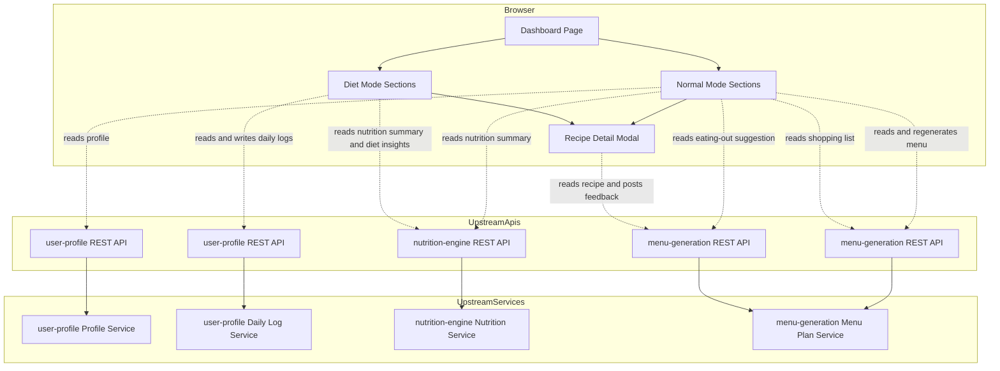
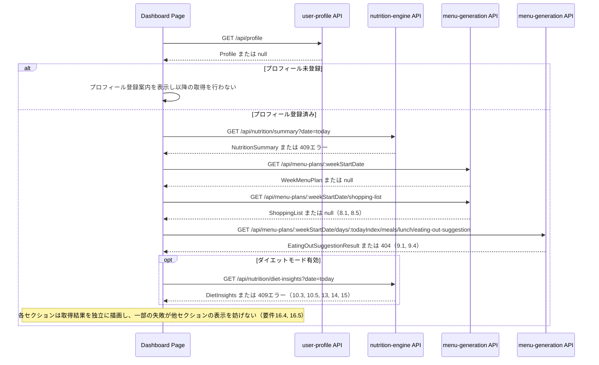
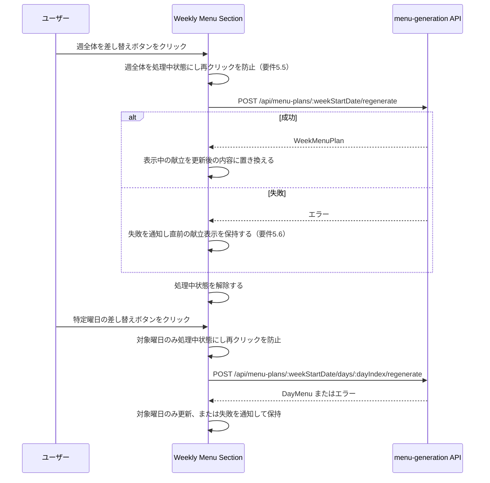
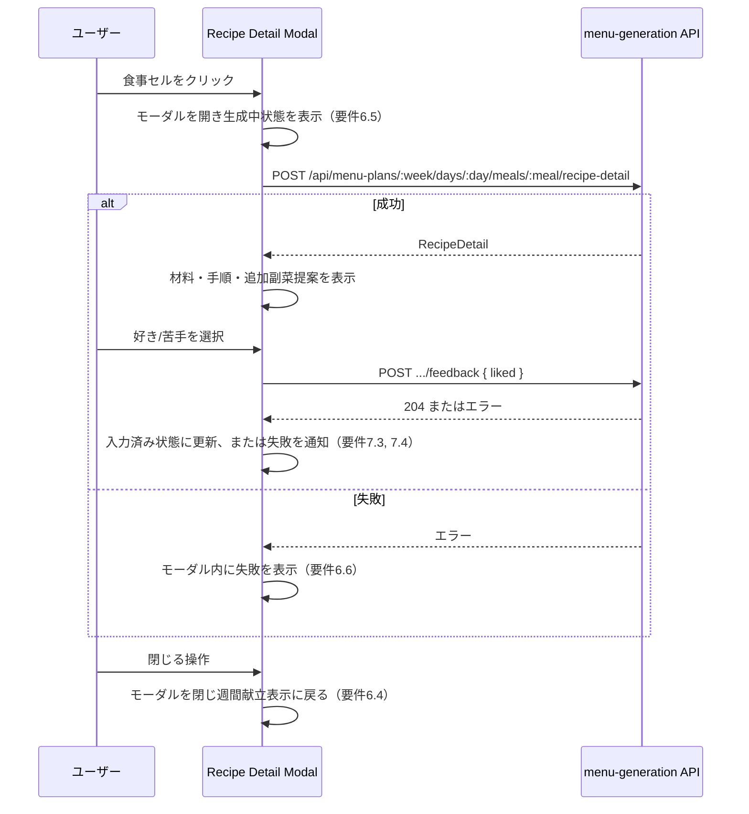

# Technical Design: results-dashboard

## Overview

本機能は、栄養管理Webアプリケーションの結果表示ダッシュボードである。`user-profile`（プロフィール・日次ログ）、`nutrition-engine`（栄養目標値・活動レベル表示ラベル・ダイエットモード目標・安全ガードレール警告）、`menu-generation`（週間献立・レシピ詳細・追加副菜提案・満足度フィードバック）が提供するデータを統合し、栄養評価画面とダイエット状況画面の2種類のダッシュボードをレスポンシブ対応のブラウザ上に表示する。本specはロードマップ上最後のspecであり、`web`パッケージに初めて本格的な画面（`DashboardPage`）を追加する。

**Purpose**: 3つの上流specが算出・生成した値を、`.kiro/specs/results-dashboard/mockup.html`で確定したレイアウトに統合表示し、献立の差し替え・レシピ閲覧・満足度フィードバック・摂取カロリー手動修正・追加運動記録の入力操作を提供する。
**Users**: アプリを利用する唯一の利用者本人が、日々の結果確認と各種入力操作をこの画面から行う。
**Impact**: `user-profile`が構築した既存のFastifyアプリ・monorepo構成に、初めて本格的な内容を持つフロントエンド画面（`web/src/pages/DashboardPage.tsx`）を追加する。本specは独自のバックエンドを持たず、`server` / `shared`パッケージには変更を加えない（amendment: 当初案にあった本spec専用の集約バックエンド`server/src/dashboard/`は、対応する算出ロジックが`nutrition-engine` / `menu-generation`側に実装されることになったため廃止した。詳細は`research.md`を参照）。`user-profile` / `nutrition-engine` / `menu-generation`の既存コンポーネントには変更を加えない。

### Goals
- `mockup.html`が確定した単一の「1週間のおすすめ献立」（栄養評価画面にのみ配置）を中心に、栄養評価画面とダイエット状況画面を構築する
- 栄養充足率・PFCバランス・カロリー収支・体重推移をグラフ/視覚的なコンポーネントで表示する
- 献立の週単位・日単位の差し替え、レシピ詳細+追加副菜提案の閲覧、満足度フィードバックの入力、摂取カロリー手動修正、追加運動記録の入力を、対応する上流specの操作を呼び出すUIとして提供する
- 買い物リスト・外食時の代替提案（`menu-generation`が算出）、ダイエットインサイト[体重推移予測・目標到達見込み・停滞判定・運動併用シミュレーション]（`nutrition-engine`が算出）を、対応する上流specのAPIから取得しそのまま表示する
- 上流データの欠損・エラー時に、画面全体を破綻させずセクション単位で分かりやすい代替表示を行う

### Non-Goals
- 栄養目標値（カロリー・PFC・微量栄養素・活動係数・BMR・TDEE・安全ガードレールの閾値そのもの）の計算（`nutrition-engine`の責務）
- 献立・レシピの生成、食品成分DBとの照合、分量正規化（`menu-generation`の責務）
- プロフィール・日次ログ・満足度フィードバックの永続化（`user-profile` / `menu-generation`の責務）
- 買い物リストの集約・カテゴリ分類、外食時の代替提案の選定、体重推移の傾向分析・目標到達見込み週数・停滞判定・運動併用シミュレーションの算出（それぞれ`menu-generation` / `nutrition-engine`の責務。本specはこれらのAPIレスポンスをそのまま表示する）
- 認証・認可・複数ユーザー対応

## Boundary Commitments

### This Spec Owns
- 栄養評価画面・ダイエット状況画面のページ構成・レイアウト・表示モード切替・プロフィール概要表示
- 1週間のおすすめ献立の単一表示、週単位・日単位の差し替え操作、レシピ詳細+追加副菜提案のモーダル表示、満足度フィードバックの入力UI
- 摂取カロリー手動修正・追加運動記録の入力UI（保存処理自体は`user-profile`へ委譲）
- 買い物リスト・外食時の代替提案・ダイエットインサイト（体重推移予測・目標到達見込み週数・停滞判定・運動併用シミュレーション）の表示（`menu-generation` / `nutrition-engine`が算出・生成した値をそのまま整形して提示するのみで、集約・選定・傾向分析等の算出ロジックは一切持たない）

### Out of Boundary
- 活動係数・BMR・TDEE・PFC比率・微量栄養素目標値・ダイエットモード目標カロリー・安全ガードレール判定・体重推移の傾向分析/目標到達見込み週数/停滞判定/運動併用シミュレーションの算出そのもの（`nutrition-engine`）
- 献立生成・食品成分DB照合・分量正規化・レシピ詳細/追加副菜のコンテンツ生成・買い物リストの集約とカテゴリ分類・外食時の代替提案の選定（`menu-generation`）
- プロフィール・日次ログ（体重・体脂肪率・摂取カロリー実績・追加運動記録）・満足度フィードバックのスキーマ・検証・永続化（`user-profile` / `menu-generation`）
- 認証・認可・複数ユーザーのデータ分離

### Allowed Dependencies
- フロントエンド（`web`）は、`user-profile`の`GET /api/profile` / `GET|PUT /api/daily-logs/:date` / `GET /api/daily-logs?from=&to=` / `POST /api/daily-logs/:date/exercise-entries`、`nutrition-engine`の`GET /api/nutrition/summary` / `GET /api/nutrition/diet-insights`、`menu-generation`の`GET /api/menu-plans/:week` / `POST .../regenerate` / `POST .../days/:day/regenerate` / `POST .../meals/:meal/recipe-detail` / `POST .../meals/:meal/feedback` / `GET .../shopping-list` / `GET .../meals/:meal/eating-out-suggestion`を、同一Fastifyプロセスの公開HTTP APIとして直接呼び出す（買い物リスト・外食時の代替提案・ダイエットインサイトも、既存の栄養サマリ・週間献立の取得と同じ「フロントエンドが上流specのAPIを直接呼び出す」パターンに統一する。amendment: 当初案にあった本spec専用の集約バックエンドは廃止した）
- ランタイム基盤（Node.js、npm workspaces monorepo内の`web`パッケージへの追加実装）。本specは`server` / `shared`パッケージに新規コードを追加しない（自身のバックエンド・共有スキーマを持たない）。新規のSQLiteテーブルも作成しない

### Revalidation Triggers
- `user-profile`のProfile型・DailyLogEntry型のフィールド構成を変更した場合 → プロフィール概要・食事制限表示・カロリー収支入力フォームの再確認が必要
- `nutrition-engine`の`NutritionSummary`型（`activityLevelLabel`を含む）のレスポンス形式を変更した場合 → プロフィール概要・栄養充足率・ダイエット目標状況・ガードレール警告表示の再確認が必要
- `nutrition-engine`の`DietInsights`型（`weightHistory` / `weightProjection` / `goalEta` / `plateau` / `exerciseSimulation`）のレスポンス形式を変更した場合 → 体重推移グラフ・目標達成予測・停滞期アドバイス・運動併用シミュレーション表示の再確認が必要
- `menu-generation`の`WeekMenuPlan` / `MealSlot` / `RecipeDetail`型のレスポンス形式を変更した場合 → 週間献立・レシピ詳細表示の再確認が必要
- `menu-generation`の`ShoppingList` / `EatingOutSuggestionResult`型のレスポンス形式を変更した場合 → 買い物リスト・外食時の代替提案表示の再確認が必要

## Architecture

### Architecture Pattern & Boundary Map

**選定パターン**: バックエンドを持たないプレゼンテーション層。`web`から各specの公開APIを直接呼び出す（既存3specと同一の設計言語のうち、フロントエンドが上流specの公開APIを直接呼び出す部分のみを踏襲する）。amendment: 当初案にあった、本spec固有の3つの導出（買い物リスト・外食代替提案・ダイエットインサイト）のための専用バックエンドは、対応する算出ロジックが`menu-generation` / `nutrition-engine`側に実装されることになったため廃止した（詳細は`research.md`のArchitecture Pattern Evaluationを参照）。



**Architecture Integration**:
- 選定パターン: バックエンドを持たないプレゼンテーション層（依存方向 上流spec公開API → 型付きfetchラッパー → UIコンポーネント）。本specはいかなる値オブジェクトも算出・所有しない
- ドメイン境界: 本specはドメイン集約を1つも所有しない。`Profile` / `DailyLog` / `NutritionSummary` / `DietInsights` / `WeekMenuPlan` / `RecipeDetail` / `ShoppingList` / `EatingOutSuggestionResult`のいずれも、対応する上流spec（`user-profile` / `nutrition-engine` / `menu-generation`）が所有し、本specはフロントエンドから各specの公開HTTP APIを直接読み取るのみである
- 新規コンポーネントの理由: `DashboardPage`以下のUIコンポーネント群、およびそれらが利用する型付きfetchラッパー（`nutritionClient` / `menuPlanClient` / `mealSlotClient`等）が本specで初めて構築される。amendment: 当初案にあった本spec専用のバックエンド集約層（`ShoppingListService` / `EatingOutTipService` / `DietInsightsService`とその専用Gateway群）は、対応する算出ロジックが`menu-generation` / `nutrition-engine`側の承認済みamendmentとして実装されることになったため廃止した（詳細は`research.md`を参照）
- 境界順守: 本specにControllerもServiceもGatewayも存在しない。UIコンポーネントは型付きfetchラッパーを介して上流specの公開APIレスポンスをそのまま描画し、集約・選定・傾向分析等の導出は一切行わない

### Technology Stack

| Layer | Choice / Version | Role in Feature | Notes |
|-------|------------------|------------------|-------|
| Frontend | React 19 + TypeScript 5 + Vite 6 | `DashboardPage`とその配下セクションコンポーネントのSPA実装 | `user-profile`の`design.md`で確定済みのスタックをそのまま踏襲（再選定なし）。新規チャートライブラリは追加せず、mockupのインラインSVG構造を専用コンポーネント化する（`research.md`のBuild vs Adopt参照） |
| Backend | なし | 本specは独自のバックエンドを持たない。買い物リスト・外食時の代替提案・ダイエットインサイトを含む全ての表示データは、フロントエンドが`user-profile` / `nutrition-engine` / `menu-generation`の公開APIを直接呼び出して取得する | amendment: 当初案にあった`/api/dashboard/*`の薄い集約バックエンドは、対応する算出ロジックが上流spec側に実装されることになったため廃止した |
| Validation | Zod 4 | 上流spec（`nutrition.schema.ts` / `menu.schema.ts` / `profile.schema.ts` / `daily-log.schema.ts`）が公開する型をフロントエンドでそのまま再利用し、レスポンス検証・型推論に用いる | 本specは新規のZodスキーマを`shared`パッケージに追加しない（`dashboard.schema.ts`は不要になった） |
| Data / Storage | なし | 本specは自身の永続化ストアも静的参照データも持たない | 買い物リストのカテゴリ表示グループ・外食メニュー参照データはいずれも`menu-generation`側のコードに帰属する |
| Infrastructure / Runtime | npm workspaces monorepo（既存の`web`パッケージに追加） | `web/src/pages/DashboardPage.tsx`以下を新規追加。`server` / `shared`パッケージへの追加は行わない | 開発時は`web`のViteサーバーが`/api`プレフィックスをFastifyへプロキシする（Viteの標準機能`server.proxy`を使用し、新規パッケージ依存は追加しない）。本番相当の配信方式（静的ビルドの配信等）はいずれのspecの責務にも含まれておらず、範囲外の運用課題として残る |

## File Structure Plan

### Directory Structure
```
web/
├── src/
│   ├── pages/
│   │   └── DashboardPage.tsx            # 表示モード状態管理、各セクションへのデータ受け渡し
│   ├── components/dashboard/
│   │   ├── ModeToggle.tsx               # 通常/ダイエットの表示モード切替
│   │   ├── ProfileStrip.tsx             # 身長・体重・年齢・性別・活動レベル・ダイエット目標のchip表示
│   │   ├── RestrictionChip.tsx          # 食事制限タイプ・強度・自由記述のchip表示
│   │   ├── NutritionSummarySection.tsx  # 推奨エネルギー量・PFC・微量栄養素充足率セクション（今日/今週の計画平均の切替を含む）
│   │   ├── PeriodToggle.tsx             # 「今日」/「今週の計画平均」の表示期間切替コントロール
│   │   ├── AdviceCallout.tsx            # 一言アドバイス表示（栄養評価・ダイエット状況の両方で使う共通コンポーネント）
│   │   ├── WeeklyMenuSection.tsx        # 1週間のおすすめ献立（週/日差し替え操作を含む、栄養評価画面にのみ配置）
│   │   ├── DayColumn.tsx                # 曜日カード1件
│   │   ├── MealCell.tsx                 # 食事セル1件（クリックでモーダルを開く）
│   │   ├── RecipeDetailModal.tsx        # レシピ詳細+追加副菜提案+フィードバックのモーダル
│   │   ├── FeedbackControl.tsx          # 好き/苦手の入力コントロール
│   │   ├── ShoppingListSection.tsx      # 買い物リスト（通常モード。menu-generationのレスポンスをそのまま表示）
│   │   ├── EatingOutTipSection.tsx      # 外食時の代替提案（通常モード。menu-generationのレスポンスをそのまま表示）
│   │   ├── DietGoalStatusSection.tsx    # 目標エネルギー量・目標体重までの見込み・安全ペース判定
│   │   ├── GuardrailWarningCallout.tsx  # 安全ガードレール警告表示
│   │   ├── CalorieBalanceSection.tsx    # 摂取・消費カロリー収支セクション（グラフ+入力操作の枠）
│   │   ├── ManualCalorieOverrideForm.tsx# 摂取カロリー手動修正フォーム
│   │   ├── ExerciseEntryForm.tsx        # 追加運動記録の入力フォーム
│   │   ├── WeightTrendSection.tsx       # 体重推移+目標達成予測セクション（nutrition-engineのDietInsightsをそのまま表示）
│   │   ├── PlateauAdviceCallout.tsx     # 停滞期アドバイス（nutrition-engineのDietInsights.plateauをそのまま表示）
│   │   ├── ExerciseSimulationSection.tsx# 運動併用シミュレーション（nutrition-engineのDietInsights.exerciseSimulationをそのまま表示）
│   │   └── charts/
│   │       ├── PfcBarChart.tsx          # PFC構成比の横積み棒
│   │       ├── NutrientSufficiencyList.tsx # 微量栄養素充足率バー一覧（menu-generationの実績値÷nutrition-engineの目標値を算出して表示。実績値そのものの計算は行わない）
│   │       ├── GoalProgressBar.tsx      # 目標体重までの進捗バー
│   │       ├── CalorieBalanceChart.tsx  # 曜日別カロリー差分の発散棒グラフ
│   │       ├── WeightTrendChart.tsx     # 体重推移+予測の折れ線グラフ
│   │       └── CompareBars.tsx          # 運動併用シミュレーションの比較バー
│   ├── api/
│   │   ├── nutritionClient.ts           # /api/nutrition/summary, /api/nutrition/diet-insights 用の型付きfetchラッパー（新規）
│   │   ├── menuPlanClient.ts            # /api/menu-plans/*（取得・週/日差し替え・買い物リスト取得）用の型付きfetchラッパー（新規）
│   │   └── mealSlotClient.ts            # /api/menu-plans/.../meals/*（レシピ詳細・フィードバック・外食代替提案）用の型付きfetchラッパー（新規）
│   ├── hooks/
│   │   └── useAsyncData.ts              # ローディング/エラー状態を統一的に扱う共通フック
│   └── App.tsx                          # （変更）プロフィール編集画面とダッシュボードを行き来する簡易ナビゲーションを追加
└── package.json
```

本specは`server` / `shared`パッケージにディレクトリを追加しない（amendment: 当初案にあった`server/src/dashboard/`と`shared/src/dashboard.schema.ts`は、対応する算出ロジックが`nutrition-engine` / `menu-generation`側の承認済みamendmentとして実装されることになったため廃止した）。

### Modified Files
- `web/src/App.tsx`: 既存の`ProfilePage`表示に加え、`DashboardPage`への簡易ナビゲーション（ルーティングライブラリを追加しない、React状態によるページ切替）を追加する
- `web/src/api/profileClient.ts`（`user-profile`が作成済み）: 変更なし。本specはそのまま再利用する
- `web/src/api/dailyLogClient.ts`（`user-profile`が作成済み）: `getLogsInRange(from, to)`を追加（task 6.2、design.mdが参照する関数が実ファイルに存在しなかった真のインフラギャップへの対応。既存の`saveDailyLog`/`addExerciseEntry`は変更なし）
- `web/src/api/httpClient.ts` / `web/src/api/types.ts`（`user-profile`が作成済み）: `nutritionClient`（task 2.1）が返す`CalculationUnavailableError`、`menuPlanClient`（task 2.2）が返す`GenerationError`をそれぞれ判別可能な戻り値として扱えるよう、エラー型判定ガードと`toApiError`の分岐を追加
- `server/src/app.ts`: 変更なし（amendment: 当初案にあった`dashboard.routes.ts`のルート登録は、本spec専用バックエンドの廃止に伴い不要になった）

## System Flows

### ダッシュボード初期表示フロー


### 週単位・日単位の献立差し替えフロー


### レシピ詳細+フィードバックフロー


買い物リストの集約ロジック・体重推移の傾向分析ロジックは、いずれも`menu-generation` / `nutrition-engine`側の内部フローであり、本specはそれらの結果（`ShoppingList` / `DietInsights`）をAPIレスポンスとしてそのまま受け取って表示するのみである（内部アルゴリズムの詳細は、それぞれ`menu-generation/design.md`の「買い物リスト生成フロー」、`nutrition-engine/design.md`の「ダイエットインサイト算出フロー」を参照）。

## Requirements Traceability

| Requirement | Summary | Components | Interfaces | Flows |
|-------------|---------|------------|------------|-------|
| 1.1-1.5 | 通常モードの推奨栄養量の可視化 | NutritionSummarySection, PfcBarChart, NutrientSufficiencyList | `nutritionClient.getSummary`, `menuPlanClient.getWeekPlan` | ダッシュボード初期表示フロー |
| 2.1-2.6 | 表示モードとプロフィール概要 | DashboardPage, ModeToggle, ProfileStrip | `profileClient.getProfile`, `nutritionClient.getSummary` | ダッシュボード初期表示フロー |
| 3.1-3.3 | 食事制限設定の表示 | RestrictionChip | `profileClient.getProfile` | ダッシュボード初期表示フロー |
| 4.1-4.5 | 1週間のおすすめ献立の表示 | WeeklyMenuSection, DayColumn, MealCell | `menuPlanClient.getWeekPlan` | ダッシュボード初期表示フロー |
| 5.1-5.6 | 献立の差し替え操作 | WeeklyMenuSection | `menuPlanClient.regenerateWeek`, `menuPlanClient.regenerateDay` | 週単位・日単位の献立差し替えフロー |
| 6.1-6.6 | レシピ詳細と追加副菜提案の表示 | RecipeDetailModal | `mealSlotClient.generateRecipeDetail` | レシピ詳細+フィードバックフロー |
| 7.1-7.4 | 満足度フィードバックの入力 | RecipeDetailModal, FeedbackControl | `mealSlotClient.submitFeedback` | レシピ詳細+フィードバックフロー |
| 8.1-8.5 | 買い物リストの表示 | ShoppingListSection | `menuPlanClient.getShoppingList` | ダッシュボード初期表示フロー |
| 9.1-9.4 | 外食時の代替提案の表示 | EatingOutTipSection | `mealSlotClient.getEatingOutSuggestion` | ダッシュボード初期表示フロー |
| 10.1-10.5 | ダイエット目標状況の表示 | DietGoalStatusSection, GoalProgressBar | `nutritionClient.getSummary`, `nutritionClient.getDietInsights` | ダッシュボード初期表示フロー |
| 11.1-11.3 | 安全ガードレール警告の表示 | GuardrailWarningCallout | `nutritionClient.getSummary` | ダッシュボード初期表示フロー |
| 12.1-12.7 | 摂取・消費カロリー収支の表示と入力 | CalorieBalanceSection, CalorieBalanceChart, ManualCalorieOverrideForm, ExerciseEntryForm | `dailyLogClient.getLogsInRange`, `dailyLogClient.saveDailyLog`, `dailyLogClient.addExerciseEntry` | - |
| 13.1-13.4 | 体重推移と目標達成予測の表示 | WeightTrendSection, WeightTrendChart | `nutritionClient.getDietInsights` | ダッシュボード初期表示フロー |
| 14.1-14.3 | 停滞期アドバイスの表示 | PlateauAdviceCallout | `nutritionClient.getDietInsights` | ダッシュボード初期表示フロー |
| 15.1-15.3 | 運動併用シミュレーションの表示 | ExerciseSimulationSection, CompareBars | `nutritionClient.getDietInsights` | ダッシュボード初期表示フロー |
| 16.1-16.5 | 依存データの欠損・エラー時の挙動 | DashboardPage, useAsyncData, 各セクションコンポーネント | 全APIクライアント呼び出し | ダッシュボード初期表示フロー |
| 17.1-17.4 | シングルユーザー運用とレスポンシブ表示 | DashboardPage, WeeklyMenuSection | - | - |
| 18.1-18.6 | 栄養量表示の期間切り替え（今日/今週の計画平均） | NutritionSummarySection, DietGoalStatusSection, PeriodToggle | `nutritionClient.getSummary`, `menuPlanClient.getWeekPlan` | ダッシュボード初期表示フロー |
| 19.1-19.4 | 栄養状況の一言アドバイス表示 | AdviceCallout | `nutritionClient.getSummary`, `menuPlanClient.getWeekPlan`, `dailyLogClient.getLogsInRange` | ダッシュボード初期表示フロー |

## Components and Interfaces

| Component | Domain/Layer | Intent | Req Coverage | Key Dependencies (P0/P1) | Contracts |
|-----------|--------------|--------|---------------|---------------------------|-----------|
| DashboardPage / 配下のUIコンポーネント群 | UI | mockup.htmlのレイアウトを再現するプレゼンテーション。上流spec（`user-profile` / `nutrition-engine` / `menu-generation`）の公開APIレスポンスをそのまま整形・グラフ化して表示する | 全要件 | 各APIクライアント (P0) | - |

本specはController・Service・Gatewayのいずれも持たない（amendment: 当初案にあった`ShoppingListService` / `EatingOutTipService` / `DietInsightsService`とそれぞれの専用Controller・Gateway群は、対応する算出ロジックが`menu-generation` / `nutrition-engine`側の承認済みamendmentとして実装されることになったため全て廃止した）。買い物リスト・外食時の代替提案・ダイエットインサイトの値オブジェクト定義（`ShoppingList` / `EatingOutSuggestionResult` / `DietInsights`）は、それぞれ`menu-generation/design.md` / `nutrition-engine/design.md`が所有し、本specは`shared`パッケージの`menu.schema.ts` / `nutrition.schema.ts`が公開する型をそのままインポートして利用する（詳細は`research.md`を参照）。

### Domain: UI (Presentation)

`DashboardPage`以下のコンポーネント群は`mockup.html`のセクション構成にそのまま対応する、新規の責務境界を持たないプレゼンテーション層である。

| Component | Intent | Requirements |
|-----------|--------|---------------|
| DashboardPage | 表示モード状態の管理、プロフィール・栄養目標・週間献立・買い物リストの取得と各セクションへの受け渡し、プロフィール未登録時の全体ガード | 2, 16 |
| ModeToggle | 通常/ダイエット表示モードの切替コントロール | 2.1, 2.2, 2.3 |
| ProfileStrip | 身長・体重・年齢・性別・活動レベル表示ラベル・ダイエット目標のchip表示 | 2.4, 2.5, 2.6 |
| RestrictionChip | 食事制限タイプ・強度・自由記述のchip表示 | 3.1, 3.2, 3.3 |
| NutritionSummarySection | 推奨エネルギー量カード、PeriodToggle、PfcBarChart、NutrientSufficiencyListの配置 | 1, 18 |
| PeriodToggle | 「今日」/「今週の計画平均」の切替コントロール | 18.1, 18.4 |
| WeeklyMenuSection | 週全体差し替えボタン（右寄せ配置）、DayColumnの横スクロール一覧、栄養評価画面にのみ配置（ダイエット状況画面には配置しない） | 4, 5, 17.4 |
| DayColumn | 曜日名・当日合計カロリー・日単位差し替えボタン（曜日行の下）・MealCell一覧 | 4.3, 5.2 |
| MealCell | 料理名表示、クリックでRecipeDetailModalを開く | 4.3, 6.1 |
| RecipeDetailModal | 材料・手順・カロリー・追加副菜提案・FeedbackControlの表示、生成中/失敗状態の表示 | 6, 7.1 |
| FeedbackControl | 好き/苦手の選択、送信中/送信済み/失敗状態の表示 | 7.1-7.4 |
| ShoppingListSection | カテゴリ別買い物リストの表示、献立未生成時の代替表示 | 8 |
| EatingOutTipSection | 外食代替提案の表示、対象データなし時の非表示 | 9 |
| DietGoalStatusSection | 目標エネルギー量（PeriodToggleによる今日/今週平均の切替を含む）・GoalProgressBar・安全ペース判定の表示 | 10, 18.5, 18.6 |
| GuardrailWarningCallout | ガードレール警告と修正提案、または安全表示 | 11 |
| CalorieBalanceSection | CalorieBalanceChart、手動修正・運動記録入力操作の枠 | 12.1, 12.2, 12.3, 12.5 |
| ManualCalorieOverrideForm | 摂取カロリー手動修正の入力・送信・失敗時の状態保持 | 12.3, 12.4, 12.7 |
| ExerciseEntryForm | 追加運動記録の入力・送信・失敗時の状態保持 | 12.5, 12.6, 12.7 |
| WeightTrendSection | WeightTrendChartの表示、見込み線なし時のフォールバック | 13 |
| PlateauAdviceCallout | 停滞時のみのアドバイス表示 | 14 |
| ExerciseSimulationSection | CompareBarsによる比較表示 | 15 |
| AdviceCallout | 一言アドバイスの表示（栄養評価画面: 充足率最低の微量栄養素、ダイエット状況画面: 曜日別カロリー収支の傾向） | 19 |

**Shared Interface**
```typescript
interface DashboardSectionProps<T> {
  data: T | null;
  isLoading: boolean;
  error: unknown; // 呼び出し先クライアントが返す上流spec固有のエラー型（CalculationUnavailableError, NotFoundError 等）をそのまま保持する
}
```
各セクションコンポーネントは`DashboardSectionProps<T>`を拡張し、それぞれのデータ型と追加のコールバック（例: `WeeklyMenuSection`は`onRegenerateWeek`/`onRegenerateDay`）のみを宣言する。

**Implementation Notes**
- Integration: `DashboardPage`は初回マウント時に`profileClient.getProfile()`を呼び出し、`null`であれば以降のデータ取得を行わずプロフィール登録案内のみを表示する（要件16.1）。それ以外の取得（`nutritionClient`, `menuPlanClient`, `mealSlotClient`）は`useAsyncData`フックを介して並行に実行し、個々の失敗を独立に扱う（要件16.4, 16.5）
- Validation: `shared`パッケージの`nutrition.schema.ts` / `menu.schema.ts`をクライアント側でも参照し、各上流APIのレスポンス形状をレンダリング前に検証する（本specは新規スキーマを追加しない）
- Risks: `WeeklyMenuSection`は週全体・日単位の差し替え中に対象範囲をローカル状態でロックし（要件5.5）、`menu-generation`側のインメモリロック（`generation_in_progress`）と二重にガードすることで、意図しない二重送信を防ぐ

##### API Contract

**利用する上流API（`user-profile` / `nutrition-engine` / `menu-generation`、フロントエンドから直接呼び出し）**

| Spec | Method | Endpoint | 用途 |
|------|--------|----------|------|
| user-profile | GET | /api/profile | プロフィール概要・食事制限chip |
| user-profile | GET | /api/daily-logs?from=&to= | カロリー収支グラフ用の直近1週間の摂取カロリー実績取得 |
| user-profile | PUT | /api/daily-logs/:date | 摂取カロリー手動修正 |
| user-profile | POST | /api/daily-logs/:date/exercise-entries | 追加運動記録の登録 |
| nutrition-engine | GET | /api/nutrition/summary?date= | 推奨栄養量・活動レベルラベル・ダイエット目標・ガードレール警告 |
| nutrition-engine | GET | /api/nutrition/diet-insights?date= | 体重推移・目標達成予測（ゴールETA）・停滞判定・運動併用シミュレーション（amendment: `nutrition-engine`に新設） |
| menu-generation | GET | /api/menu-plans/:weekStartDate | 週間献立の表示 |
| menu-generation | POST | /api/menu-plans/:weekStartDate/regenerate | 週単位差し替え |
| menu-generation | POST | /api/menu-plans/:weekStartDate/days/:dayIndex/regenerate | 日単位差し替え |
| menu-generation | POST | /api/menu-plans/:week/days/:day/meals/:meal/recipe-detail | レシピ詳細+追加副菜提案 |
| menu-generation | POST | /api/menu-plans/:week/days/:day/meals/:meal/feedback | 満足度フィードバック |
| menu-generation | GET | /api/menu-plans/:weekStartDate/shopping-list | 買い物リストの表示（amendment: `menu-generation`に新設） |
| menu-generation | GET | /api/menu-plans/:week/days/:day/meals/:meal/eating-out-suggestion | 外食時の代替提案の表示（本日昼食の食事枠を指定。amendment: `menu-generation`に新設） |

## Data Models

### Domain Model
本specは永続化される集約もいかなる値オブジェクトも所有しない。画面に表示するすべての値（`NutritionSummary` / `DietInsights` / `WeekMenuPlan` / `RecipeDetail` / `ShoppingList` / `EatingOutSuggestionResult` / `Profile` / `DailyLogEntry`）は、対応する上流spec（`user-profile` / `nutrition-engine` / `menu-generation`）が算出・保存する値オブジェクトであり、本specはそれらをそのまま画面に描画する。

### Logical Data Model
新規のデータベーステーブルは作成しない。本specは静的参照データも保持しない（amendment: 当初案にあった`category-display-groups.data.ts`（食品カテゴリ→表示グループ）と`eating-out-reference.data.ts`（外食メニュー参照ペア）は本specから削除し、いずれも`menu-generation`側の同名ファイルに一本化した）。

### Physical Data Model
なし（本specは新規のデータベーステーブルを作成しない）。

### Data Contracts & Integration

**API Data Transfer**: JSON over HTTP。フロントエンドは各上流spec（`user-profile` / `nutrition-engine` / `menu-generation`）が`shared`パッケージに公開する既存のZodスキーマ（`profile.schema.ts` / `daily-log.schema.ts` / `nutrition.schema.ts` / `menu.schema.ts`）をそのまま再利用してレスポンスを検証する。本specは新規のZodスキーマを追加しない。

**Cross-Spec Data Contracts**:
- 本specは`user-profile`の`GET /api/profile` / `GET|PUT /api/daily-logs/:date` / `GET /api/daily-logs?from=&to=` / `POST /api/daily-logs/:date/exercise-entries`をフロントエンドから直接呼び出す
- 本specは`nutrition-engine`の`GET /api/nutrition/summary?date=` / `GET /api/nutrition/diet-insights?date=`をフロントエンドから直接呼び出す
- 本specは`menu-generation`の`GET /api/menu-plans/:weekStartDate`他、および`GET /api/menu-plans/:weekStartDate/shopping-list` / `GET /api/menu-plans/:week/days/:day/meals/:meal/eating-out-suggestion`をフロントエンドから直接呼び出す
- amendment: 当初`results-dashboard`側の未解決の上流依存としてフラグ付けしていた「食品名・カテゴリ参照の欠落」（`FoodCatalogGateway`が前提としていた`menu-generation`側の拡張）は、`menu-generation`の承認済みamendmentにより`ShoppingListService`が自身の`FoodCompositionRepository`で品目名・カテゴリを解決し`ShoppingList`として返すことで解消された。本specはもはや食品カタログへの参照ポートを必要としない
- amendment（解消済み）: 上記の数量表現に関する論点も、`menu-generation`の後続amendmentで解消された。`ShoppingListItem`は`quantityGrams`（正規化済みグラム量）に加え、`food_items.display_unit_code`が設定済みの食品については換算後の`displayQuantity`（0.5刻み丸め）と`displayUnit`（例: `"個"` `"玉"` `"束"`）を、未設定の食品については`quantityGrams`と同値の`displayQuantity`・`"g"`の`displayUnit`を返す。本specは`item.displayQuantity`+`item.displayUnit`をそのまま表示するだけでよく、独自の単位変換ロジックは不要（`mockup.html`の「白菜 1/2玉」表示は`displayQuantity: 0.5, displayUnit: "玉"`に対応する）
- amendment: `NutrientSufficiencyList`が表示する微量栄養素の充足率は、`nutrition-engine`の目標値そのものではなく、`menu-generation`が`GET /api/menu-plans/:weekStartDate`のレスポンス（`WeekMenuPlan.days[].dayNutrition`、要件4.7で追加された`VerifiedNutritionValues`）で提供する実績値と、`nutrition-engine`の`NutritionSummary.normalMode.micronutrients`（`MicronutrientTargets`型）の比（実績÷目標）として本specのフロントエンドで算出する。「今週の計画平均」表示（要件18）は、`WeekMenuPlan.days[]`の7件を単純平均した`dayNutrition`を使う。いずれも四則演算のみで、`nutrition-engine`/`menu-generation`が持つドメインロジック（栄養価算出式そのもの）を再実装するものではない
- フィールド名対応: `fiberG`/`calciumMg`/`ironMg`/`vitaminAUg`/`vitaminDUg`/`vitaminB1Mg`/`vitaminB2Mg`/`vitaminCMg`は`dayNutrition`と`micronutrients`で同名のため単純に対応する。食塩相当量のみ命名が非対称（`dayNutrition.saltEquivalentG`＝実績値 ÷ `micronutrients.saltEquivalentUpperLimitG`＝上限目安）で、かつ上限（低いほど良い）指標であるため、他の8項目と異なり「実績が上限に対してどの程度の割合か」を表示する（`nutrient-row.ceiling`のスタイル、`mockup.html`参照）
- `DietGoalStatusSection`の「今週の平均」（要件18.5）は、`nutritionClient.getSummary`を対象週の7日分の日付でそれぞれ呼び出し（`nutrition-engine`は`GET /api/nutrition/summary?date=`が単一日付しか受け付けないため）、7件の`dietMode.calorieTarget`を単純平均する。`menu-generation`のデータは使わない（目標エネルギー量は`nutrition-engine`が算出する値であり、`dayNutrition`はあくまで実績値のため）

## Error Handling

### Error Strategy
本specは読み取り・書き込みいずれについても独自のバックエンドを持たないため、独自の`Result<T,E>`型・エラー分類を定義しない。各上流specが公開する既存のエラー形式（`nutrition-engine`の`CalculationUnavailableError`、`menu-generation`の`NotFoundError` / `GenerationError`、および該当データなし時の200+`null`パターン）をフロントエンドがそのままセクション単位で解釈し、表示する。

### Error Categories and Responses
- **栄養目標値・ダイエットインサイトの算出不可（409）**: `nutrition-engine`の`GET /api/nutrition/summary` / `GET /api/nutrition/diet-insights`が返す`CalculationUnavailableError`（`profile_missing` / `diet_mode_disabled` / `incomplete_diet_mode_data`等）→ 該当セクションに算出できない理由を表示する（16.2）
- **献立・買い物リスト未生成（200 + null）**: `menu-generation`の`GET /api/menu-plans/:weekStartDate` / `GET .../shopping-list`が対象週のプラン未生成時に返す`null`→ 未生成である旨と生成操作を提示する（4.5, 8.5）
- **外食代替提案なし**: `menu-generation`の`GET .../eating-out-suggestion`が対象食事枠なしで返す404、または候補なしで返す`suggestion: null`のいずれも「代替提案を表示しない」として扱う（9.4）
- **その他の上流エラー**: ネットワークエラー・5xx等 → 当該セクションのみにエラー表示を行い、他セクションの表示・操作に影響させない（16.4, 16.5）

### Error Envelope
本specは独自のエラー型を定義しない。各セクションコンポーネントは、呼び出し先クライアント（`nutritionClient` / `menuPlanClient` / `mealSlotClient` / `profileClient` / `dailyLogClient`）が返す上流spec側のエラー型をそのまま`DashboardSectionProps<T>.error`に格納して表示する。

## Testing Strategy

### Unit Tests
- `nutritionClient.getDietInsights`: 200時のレスポンスが`nutrition.schema.ts`の`DietInsights`スキーマ通りにparseされること、`nutrition-engine`の409（`profile_missing` / `diet_mode_disabled` / `incomplete_diet_mode_data`の各`reason`）が判別可能な戻り値として呼び出し元に伝わることを確認する
- `menuPlanClient.getShoppingList`: 200 + `ShoppingList`と200 + `null`（対象週の献立未生成）がそれぞれ判別可能な戻り値として伝わることを確認する
- `mealSlotClient.getEatingOutSuggestion`: 200 + `EatingOutSuggestionResult`（`suggestion`が値または`null`）と404（対象食事枠なし）がそれぞれ判別可能な戻り値として伝わることを確認する

### Integration Tests
本specは独自のバックエンドAPIを持たないため、結合テストの対象を持たない。`GET /api/nutrition/diet-insights` / `GET /api/menu-plans/:weekStartDate/shopping-list` / `GET .../eating-out-suggestion`自体の結合テストは、それぞれ`nutrition-engine` / `menu-generation`のtasks.mdで実施される。

### E2E/UI Tests
- 栄養評価画面とダイエット状況画面を切り替え、1週間のおすすめ献立セクションが栄養評価画面にのみ表示されダイエット状況画面には表示されないこと（4.1, 4.2）
- 週全体差し替えボタン（曜日カード列の上部・右寄せ）と各曜日カードの日単位差し替えボタン（曜日名・カロリー行の下）をクリックし、処理中は再クリックが防止され、成功時に該当範囲のみ更新されることを確認する（5.1, 5.2, 5.5）
- 食事セルをクリックしてレシピ詳細モーダルを開き、材料・手順・追加副菜提案が表示されること、好き/苦手を送信できること、閉じる操作で週間献立表示に戻ることを確認する（6, 7）
- ダイエット状況画面で摂取カロリー手動修正・追加運動記録の入力フォームから送信し、カロリー収支グラフに反映されることを確認する（12）
- 買い物リスト・外食時の代替提案・ダイエットインサイト（体重推移予測・停滞期アドバイス・運動併用シミュレーション）の各セクションが、対応する上流APIのレスポンスをそのまま表示し、上流APIがエラーまたは算出不可を返した場合は該当セクションのみが代替表示になり他セクションに影響しないことを確認する（8, 9, 10.3, 10.5, 13, 14, 15, 16.2, 16.4, 16.5）
- プロフィール未登録の状態でダッシュボードを開いた場合に登録案内が表示され、他のセクションが表示されないことを確認する（16.1）
- 画面幅を縮小した際に1週間のおすすめ献立セクションが横スクロール表示に切り替わることを確認する（17.4）

## Security Considerations

本specは要件17により認証・認可を実装しない。これは既存3specと同じく個人利用・ローカル完結という前提に基づく設計上の決定である。本specは独自のバックエンドを持たず、全てのデータ取得・操作をフロントエンドから上流spec（`user-profile` / `nutrition-engine` / `menu-generation`）の公開APIへ直接委譲するため、本spec自身に起因する書き込み・データ整合性リスクは発生しない。`menu-generation`が生成する`dishName`等の自由記述テキストをそのまま表示する箇所（週間献立・レシピ詳細・買い物リストの品目名・外食時の代替提案のメニュー名）は、フロントエンド側で標準的なエスケープ処理（Reactのデフォルトのテキストレンダリング）に委ね、追加のサニタイズ処理は行わない。
