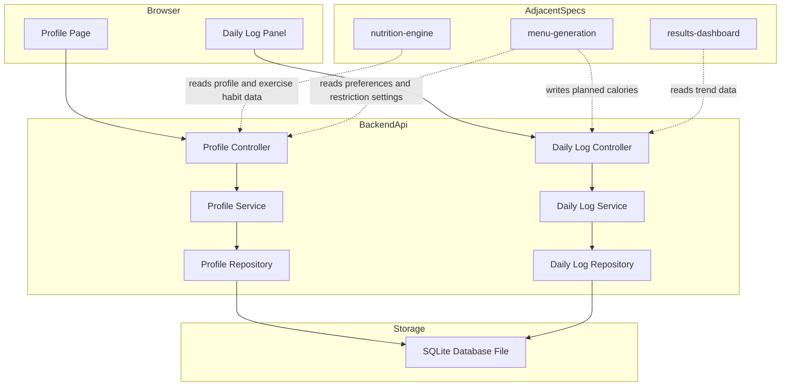
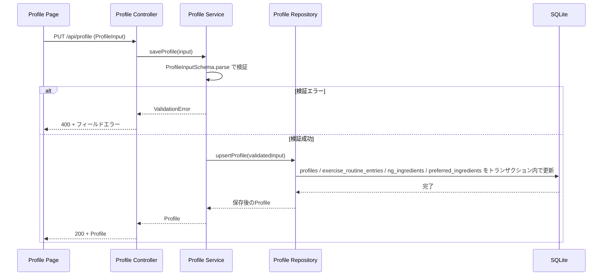
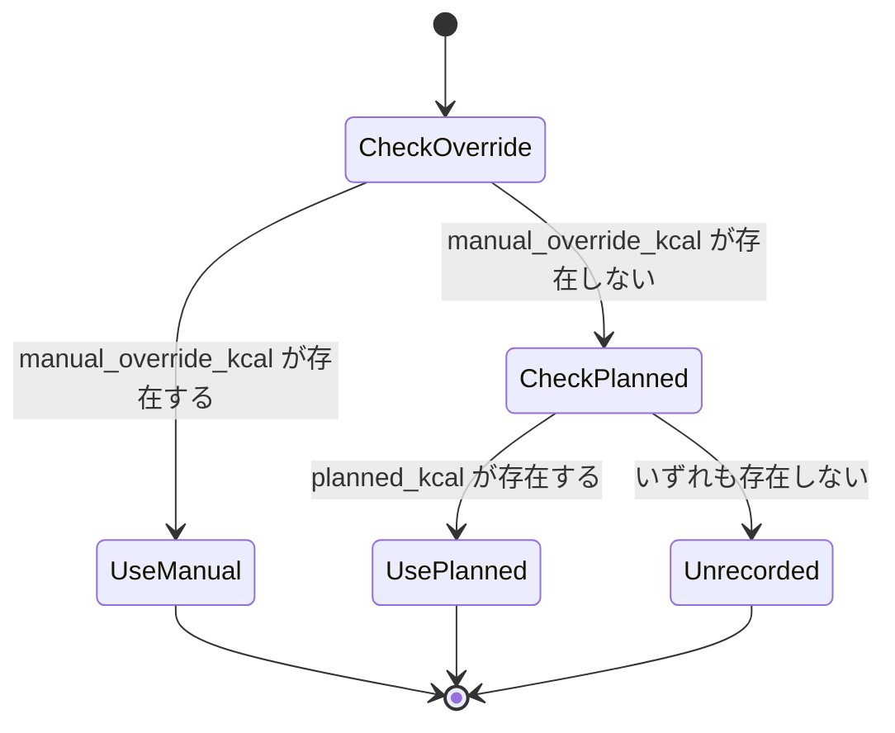
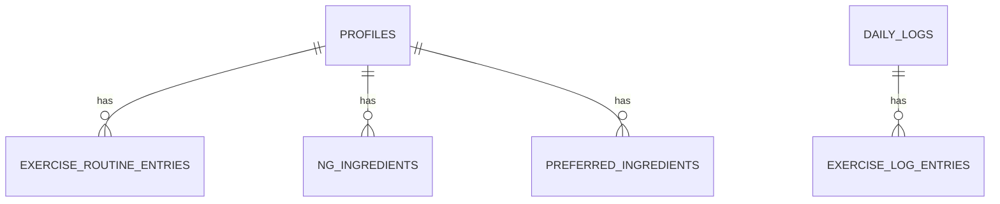

# Technical Design: user-profile

## Overview

本機能は、栄養管理Webアプリケーションのシングルユーザー・プロフィールデータストアである。利用者は身体情報・生活習慣情報・運動習慣・食の嗜好・食事制限設定・ダイエットモード目標を一度入力すればプロフィールとして永続化され、以降 nutrition-engine（活動レベル・栄養目標値の算出）と menu-generation（献立生成）が再入力なしに参照できる。加えて、体重・体脂肪率・摂取カロリー実績・追加運動記録を日付単位の日次ログとして記録し、results-dashboard が推移を可視化するためのデータを提供する。

**Purpose**: 認証を伴わない個人利用のプロフィール／日次ログの入力・保存・更新・推移データ提供を実現する。
**Users**: アプリを利用する唯一の利用者本人が、初回のプロフィール登録・以降の見直し・毎日の記録入力を行う。
**Impact**: greenfieldプロジェクトの起点となるspecであり、新規にバックエンドAPI・データベーススキーマ・フロントエンド画面（プロフィール編集画面・今日の記録パネル）を構築する。既存システムの変更はない。

### Goals
- プロフィール（必須項目・拡張項目・運動習慣・食の嗜好・食事制限設定・ダイエットモード目標）を1つの集約として入力・保存・再編集できる
- 体重・体脂肪率・摂取カロリー実績（自動反映＋手動上書きのハイブリッド）・追加運動記録を日付単位で記録できる
- 記録した日次ログを日付範囲で取得できるインターフェースを提供し、results-dashboard 等の可視化に利用できる状態にする
- nutrition-engine・menu-generation が必要とするデータ（運動習慣詳細・食事制限設定・食の嗜好・NG食材）を欠損なく提供する

### Non-Goals
- 活動レベル（活動係数）・BMR・TDEE・PFC・微量栄養素目標値の計算（nutrition-engine の責務）
- ダイエットモードの安全ガードレール判定（最低摂取カロリー・最大減量ペースの警告、nutrition-engine の責務）
- 献立の生成・食品成分DBとの照合（menu-generation の責務）
- 推移データのグラフ描画・結果画面レイアウト（results-dashboard の責務）
- 複数ユーザー管理・認証・認可（将来拡張、本specでは未実装）

## Boundary Commitments

### This Spec Owns
- プロフィール集約（基本情報・拡張身体情報・生活習慣・運動習慣詳細・食の嗜好／NG食材・食事制限設定・ダイエットモード目標）のスキーマ、検証ルール、永続化、CRUD API
- 日次ログ集約（体重・体脂肪率・摂取カロリー実績・追加運動記録）のスキーマ、検証ルール、永続化、CRUD API
- 摂取カロリー実績のハイブリッド解決ロジック（計画値と手動上書き値の優先順位）
- 日次ログの日付範囲取得インターフェース（推移データの供給元）

### Out of Boundary
- 活動係数・BMR・TDEE・PFC・微量栄養素の計算式（nutrition-engine）
- ダイエット安全ガードレールの判定・警告メッセージ生成（nutrition-engine）
- 献立生成・食品成分DB照合（menu-generation）
- 推移データのグラフ描画・ダッシュボードUI（results-dashboard）
- 認証・認可・複数ユーザーのデータ分離

### Allowed Dependencies
- 本specはロードマップ上の起点specであり、他specへの依存を持たない
- ランタイム基盤（Node.js、ローカルファイルシステム上のSQLiteファイル）にのみ依存する
- menu-generation からの計画kcal受信、および nutrition-engine・menu-generation・results-dashboard によるこのspec提供APIの呼び出しは「本specが公開する契約への外部からのアクセス」であり、本spec自身が依存する対象ではない

### Revalidation Triggers
- プロフィールのフィールド構成（型・必須/任意・選択肢）を変更した場合 → nutrition-engine・menu-generation の入力契約に影響するため両specの再確認が必要
- 日次ログのスキーマまたは日付範囲取得APIのレスポンス形式を変更した場合 → results-dashboard の表示ロジックに影響する
- 摂取カロリー実績のハイブリッド解決ロジック（計画値/手動上書きの優先順位）を変更した場合 → menu-generation との計画kcal受け渡し契約、および results-dashboard のカロリー収支表示に影響する
- 運動習慣データ（運動量テーブルの列構成）を変更した場合 → nutrition-engine の活動係数算出ロジックに影響する

## Architecture

### Architecture Pattern & Boundary Map

**選定パターン**: レイヤードアーキテクチャ（Route → Service → Repository）。単一ユーザー・2集約（Profile / DailyLog）という規模に対し、ヘキサゴナルやCQRSは抽象化過多と判断した（詳細は `research.md` の Architecture Pattern Evaluation を参照）。



**Architecture Integration**:
- 選定パターン: レイヤードアーキテクチャ（依存方向 Types → Schema/Validation → Repository → Service → Controller → UI）
- ドメイン境界: `Profile`（プロフィール集約）と `DailyLog`（日次ログ集約）は完全に独立したモジュールとして分離し、互いのテーブル・サービスを参照しない。摂取カロリー実績の計画値受信のみ DailyLog 側が外部（menu-generation）から受け取る
- 新規コンポーネントの理由: greenfieldのため既存パターンはない。全コンポーネントが本specで新規作成される
- 境界順守: Controller層はHTTPの関心事のみを扱い、業務ルール（必須条件・レンジ検証・ハイブリッド解決）はService層に閉じ込める。Repository層はSQL/永続化のみを扱う

### Technology Stack

| Layer | Choice / Version | Role in Feature | Notes |
|-------|------------------|------------------|-------|
| Frontend | React 19 + TypeScript 5 + Vite 6 | プロフィール編集画面・今日の記録パネルのSPA実装 | mockup.html のセクション構成をコンポーネント境界に対応させる |
| Backend | Node.js 22 LTS + Fastify 5 + TypeScript 5 | REST API（プロフィールCRUD・日次ログCRUD・推移データ取得） | greenfield小規模TypeScript APIとしてFastifyを採用（詳細は`research.md`） |
| Validation | Zod 4 | リクエスト/レスポンスのスキーマ検証・型推論 | `shared`パッケージでフロント/バックエンド間のスキーマを共有 |
| Data / Storage | SQLite（ファイルベース）+ better-sqlite3 13 | プロフィール（シングルトン）・日次ログ（時系列）の永続化 | 同期API・トランザクション組み込み。マイグレーションは番号付きSQLファイルをアプリ起動時に順次適用する自前ランナーで管理し、ORMは導入しない |
| Infrastructure / Runtime | npm workspaces monorepo（`server` / `web` / `shared`） | 型定義とZodスキーマを `shared` パッケージで一元管理 | 単一プロセスのローカル実行を前提とし、コンテナ化・マルチプロセス構成は本specのスコープ外 |

## File Structure Plan

### Directory Structure
```
server/
├── src/
│   ├── db/
│   │   ├── connection.ts            # better-sqlite3コネクションの単一インスタンス管理
│   │   ├── migrate.ts               # 起動時マイグレーションランナー
│   │   └── migrations/
│   │       ├── 001_create_profiles.sql
│   │       ├── 002_create_exercise_routine_entries.sql
│   │       ├── 003_create_ingredient_lists.sql
│   │       └── 004_create_daily_logs.sql
│   ├── profile/
│   │   ├── profile.routes.ts        # /api/profile ルーティング（Controller相当）
│   │   ├── profile.service.ts       # プロフィール集約の業務ルール
│   │   └── profile.repository.ts    # profiles / exercise_routine_entries / ng_ingredients / preferred_ingredients へのアクセス
│   ├── daily-log/
│   │   ├── daily-log.routes.ts      # /api/daily-logs ルーティング（Controller相当）
│   │   ├── daily-log.service.ts     # ハイブリッド摂取カロリー解決・日次ログ業務ルール
│   │   └── daily-log.repository.ts  # daily_logs / exercise_log_entries へのアクセス
│   ├── shared/
│   │   └── result.ts                # Result<T,E> 判別共用体、エラー型
│   └── app.ts                       # Fastifyアプリのブートストラップ・ルート登録
└── package.json

web/
├── src/
│   ├── pages/
│   │   └── ProfilePage.tsx          # mockup.htmlのレイアウトに対応するページコンテナ
│   ├── components/profile/
│   │   ├── BasicInfoSection.tsx     # 身長・体重・年齢・性別（必須）
│   │   ├── BodyInfoSection.tsx      # 体脂肪率・妊娠授乳・既往症等
│   │   ├── LifestyleSection.tsx     # 睡眠・飲酒・喫煙・調理スキル/時間・予算感
│   │   ├── ExerciseHabitSection.tsx # 仕事中の活動度・通勤手段・平均歩数
│   │   ├── ExerciseRoutineTable.tsx # 1週間の運動量（行の追加/削除）
│   │   ├── FoodPreferenceSection.tsx# NG食材・好み食材のセクションラッパー
│   │   ├── IngredientChipList.tsx   # chip追加/削除の共通UI（NG食材/好み食材で再利用）
│   │   ├── DietRestrictionSection.tsx # 食事制限タイプ・強度・自由記述
│   │   └── DietModeSection.tsx      # ダイエットモードトグル・目標体重・目標期間
│   ├── components/daily-log/
│   │   ├── DailyLogPanel.tsx        # 今日の記録サイドバー全体
│   │   ├── WeightBodyFatFields.tsx  # 体重・体脂肪率の入力
│   │   ├── CalorieIntakeField.tsx   # 自動反映値の表示 + 手動上書きUI
│   │   └── ExerciseLogList.tsx      # 追加運動記録の一覧・追加・削除
│   ├── api/
│   │   ├── profileClient.ts         # /api/profile 用の型付きfetchラッパー
│   │   └── dailyLogClient.ts        # /api/daily-logs 用の型付きfetchラッパー
│   └── App.tsx
└── package.json

shared/
├── src/
│   ├── profile.schema.ts            # Zodスキーマ + 推論型（ProfileInput, Profile 等）
│   └── daily-log.schema.ts          # Zodスキーマ + 推論型（DailyLogInput, DailyLogEntry 等）
└── package.json
```

### Modified Files
なし（greenfieldのため全ファイルが新規作成）

## System Flows

### プロフィール保存フロー


### 摂取カロリー実績のハイブリッド解決フロー


- 利用者が手動上書き値を入力した場合、以後 menu-generation から新しい計画kcalを受信しても手動上書き値は自動的に置き換わらない（要件9.3）。手動上書きを解除する操作を行った場合のみ計画値にフォールバックする。

## Requirements Traceability

| Requirement | Summary | Components | Interfaces | Flows |
|-------------|---------|------------|------------|-------|
| 1.1-1.5 | 基本プロフィール情報（必須） | ProfileService, ProfileRepository | `PUT /api/profile`, `GET /api/profile` | プロフィール保存フロー |
| 2.1-2.7 | 拡張身体情報・生活習慣情報 | ProfileService, ProfileRepository | `PUT /api/profile` | プロフィール保存フロー |
| 3.1-3.5 | 食の嗜好・NG食材 | ProfileService, ProfileRepository (ng_ingredients, preferred_ingredients) | `PUT /api/profile` | プロフィール保存フロー |
| 4.1-4.10 | 運動習慣データ | ProfileService, ProfileRepository (exercise_routine_entries) | `PUT /api/profile`, `GET /api/profile` | プロフィール保存フロー |
| 5.1-5.5 | 食事制限設定 | ProfileService | `PUT /api/profile` | プロフィール保存フロー |
| 6.1-6.5 | ダイエットモード設定 | ProfileService | `PUT /api/profile` | プロフィール保存フロー |
| 7.1-7.5 | プロフィールの再編集・更新 | ProfileService, ProfileRepository | `GET /api/profile`, `PUT /api/profile` | プロフィール保存フロー |
| 8.1-8.5 | 体重・体脂肪率の日次記録 | DailyLogService, DailyLogRepository | `PUT /api/daily-logs/:date` | - |
| 9.1-9.5 | 摂取カロリー実績のハイブリッド記録 | DailyLogService, DailyLogRepository | `PUT /api/daily-logs/:date`, `PUT /api/daily-logs/:date/planned-calories` | ハイブリッド解決フロー |
| 10.1-10.5 | 追加運動記録 | DailyLogService, DailyLogRepository (exercise_log_entries) | `POST /api/daily-logs/:date/exercise-entries`, `DELETE /api/daily-logs/:date/exercise-entries/:entryId` | - |
| 11.1-11.4 | 日次ログ推移データの提供 | DailyLogService, DailyLogRepository | `GET /api/daily-logs?from=&to=` | - |
| 12.1-12.3 | シングルユーザー・認証なし運用 | ProfileController, DailyLogController, app.ts | 全API | - |

## Components and Interfaces

| Component | Domain/Layer | Intent | Req Coverage | Key Dependencies (P0/P1) | Contracts |
|-----------|--------------|--------|---------------|---------------------------|-----------|
| ProfileController | API | `/api/profile` のHTTPハンドリング | 1-7, 12 | ProfileService (P0) | API |
| ProfileService | Domain | プロフィール集約の検証・業務ルール | 1-7 | ProfileRepository (P0) | Service |
| ProfileRepository | Data | プロフィール関連4テーブルの永続化 | 1-7 | SQLite (P0) | State |
| DailyLogController | API | `/api/daily-logs` のHTTPハンドリング | 8-11, 12 | DailyLogService (P0) | API |
| DailyLogService | Domain | 日次ログの検証・ハイブリッド解決・推移取得 | 8-11 | DailyLogRepository (P0) | Service |
| DailyLogRepository | Data | 日次ログ関連2テーブルの永続化 | 8-11 | SQLite (P0) | State |
| ProfilePage / セクションコンポーネント群 | UI | mockup.htmlのフォームを再現するプレゼンテーション | 1-7 | profileClient (P0) | - |
| DailyLogPanel / サブコンポーネント群 | UI | 今日の記録サイドバーのプレゼンテーション | 8-10 | dailyLogClient (P0) | - |

### Domain: Profile

#### ProfileService

| Field | Detail |
|-------|--------|
| Intent | プロフィール集約（基本情報・拡張項目・運動習慣・食の嗜好・食事制限・ダイエット目標）の検証と保存を担う |
| Requirements | 1.1, 1.2, 1.3, 1.4, 1.5, 2.1, 2.2, 2.3, 2.4, 2.5, 3.1, 3.2, 3.3, 3.4, 3.5, 4.1, 4.2, 4.3, 4.4, 4.5, 4.6, 4.7, 4.8, 4.9, 4.10, 5.1, 5.2, 5.3, 5.4, 5.5, 6.1, 6.2, 6.3, 6.4, 6.5, 7.1, 7.2, 7.3, 7.4 |

**Responsibilities & Constraints**
- 必須項目（身長・体重・年齢・性別）の欠落を拒否する（1.2, 1.3）
- 拡張項目のレンジ検証（体脂肪率0-100%、睡眠時間非負）を行う（2.3, 2.4）
- 運動習慣の必須選択（お仕事中の活動度・通勤手段）と運動量テーブル各行の正数制約を検証する（4.3, 4.5, 4.10）
- 食事制限タイプが「制限なし」以外のとき強度選択を必須とする（5.3, 5.4）
- ダイエットモードが有効なとき目標体重・目標達成期間を必須とし、無効なとき不要とする（6.2, 6.3, 6.4）。目標達成期間の安全性（最大減量ペース等）は判定しない（6.5, Out of Boundary）
- プロフィールは常に高々1件のみ存在するシングルトンとして扱う（7.4）

**Dependencies**
- Outbound: ProfileRepository — 検証済み入力の永続化と現在値の取得 (P0)

**Contracts**: Service [x] / API [ ] / Event [ ] / Batch [ ] / State [ ]

##### Service Interface
```typescript
type Gender = "female" | "male" | "undisclosed";
type PregnancyStatus = "none" | "pregnant" | "lactating";
type JobActivityLevel = "mostly_sedentary" | "mixed" | "mostly_active";
type CommuteMethod = "walk_or_bike" | "transit" | "car";
type RoutineScene = "commute" | "work" | "after_work" | "holiday" | "other";
type ExerciseIntensity = "light" | "moderate" | "vigorous";
type RestrictionType = "none" | "low_carb" | "low_fat" | "high_protein" | "calorie_only";
type RestrictionIntensity = "light" | "standard" | "strict";
type SmokingHabit = "non_smoker" | "smoker";
type AlcoholHabit = "none" | "occasional" | "frequent";

interface ExerciseRoutineEntryInput {
  scene: RoutineScene;
  content: string;
  frequencyPerWeek: number; // > 0
  durationMinutes: number;  // > 0
  intensity: ExerciseIntensity;
}

interface ProfileInput {
  heightCm: number;         // > 0, required
  weightKg: number;         // > 0, required
  age: number;               // > 0, required
  gender: Gender;             // required
  bodyFatPct: number | null;  // 0-100
  medicalNotes: string | null;
  pregnancyStatus: PregnancyStatus;
  sleepHours: number | null;  // >= 0
  alcoholHabit: AlcoholHabit | null;
  smokingHabit: SmokingHabit | null;
  cookingSkill: string | null;
  cookingTimePreference: string | null;
  budgetPreference: string | null;
  jobActivityLevel: JobActivityLevel;   // required
  commuteMethod: CommuteMethod;         // required
  averageDailySteps: number | null;     // >= 0
  exerciseRoutine: ExerciseRoutineEntryInput[];
  ngIngredients: string[];
  preferredIngredients: string[];
  restrictionType: RestrictionType;
  restrictionIntensity: RestrictionIntensity | null; // required unless restrictionType === "none"
  restrictionNotes: string | null;
  dietModeEnabled: boolean;
  goalWeightKg: number | null;      // required (> 0) when dietModeEnabled
  goalPeriodWeeks: number | null;   // required (> 0) when dietModeEnabled
}

interface Profile extends ProfileInput {
  createdAt: string; // ISO 8601
  updatedAt: string; // ISO 8601
}

interface ProfileService {
  getProfile(): Profile | null;
  saveProfile(input: ProfileInput): Result<Profile, ValidationError>;
}
```
- Preconditions: `input` は `ProfileInputSchema`（Zod, `shared`パッケージ）を満たす。条件付き必須（`restrictionIntensity`, `goalWeightKg`, `goalPeriodWeeks`）はスキーマの `superRefine` で表現する
- Postconditions: 成功時はプロフィール全体（子テーブルを含む）が永続化され、直前の日次ログには影響しない（7.3）
- Invariants: `getProfile()` は常に0件または1件を返す

#### ProfileRepository

| Field | Detail |
|-------|--------|
| Intent | `profiles` / `exercise_routine_entries` / `ng_ingredients` / `preferred_ingredients` の永続化 |
| Requirements | 1.5, 3.3, 3.4, 4.7, 4.8, 7.3, 7.4 |

**Responsibilities & Constraints**
- プロフィール本体と3つの子リストを単一トランザクションで置き換える（子リストは全件削除→再挿入）
- シングルトン制約（`id = 1`固定）をスキーマレベルで保証する

**Dependencies**
- Outbound: better-sqlite3 コネクション (P0)

**Contracts**: Service [x] / API [ ] / Event [ ] / Batch [ ] / State [x]

##### Service Interface
```typescript
interface ProfileRepository {
  findCurrent(): Profile | null;
  upsert(profile: ProfileInput): Profile;
}
```
- Preconditions: 呼び出し元（ProfileService）が入力を検証済みであること
- Postconditions: `upsert` は既存プロフィールを更新するか、存在しなければ新規作成する
- Invariants: `profiles`テーブルの行数は常に0または1

##### State Management
- State model: `profiles`（シングルトン行）+ `exercise_routine_entries` / `ng_ingredients` / `preferred_ingredients`（`profile_id`外部キーで従属）
- Persistence & consistency: 1トランザクション内でプロフィール本体と子テーブルを整合させる（部分更新失敗時はロールバック）
- Concurrency strategy: シングルユーザー・単一プロセス前提のため排他制御は不要（better-sqlite3の同期書き込みで直列化される）

### Domain: Daily Log

#### DailyLogService

| Field | Detail |
|-------|--------|
| Intent | 日次ログ（体重・体脂肪率・摂取カロリー実績・追加運動記録）の検証・ハイブリッド解決・範囲取得 |
| Requirements | 8.1, 8.2, 8.3, 8.4, 8.5, 9.1, 9.2, 9.3, 9.4, 9.5, 10.1, 10.2, 10.3, 10.4, 10.5, 11.1, 11.2, 11.4 |

**Responsibilities & Constraints**
- 体重は日付ごとに1件、同日の再記録は最新値で上書きする（8.1, 8.4）
- 体重・体脂肪率のレンジ検証（体重>0、体脂肪率0-100%）を行う（8.5）
- 摂取カロリー実績は `manualOverrideKcal ?? plannedKcal ?? null` の優先順位で解決し、手動上書き値を計画値の受信で自動上書きしない（9.1, 9.2, 9.3, 9.5）
- 追加運動記録は日付ごとに複数件保持し、追加・削除を行える（10.1, 10.3, 10.4）
- 追加運動記録の時間・想定消費カロリーは正数のみ許可する（10.5）
- 日付範囲取得時、記録のない日付を欠損として扱い他日付の取得結果に影響させない（11.2）。結果は日付昇順で返す（11.4）

**Dependencies**
- Outbound: DailyLogRepository — 永続化とクエリ (P0)

**Contracts**: Service [x] / API [ ] / Event [ ] / Batch [ ] / State [ ]

##### Service Interface
```typescript
type IsoDate = string; // "YYYY-MM-DD"
type CalorieIntakeSource = "manual" | "planned" | "unrecorded";

interface DailyLogInput {
  weightKg?: number;               // > 0
  bodyFatPct?: number | null;      // 0-100
  manualOverrideKcal?: number | null; // >= 0, null clears the override
}

interface ExerciseEntryInput {
  activityName: string;
  durationMinutes: number;           // > 0
  estimatedCaloriesBurned: number;   // > 0
}

interface ExerciseLogEntry extends ExerciseEntryInput {
  id: number;
}

interface DailyLogEntry {
  date: IsoDate;
  weightKg: number | null;
  bodyFatPct: number | null;
  plannedKcal: number | null;
  manualOverrideKcal: number | null;
  calorieIntakeActual: number | null;   // derived: manualOverrideKcal ?? plannedKcal ?? null
  calorieIntakeSource: CalorieIntakeSource;
  exerciseEntries: ExerciseLogEntry[];
}

interface DailyLogService {
  getLog(date: IsoDate): DailyLogEntry | null;
  getLogsInRange(from: IsoDate, to: IsoDate): DailyLogEntry[];
  upsertLog(date: IsoDate, input: DailyLogInput): Result<DailyLogEntry, ValidationError>;
  setPlannedCalories(date: IsoDate, plannedKcal: number): Result<DailyLogEntry, ValidationError>;
  addExerciseEntry(date: IsoDate, input: ExerciseEntryInput): Result<ExerciseLogEntry, ValidationError>;
  removeExerciseEntry(date: IsoDate, entryId: number): Result<void, NotFoundError>;
}
```
- Preconditions: `input` は `DailyLogInputSchema` / `ExerciseEntryInputSchema`（Zod）を満たす
- Postconditions: `upsertLog` はレコードが存在しなければ新規作成し、存在すれば指定フィールドのみ更新する（未指定フィールドは既存値を保持）
- Invariants: `calorieIntakeActual` は常に `manualOverrideKcal ?? plannedKcal ?? null` から導出され、独立して保存されない

#### DailyLogRepository

| Field | Detail |
|-------|--------|
| Intent | `daily_logs` / `exercise_log_entries` の永続化とクエリ |
| Requirements | 8.1, 8.4, 9.1, 9.3, 10.1, 11.1, 11.2, 11.4 |

**Responsibilities & Constraints**
- 指定日付の `daily_logs` 行が存在しない場合、書き込み操作（体重記録・カロリー上書き・運動記録追加のいずれか）の前に自動作成する
- 日付範囲クエリは主キー（日付）でソートして返す

**Dependencies**
- Outbound: better-sqlite3 コネクション (P0)

**Contracts**: Service [x] / API [ ] / Event [ ] / Batch [ ] / State [x]

##### Service Interface
```typescript
interface DailyLogRepository {
  findByDate(date: IsoDate): DailyLogEntry | null;
  findInRange(from: IsoDate, to: IsoDate): DailyLogEntry[];
  upsertCore(date: IsoDate, fields: DailyLogInput): DailyLogEntry;
  upsertPlannedKcal(date: IsoDate, plannedKcal: number): DailyLogEntry;
  addExerciseEntry(date: IsoDate, entry: ExerciseEntryInput): ExerciseLogEntry;
  removeExerciseEntry(date: IsoDate, entryId: number): boolean;
}
```
- Preconditions: 呼び出し元が入力を検証済みであること
- Postconditions: 全書き込みは対象日付の `daily_logs` 行の存在を保証したうえで実行される
- Invariants: `exercise_log_entries.log_date` は必ず対応する `daily_logs.log_date` を持つ

##### State Management
- State model: `daily_logs`（日付を主キーとする時系列テーブル）+ `exercise_log_entries`（`log_date`外部キーで従属）
- Persistence & consistency: 単一日付内の更新（体重・カロリー上書き・運動記録追加）はそれぞれ独立したトランザクションで完結し、他日付のレコードに影響しない
- Concurrency strategy: シングルユーザー・単一プロセス前提のため排他制御は不要

### Domain: UI (Presentation)

mockup.html のセクション構成にそのまま対応する。いずれも新規の責務境界を持たず、`profileClient` / `dailyLogClient` を通じてバックエンドAPIを呼び出すプレゼンテーション層である。

**Implementation Notes**
- Integration: `ProfilePage` は `GET /api/profile` の結果でフォームを初期化し（7.1, 7.2）、保存時に `PUT /api/profile` を呼び出す。`DailyLogPanel` は当日日付で `GET /api/daily-logs/:date` を初期取得し、各操作ごとに対応するエンドポイントを呼び出す
- Validation: Zodスキーマ（`shared`パッケージ）をクライアント側でも再利用し、送信前に同一ルールで検証してユーザーへ即時フィードバックする。最終的な正としての検証はサーバー側（Service層）が行う
- Risks: `ExerciseRoutineTable` と `IngredientChipList` は行/chip単位の増減をローカル状態で管理し、保存時にのみ配列全体をAPIへ送信する（req 4.6-4.9, 3.1-3.4 の一括保存モデルに合致）

##### API Contract

**Profile**

| Method | Endpoint | Request | Response | Errors |
|--------|----------|---------|----------|--------|
| GET | /api/profile | - | `Profile \| null` | 500 |
| PUT | /api/profile | `ProfileInput` | `Profile` | 400, 500 |

**Daily Log**

| Method | Endpoint | Request | Response | Errors |
|--------|----------|---------|----------|--------|
| GET | /api/daily-logs?from={date}&to={date} | - | `DailyLogEntry[]`（日付昇順） | 400, 500 |
| GET | /api/daily-logs/:date | - | `DailyLogEntry \| null` | 400, 500 |
| PUT | /api/daily-logs/:date | `DailyLogInput` | `DailyLogEntry` | 400, 500 |
| PUT | /api/daily-logs/:date/planned-calories | `{ plannedKcal: number }` | `DailyLogEntry` | 400, 500 |
| POST | /api/daily-logs/:date/exercise-entries | `ExerciseEntryInput` | `ExerciseLogEntry` | 400, 500 |
| DELETE | /api/daily-logs/:date/exercise-entries/:entryId | - | 204 No Content | 404, 500 |

`PUT /api/daily-logs/:date/planned-calories` は menu-generation が計画献立kcalを反映するために呼び出す想定の契約であり、本specはこのエンドポイントの受信側のみを実装する（送信側の実装は menu-generation のスコープ）。

## Data Models

### Domain Model
- **Profile 集約**（ルート: `Profile`）: `ExerciseRoutineEntry[]`・`ngIngredients: string[]`・`preferredIngredients: string[]` を内包する。集約全体が1つのトランザクションで保存される
- **DailyLog 集約**（ルート: `DailyLogEntry`、識別子は日付）: `ExerciseLogEntry[]` を内包する。日付ごとに独立したライフサイクルを持つ
- 不変条件: `Profile` は常に0または1件。`DailyLogEntry.calorieIntakeActual` は保存された値ではなく `manualOverrideKcal` と `plannedKcal` からの導出値

### Logical Data Model



- `PROFILES` は常に高々1行（シングルトン）。`DAILY_LOGS` は日付（`log_date`）を自然キーとする時系列テーブルで `PROFILES` から独立している（プロフィールが1件のみのため外部キーは不要）
- `EXERCISE_ROUTINE_ENTRIES` / `NG_INGREDIENTS` / `PREFERRED_INGREDIENTS` は `profile_id` を外部キーとして持ち、プロフィール保存のたびに全件置き換えられる
- `EXERCISE_LOG_ENTRIES` は `log_date` を外部キーとして持ち、対応する `DAILY_LOGS` 行に従属する

### Physical Data Model

**profiles**
| Column | Type | Constraint |
|--------|------|------------|
| id | INTEGER | PRIMARY KEY, CHECK (id = 1) |
| height_cm | REAL | NOT NULL, > 0 |
| weight_kg | REAL | NOT NULL, > 0 |
| age | INTEGER | NOT NULL, > 0 |
| gender | TEXT | NOT NULL, CHECK IN ('female','male','undisclosed') |
| body_fat_pct | REAL | NULL, CHECK (0-100) |
| medical_notes | TEXT | NULL |
| pregnancy_status | TEXT | NOT NULL DEFAULT 'none', CHECK IN ('none','pregnant','lactating') |
| sleep_hours | REAL | NULL, >= 0 |
| alcohol_habit | TEXT | NULL, CHECK IN ('none','occasional','frequent') |
| smoking_habit | TEXT | NULL, CHECK IN ('non_smoker','smoker') |
| cooking_skill | TEXT | NULL |
| cooking_time_preference | TEXT | NULL |
| budget_preference | TEXT | NULL |
| job_activity_level | TEXT | NOT NULL, CHECK IN ('mostly_sedentary','mixed','mostly_active') |
| commute_method | TEXT | NOT NULL, CHECK IN ('walk_or_bike','transit','car') |
| average_daily_steps | INTEGER | NULL, >= 0 |
| restriction_type | TEXT | NOT NULL DEFAULT 'none', CHECK IN ('none','low_carb','low_fat','high_protein','calorie_only') |
| restriction_intensity | TEXT | NULL, CHECK IN ('light','standard','strict') |
| restriction_notes | TEXT | NULL |
| diet_mode_enabled | INTEGER | NOT NULL DEFAULT 0 |
| goal_weight_kg | REAL | NULL, > 0 |
| goal_period_weeks | INTEGER | NULL, > 0 |
| created_at | TEXT | NOT NULL |
| updated_at | TEXT | NOT NULL |

**exercise_routine_entries**
| Column | Type | Constraint |
|--------|------|------------|
| id | INTEGER | PRIMARY KEY AUTOINCREMENT |
| profile_id | INTEGER | NOT NULL, REFERENCES profiles(id) ON DELETE CASCADE |
| scene | TEXT | NOT NULL, CHECK IN ('commute','work','after_work','holiday','other') |
| content | TEXT | NOT NULL |
| frequency_per_week | REAL | NOT NULL, > 0 |
| duration_minutes | REAL | NOT NULL, > 0 |
| intensity | TEXT | NOT NULL, CHECK IN ('light','moderate','vigorous') |
| sort_order | INTEGER | NOT NULL DEFAULT 0 |

**ng_ingredients** / **preferred_ingredients**（同一構造）
| Column | Type | Constraint |
|--------|------|------------|
| id | INTEGER | PRIMARY KEY AUTOINCREMENT |
| profile_id | INTEGER | NOT NULL, REFERENCES profiles(id) ON DELETE CASCADE |
| name | TEXT | NOT NULL |

**daily_logs**
| Column | Type | Constraint |
|--------|------|------------|
| log_date | TEXT | PRIMARY KEY（`YYYY-MM-DD`） |
| weight_kg | REAL | NULL, > 0 |
| body_fat_pct | REAL | NULL, CHECK (0-100) |
| planned_kcal | REAL | NULL, >= 0 |
| manual_override_kcal | REAL | NULL, >= 0 |
| updated_at | TEXT | NOT NULL |

**exercise_log_entries**
| Column | Type | Constraint |
|--------|------|------------|
| id | INTEGER | PRIMARY KEY AUTOINCREMENT |
| log_date | TEXT | NOT NULL, REFERENCES daily_logs(log_date) ON DELETE CASCADE |
| activity_name | TEXT | NOT NULL |
| duration_minutes | REAL | NOT NULL, > 0 |
| estimated_calories_burned | REAL | NOT NULL, > 0 |

### Data Contracts & Integration

**API Data Transfer**: JSON over HTTP。リクエスト/レスポンスの型は `shared` パッケージのZodスキーマから推論し、`Components and Interfaces` に記載の各インターフェース定義と一致させる。

**Cross-Spec Data Contracts**（実装は依存spec側、本specは受信/提供口のみを保証）:
- nutrition-engine は `GET /api/profile` のレスポンスから `jobActivityLevel` / `commuteMethod` / `averageDailySteps` / `exerciseRoutine` を読み取り活動係数を算出する
- menu-generation は `GET /api/profile` のレスポンスから `ngIngredients` / `preferredIngredients` / `restrictionType` / `restrictionIntensity` / `restrictionNotes` を読み取り献立生成の参考情報とする
- menu-generation は `PUT /api/daily-logs/:date/planned-calories` を呼び出して当日の計画kcalを本specに反映する
- results-dashboard は `GET /api/daily-logs?from=&to=` を呼び出して体重・体脂肪率・摂取カロリー実績・運動記録の推移データを取得する

## Error Handling

### Error Strategy
Zodスキーマによる境界検証で不正な入力を早期に拒否し、フィールド単位のエラーメッセージを返す。業務ルール違反（条件付き必須項目の欠落等）もService層でのバリデーションとして同じ400エラー経路に統合する。

### Error Categories and Responses
- **入力エラー（400）**: 必須項目欠落（1.2, 4.3）、レンジ逸脱（2.3, 2.4, 4.5, 4.10, 8.5, 9.4, 10.5）、条件付き必須違反（5.3, 6.4）→ フィールド名とエラー理由を含む `ValidationError` を返し、UIはフィールド単位でエラーを表示する
- **未検出（404）**: 存在しない `exerciseEntryId` の削除要求 → `NotFoundError` を返す
- **サーバーエラー（500）**: SQLite書き込み失敗等のインフラ障害 → 汎用エラーを返しログに詳細を記録する

### Error Envelope
```typescript
type Result<T, E> = { ok: true; value: T } | { ok: false; error: E };

interface ValidationError {
  type: "validation";
  fieldErrors: Record<string, string[]>;
}

interface NotFoundError {
  type: "not_found";
  message: string;
}
```

## Testing Strategy

### Unit Tests
- `ProfileService.saveProfile`: 必須項目（身長・体重・年齢・性別）欠落時に拒否すること（1.2, 1.3）
- `ProfileService.saveProfile`: 体脂肪率が0-100%の範囲外のとき拒否すること（2.3）
- `ProfileService.saveProfile`: 食事制限タイプが「制限なし」以外のとき強度未選択を拒否し、「制限なし」のとき強度未選択を許可すること（5.3, 5.4）
- `ProfileService.saveProfile`: ダイエットモード有効時に目標体重・目標達成期間の欠落または0以下の値を拒否すること（6.2, 6.4）
- `DailyLogService`: 摂取カロリー実績の解決が「手動上書き優先、次に計画値、いずれもなければ未記録」の順に従うこと（9.1, 9.2, 9.5）
- `DailyLogService`: 同一日付への体重の再記録が既存値を最新値で上書きすること（8.4）

### Integration Tests
- `PUT /api/profile` → `GET /api/profile` で保存内容がすべての項目（拡張項目・運動量テーブル・NG食材・食事制限設定を含む）を伴って再取得できること（7.1, 4.6-4.9）
- `PUT /api/daily-logs/:date` で手動上書き値を設定した後、`PUT /api/daily-logs/:date/planned-calories` を呼び出しても上書き値が保持されること（9.3）
- `GET /api/daily-logs?from=&to=` に記録の欠けた日付を含む範囲を指定した場合、欠損日付が他日付の結果に影響しないこと（11.2, 11.4）
- `POST /api/daily-logs/:date/exercise-entries` → `DELETE .../:entryId` で追加・削除が一覧に反映されること（10.3, 10.4）

### E2E/UI Tests
- mockup.html のフォーム構成（基本情報〜ダイエットモード）を一通り入力して保存し、画面再読み込み後に全項目が保持されていることを確認する（7.1, 7.2）
- ダイエットモードのトグルをオン/オフし、目標体重・目標達成期間フィールドの表示切替とオン時の必須検証が機能することを確認する（6.2, 6.3）
- 「今日の記録」で体重・体脂肪率を保存し、追加運動記録を1件登録・削除できることを確認する（8.3, 10.3, 10.4）

## Security Considerations

本specは要件12により認証・認可を実装しない。これは個人利用・ローカル完結という前提に基づく設計上の決定であり、本アプリケーションをローカル環境または信頼されたプライベートネットワーク以外に公開しないことが運用上の前提となる。SQLアクセスは全てbetter-sqlite3のプリペアドステートメント経由で行い、SQLインジェクションを防止する。
